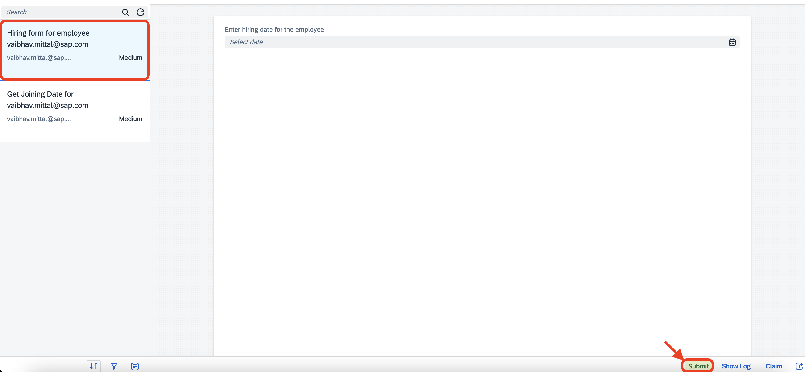
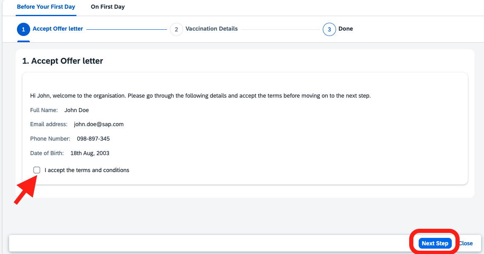
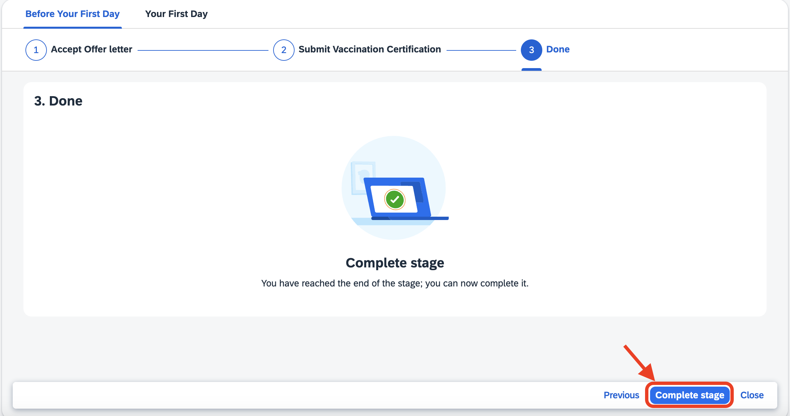
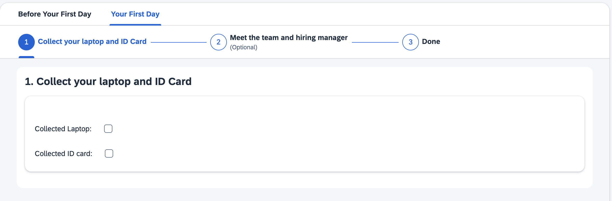
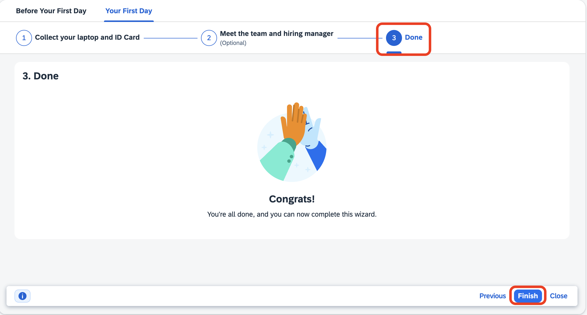

# Execute the Guided Process
Now that you have published the guided process, we will move on to executing the guided process.

### Working on the First Stage

1. To start the execution of the Guided Process, click on the `Start` button on the page that you are on. It will take a few seconds for the guided process to start and first step to appear on the screen.
    
2. [Admin] Then as an admin/manager, we need to provide the joining date for the user. Navigate to this [URL](https://ca10-cr-consumer.ca10.process-automation.build.cloud.sap/comsapspaprocessautomation.comsapspainbox/inbox.html) and you will see a task named `Hiring form for employee`. Fill out the date field in that form with any past date and click on the `Submit` button. (We are providing a past date so that you don't have to wait until that date to continue executing the process)

3. Coming back to the work zone tab, as the first step, you will need to accept the terms and conditions using the toggle button and then accept the offer letter by clicking on the `Next Step` button. (In a real scenario, the terms and conditions would be a link taking you to actual terms. We didn't add any here for the sake of simplicity)
    
4. In this step, you need to provide the vaccination details and click on `Next Step` to mark this task as completed. 
5. As all the steps in this stage are completed, we will complete the stage by ckicking on the `Complete Stage` button.

### Working on the Second Stage

1. Now the execution has reached the first step of second stage:

2. Please toggle both the buttons (even though we are not giving you a laptop 😊) and click on the `Next Step` button to complete this step.
3. Now, you have reached the final step which is an optional step (as configured by you when you designed the guided process). We don't need to complete it.
4. Now let's go to the `Done` section by clicking the `Done` button and complete the execution by clicking on the `Finish` button.

Hurray!!! You have successfully designed, deployed and executed a Guided Process.
