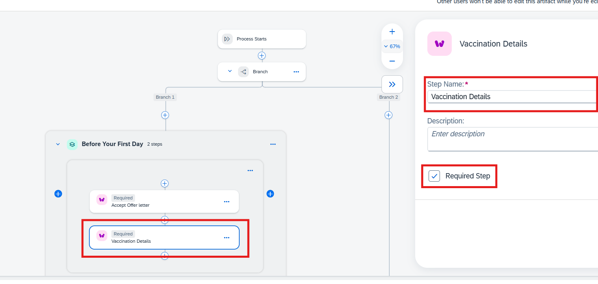

# Model a Guided Process with SAP Build Process Automation
## Model Guided Process

In this tutorial, you will see how to model a **Guided Process** in SAP Build Process Automation.

You will learn

* How to model parallel stages and steps?

* How to model sequential stages and steps?

* How to pass output of one step to another?

* How to release and deploy the model into an environment?

### Create a Business Process Project and add dependent project
1. Create a Business Process Project by clicking on "**Create**" button. In the "Create Project" wizard, select "**Automated Process**" and click on "**Next**"
   
    

2. Select "Process" and click on "**Next**"
   
   

3. Enter the project name in the following format -  "**`GuidedProcess_APACHandson_handsonuser<<UsernumberAllocated>>`**" and click on "**Review**"
   
    

4. In the last screen, click on "**Create**" to complete creation of the project.

   
   
5. Open the project created and select the "**Dependencies**" tab and click on "**Manage Dependencies**"

   

6. Click on "Add" -> "**Add a Business Process Project Dependency**"

   

7. Select the dependent project details as below and click on "**Add**" and close the window.

   

8. The dependent project has the required proces and form which will be used in the Guided Process below.

   

### Create a Guided Process

1.	Go to **Artifacts** tab and click on the `Create` button to begin setting up a new guided process. Upon clicking, a list of skills will be displayed.

    

2.	From the list, select **Guided Process** to proceed with the creation

    

3.	A window titled **Create Guided Process** will appear on the screen. In the designated field enter the name of the Guided Process in the format “**`<<Your SAP I-number>>_onBoarding`**”.

    

4. Click `Create` to begin modelling your first Guided Process.

    

*🎉🎉 Congratulations!!! You have successfully created your first Guided Process! 🎉🎉*

### Model a Guided Process

Let's now model  our Guided Process in a structured and efficient manner. The step-by-step guide that follows will help you navigate each stage with clarity and ease.

1.	Click on the `+` icon located below the **Process Starts** step to open a drop-down menu. As shown in the image below, this menu provides various options, including *Stages, Subprocess and Controls & Events*, enabling you to structure and refine your Guided Process.

    

2.	From drop-down menu, click on `Controls and Events`. Upon selection, two options will appear - `Branch` and `Wait for Duration` - allowing you to introduce to parallel execution or time-based delays within your guided process

    

3.	Next, click on `Branch` to enable parallel execution within your guided process. This allows mutiple steps to run simulataneously on seprate branches, ensuring that different tasks can progress independently without any conditional dependencies.

    

##### Model a Stage with two sequential Steps

A **Stage** serves as a logical container that contain mutiple steps, which may be executed either parallelly or sequentially.

A **Step** represents a task within a **Stage** and can be enriched with various types of content, including videos, documents, forms, tasks, UI cards, and apps.

1.	Locate *Branch 1* and click the `+` icon. From the available options. Select `Stages` to define a logical container within your guided process.

    

2.	Rename the stage as “**Before Your First Day**” to represent tasks that need to be completed by the employee, before his/her first day.

    

3.	Within the **Before Your First Day** stage, click `Add Step` button to incorporate a new step.

    

4.	Upon clicking `Add Step`, a drop-down menu will appear, displaying **Widget**. Click on `Widget` as shown in below image. This will add a step in your stage.

    

5.	Name the step as “**Accept Offer letter**” to clearly define its purpose within the guided process. Next, click `Required Step` checkbox to mark this step as mandatory. A *Required Step* cannot be skipped and must be completed before proceeding further. If the *Required Step* checkbox is left unchecked, the step remains optional and can be  bypassed. 

    

*🎉🎉 Congratulation!!! You have successfully created a mandatory step within a stage! 🎉🎉*

##### Model a sequential step in "Before Your First Day" stage

1.	To add another step in sequence to the **Accept Offer Letter** step, click the `+` icon located directly below it. Upon clicking, drop-down menu will appear.

    

2. From the drop-down menu, click on `Widget` to add a new step to your stage.

    

3.	The newly added step is sequential to **Accept Offer Letter**. Name the step as **Vaccination Details** to define it's purpose within guided process. Then, check the `Required Step` checkbox to mark it as mandatory.

    

At this stage, you have successfully created a **stage** containing **two mandatory steps** arranged in *sequential order*.

##### Integrate an existing Process

1. Locate *Branch 2* and click `+` icon below it. This will open a drop-down menu with three options: *Stages*, *Subprocess* and *Controls & Events*.

    

2.	To proceed with adding a dependency process, select `Subprocess` from the menu. This will allow you to integrate the existing process as a step within your guided process.

    

3.	Select the process titled `Fetch Hire Date` to integrate it within your guided process.

    

##### Configure a "Wait for Duration"

**"Wait for Duration"** step introduces a pause in the guided process, requiring a specific date to be elapsed before the process can proceed further. This ensures that execution resumes only after the defined waiting period has elapsed.

1. Click the `+` icon located just above **Stage 1**. This will open a drop-down menu. Select **Controls and Events** where you see two options: *Branch, Wait for Duration*.

    

2. From the available options, Select `Wait for Duration` to introduce a waiting period in the guided process.

    

3. Once **Wait for duration** is added to the guided process. Click on “`Select Item`” under the *Time Duration* section. This opens the **Process Content** panel beside it, displaying **Fetch Hire Date** step’s output as Hiring Date.

    

4. Click on `Hiring Date` within the **Process Content** panel. This will automatically populate the textfield with the *Fetch Hire Date* process's **Hiring Date**.

    

##### Model a Stage with two parallel Steps

1.	Click on `Stage 1` to begin configuring it. Rename the stage as “**On First Day**” to represent tasks that need to be completed by the employee, on his/her first day.

    

2.	Click on `Add Step` within the **On First Day** stage. From the drop-down menu, select `Widget` to define a new step within the stage.

    

3.	Name the step as “**Collect your laptop and ID Card**” to specify its purpose. Then, check the `Required Step` checkbox to ensure that this step must be completed in order to complete the stage.

    

4.	Click the `+` icon located to the right of the **Collect your laptop and ID Card** step. This will create a new step that runs parallel to the **Collect your laptop and ID Card** step, inside the stage **On First Day**.

    

5.	Upon clicking the `+` icon, a drop down menu will appear. Select `Widget` from the menu to add a new step. Name the newly added step “**Meet the team and hiring manager**” to define its purpose. This time, donot check the `Required Step` checkbox. As a result the stage can be completed even if this step is not performed.

    

[NOTE]: “**Collect your laptop and ID Card**” and “**Meet the team and hiring manager**” steps are *parallel* within stage **"On First Day"**. It means you can work on both steps simultaneously.

*🎉🎉 Congratualtions!!! You have successfully modeled your first guided process! 🎉🎉*

### Release and Deploy the Project having Guided Process

To ensure your guided process is ready for execution, you need to *Save*, *Release* and *Deploy* it into the target environment. This section provided a structural approach in finalizing and making your process operational.

1.	First, click on `Save` to ensure all changes to the guided process are stored. Once saved, click on `Release` to release the project and making it ready for deployment.

    

2.	After clicking on `Release`, a dialog box will appear. To proceed, click on `Release` button which is within the dialog box in order to finalize the release of the project.

    

3.	At “**GuidedProcess_dcomHandson_caseRuntimeDemoUser`SerialNumer`**” level, locate the drop-down menu. Click on `Editable`, then select **latest released version** to access most recently released version of guided process.

    

4.	Once the project is released, locate the `Deploy` button on the right topmost corner and click it. This will open a drop-down menu titled “**Choose an Environment**”, displaying list of available environments. If your username ends with *01@sap.com*, then select the environment which ends with *01* and same goes for *02*, *03* etc. After selecting the environment click on `Upgrade` to initiate the deployment process.

    

*🎉🎉Congratulations!!!. You have successfully modeled, released and deployed your first guided process.🎉🎉*

With this, you have completed the entire journey - From designing and structuring the process to making it live in the target environment. Now, let’s proceed with publishing the guided process on Work Zone by following the instructions in [here](workZoneDeployment.md).
