# Deploy the Work Zone content

After you have deployed the guided process in the SAP Build Process Automation lobby, you need to configure and publish a Work Zone wizard which would actually be used for the execution of the guided process.

### Create a workspace
We need to create a workspace where we will configure and publish the guided process:

1. Open the workzone [home page](https://ca10-cr-consumer.workzone.cfapps.ca10.hana.ondemand.com/site#workzone-home&/home), hover over the `Workspaces` dropdown and select `New Workspace`
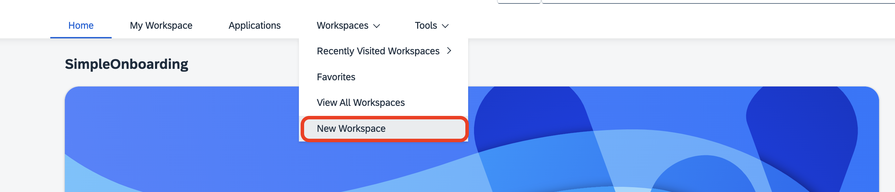

2. It will open a dialog-box, select `Public Workspace` from the types of workspaces
3. Enter a unique name for the workspace starting with your I number \<Your I Number\>_workspace, something like I098765_workspace, and click `Finish`
 
### Create a workpage
Now that we created a workspace, we need to create a workpage specific to our usecase:

1. On the workspace page, you will see a `+` symbol on the right hand side of the page. Click that button and select `Workpage` from the available options.
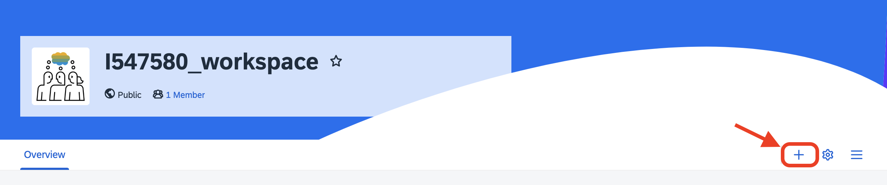
  
2. On the next screen, put an appropriate name in the `Tab Name` field and click on `Add` button.
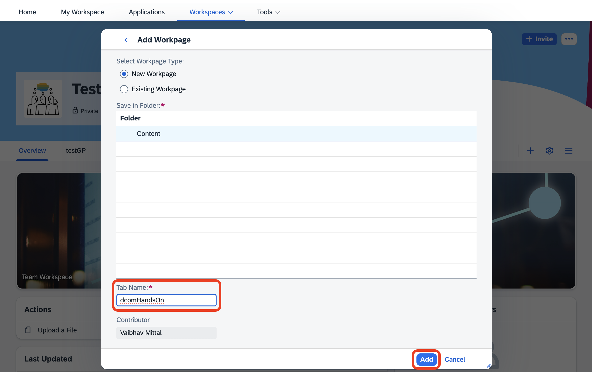
3. Now, click on the `Add section` button in the middle of the screen and you will be seeing a page like this.
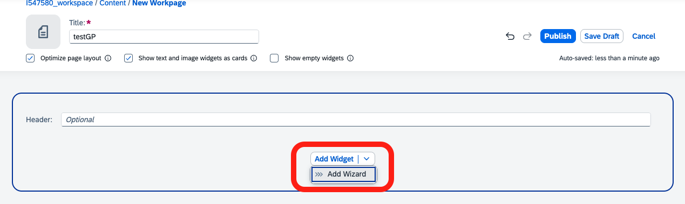

4. You will see a drop down on this page as highlighted in the above image. Select the `Add Wizard` button from the dropdown.
5. On the next screen, you will see a dropdown under the `Process` area.
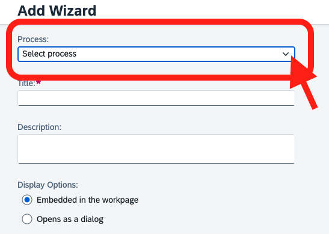
6. Click on that dropdown and you will see the section for the environment where you deployed your Guided Process.
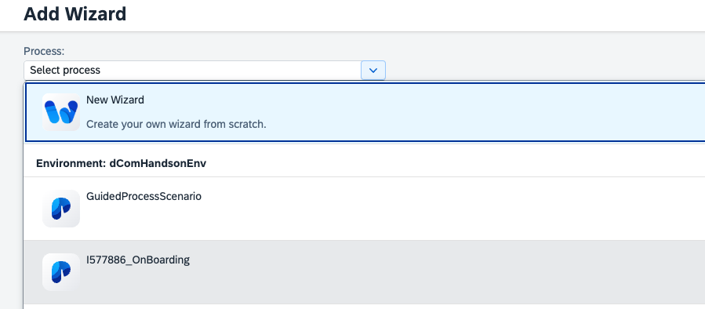
7. In that section you will see the Guided Process that you deployed, select that process. Scroll down and you will see the stages and steps that you created.
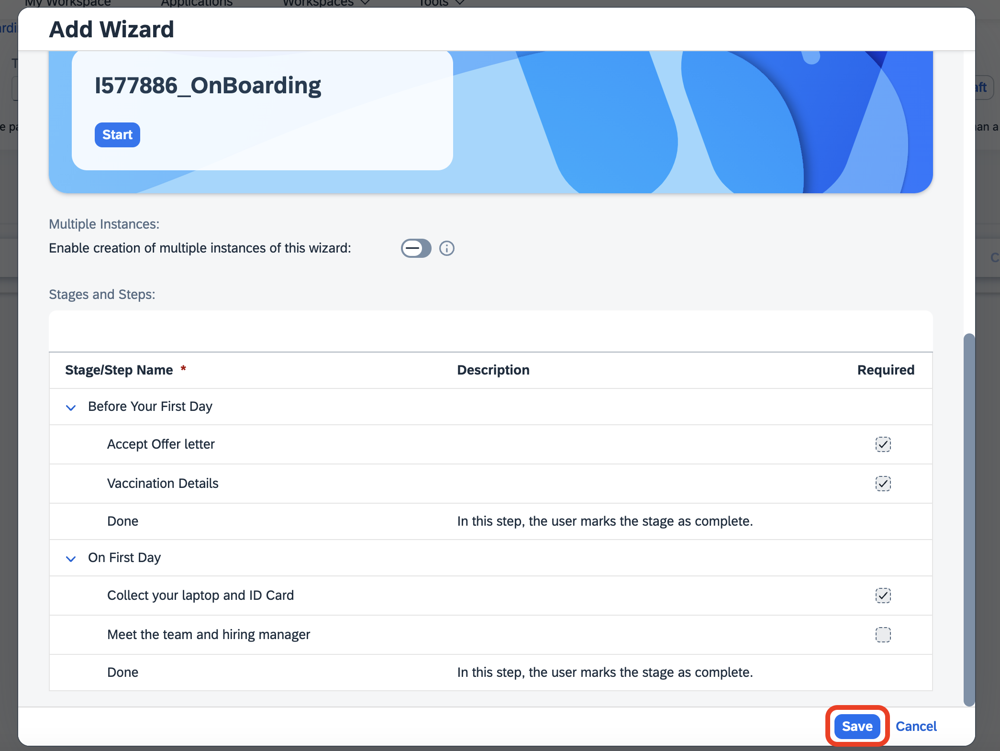
8. Click on the `Save` button.

Congratulations! You have successfully created a Workpage.

### Add widgets for Human Tasks
Now we need to add widgets for all the human tasks we created. These widgets are the actual tasks which the user will work upon.

1. After the previous section, you will see a screen which contains the stages and steps which are part of the guided process that you created. One by one we will add widgets to each of the tasks.
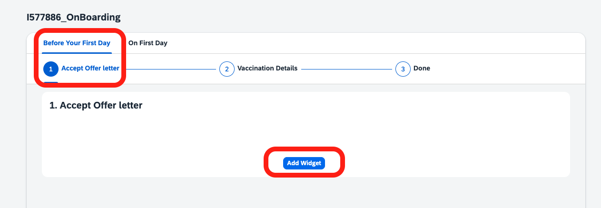
2. Currently, the `Accept Offer Letter` step in `Before Your First Day` stage is selected. Click on `Add Widget` button and select the Cards option.
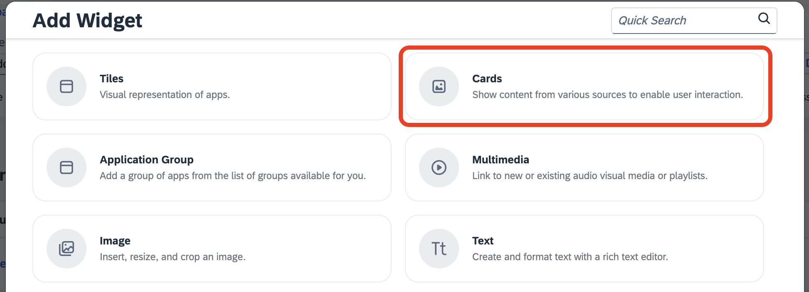
3. In the next screen, search for the `Offer Letter` card and select it and click on the `Save` button.
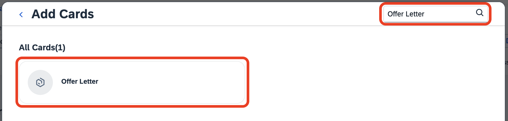
4. Good Job! Now we just need to repeat the same for the remaining steps.
5. Select the `Vaccination Details` step and click on the `Add Widget` button. Select the `Cards` option.
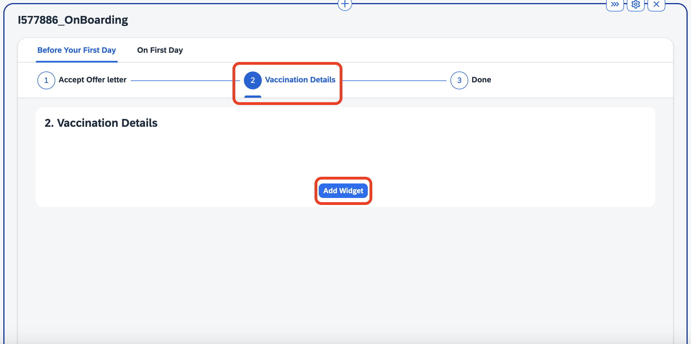
6. In the next screen, search for the `Vaccination Card` card and select it and click on the `Save` button.
7. Select the `On First Day` stage. You will see that the `Collect your laptop and ID Card` step is already selected.
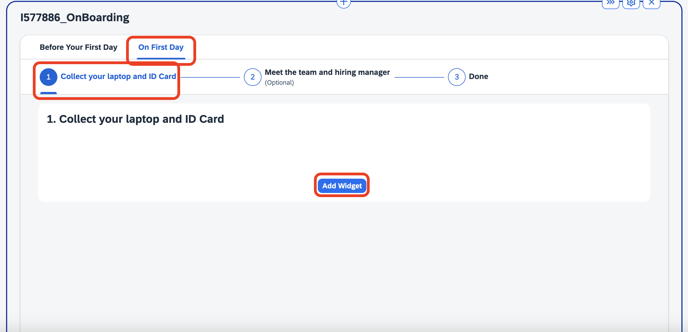 
8. Click on the `Add Widget` button. Select the `Cards` option.
9. In the next screen, search for the `Assets Collection` card and select it and click on the `Save` button.
10. We would not be adding a widget for the optional step as we are not going to work upon it.
11. Finally click on the `Publish` button on top right corner. A dialogbox will appear. Don't change anything in the dialogbox and click on the `Publish` button.
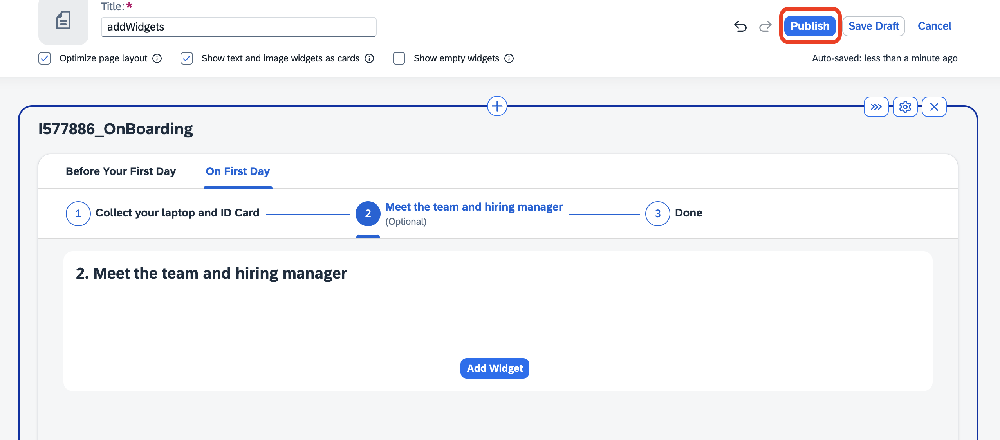

Hurraayy!! You have now successfully deployed and published the Guided Process. Please keep the work zone tab open, the execution will start from there! To execute the guided process, please follow the instructions outlined in [here](GuidedProcessExecution.md).
