## Description

This exercise contains the material for hands-on sessions called "Create processes from BPMN models".

## Overview

You will learn how to :
- Generate a process in SBPA given the BPMN file from Signavio as input
- Do the necessary manual configuration to replace the placeholders for actual SBPA form, approval forms, subprocess
- Adjust the script task, mail task
- Save, Release and Deploy the project
- Run the project
  
## Exercises

Exercise 1.1 [Save as New Project ](https://github.com/SAP-samples/process-automation-enablement/blob/main/Workshops/APAC-2025/exercises/bpmn%20import/readme.md#save-as-new-project) <br>
Exercise 1.2 [Import BPMN file to generate process](https://github.com/SAP-samples/process-automation-enablement/tree/main/Workshops/APAC-2025/exercises/bpmn%20import#import-bpmn-file-to-generate-process
) <br>
Exercise 1.3 [Adjust the Configurations in the process](https://github.com/SAP-samples/process-automation-enablement/tree/main/Workshops/APAC-2025/exercises/bpmn%20import#adjust-the-configurations-in-the-process
) <br>
Exercise 1.4 [Replace the placeholder for “Get Procurement Approver” with SBPA subprocess](https://github.com/SAP-samples/process-automation-enablement/tree/main/Workshops/APAC-2025/exercises/bpmn%20import#replace-the-placeholder-for-get-procurement-approver-with-sbpa-subprocess) <br>
Exercise 1.5 [Replace the placeholder for “Procurement Review Approval” with SBPA approval form](https://github.com/SAP-samples/process-automation-enablement/tree/main/Workshops/APAC-2025/exercises/bpmn%20import#replace-the-placeholder-for-procurement-review-approval-with-sbpa-approval-form) <br>
Exercise 1.6 [Replace the placeholder for “Finance Review” with SBPA approval form](https://github.com/SAP-samples/process-automation-enablement/tree/main/Workshops/APAC-2025/exercises/bpmn%20import#replace-the-placeholder-for-finance-review-with-sbpa-approval-form) <br>
Exercise 1.7 [Replace the placeholder for “CEO Approval” with SBPA approval form](https://github.com/SAP-samples/process-automation-enablement/tree/main/Workshops/APAC-2025/exercises/bpmn%20import#replace-the-placeholder-for-ceo-approval-with-sbpa-approval-form) <br>
Exercise 1.8 [Adjust the Mail task  “CapEx Approval Status Mail”](https://github.com/SAP-samples/process-automation-enablement/tree/main/Workshops/APAC-2025/exercises/bpmn%20import#adjust-the-mail-task--capex-approval-status-mail) <br>
Exercise 1.9 [Add a trigger](https://github.com/SAP-samples/process-automation-enablement/tree/main/Workshops/APAC-2025/exercises/bpmn%20import#add-a-trigger) <br>
Exercise 1.10 [Release and Deploy the project](https://github.com/SAP-samples/process-automation-enablement/tree/main/Workshops/APAC-2025/exercises/bpmn%20import#release-and-deploy-the-project) <br>
Exercise 1.11 [Run the process](https://github.com/SAP-samples/process-automation-enablement/tree/main/Workshops/APAC-2025/exercises/bpmn%20import#run-the-process) <br>
  
Good luck!
  
### Save as New Project

a.	Go to [Lobby link](https://sap-build-day-appprocess.us10.build.cloud.sap/lobby) <br>
b.	Locate the Process Automation type of application with name “BPMN Import - APAC Template” <br/>
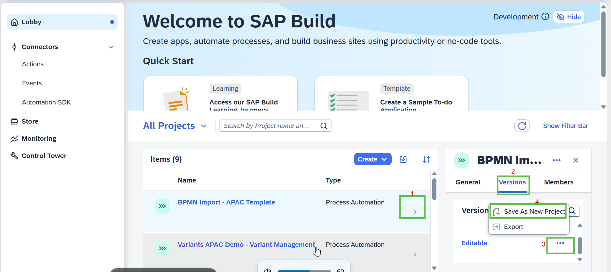
 <ul>
   i.	Click on the arrow to Navigate <br/>
   ii.	Choose “Versions” tab <br/>
   iii.	Choose the option for Version as “Editable” <br/>
   iv.	Click on “Save as New Project” <br/>
   v.	Give a different project name BPMN Import - APAC Template followed by your test user number (say for example, BPMN Import - APAC Template 01) and description if required <br/>
   vi. Click on "Save as New"
  </ul>
A new project is saved now. <br/>

### Import BPMN file to generate process
  a.	Click on your project <br/>
  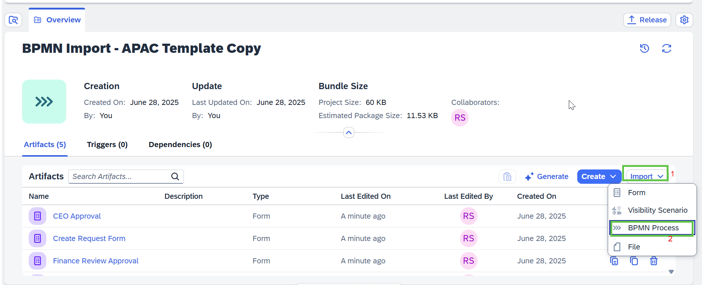
  b.	Click on Import->BPMN Process <br/>
  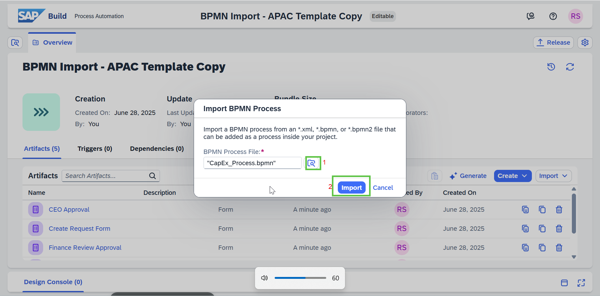
  c.	Browse for the BPMN file(CapEx_Process.bpmn) and choose it <br/>
  d.	Click on Import <br/>
  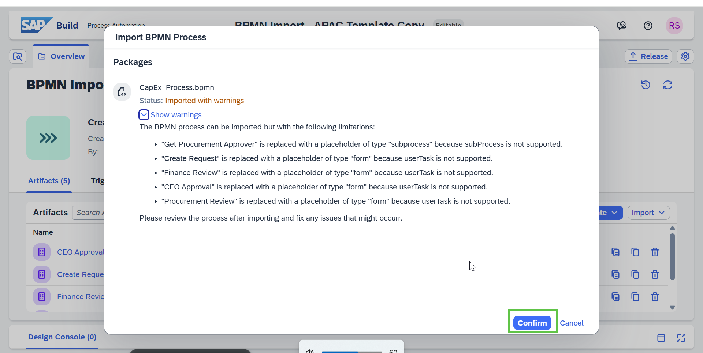
  e.	Check the warnings and choose Confirm <br/>
  f.	Message that “BPMN Process Imported Successfully” will come up <br/>
  g.	Process named “CapEx_Process” will be generated <br/>

### Adjust the Configurations in the process
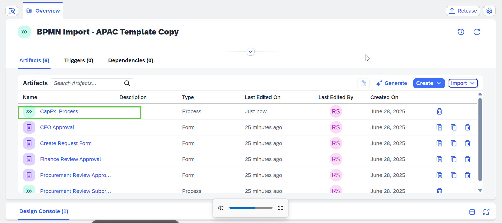
a.	Click on “CapEx_Process” and open it <br/>
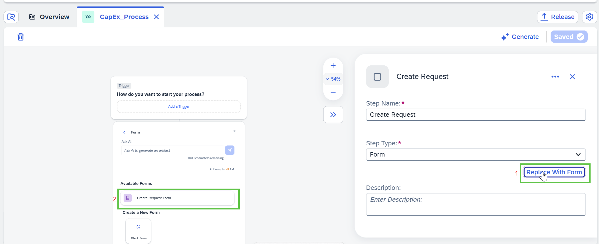
b.	Replace the placeholder for “Create Request” with SBPA form <br/>
<ul>
i.	Click on “Create Request” placeholder <br/>
ii.	Click on “Replace with Form” <br/>
iii.	Choose “Create Request Form” from Available Forms(Hint: You can create a form from scratch using Blank Form if there are no available forms) <br/>
iv.	Now the placeholder is replaced with actual form .You can click on “Open Editor” to check the content of the form  <br/>
v.	Click on General tab and <br/>  
<ul> 
  
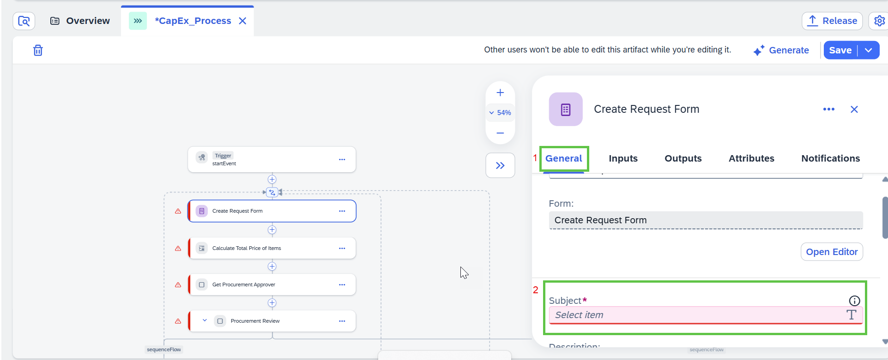 
1.	Click on Subject and enter “Request Form” <br/>
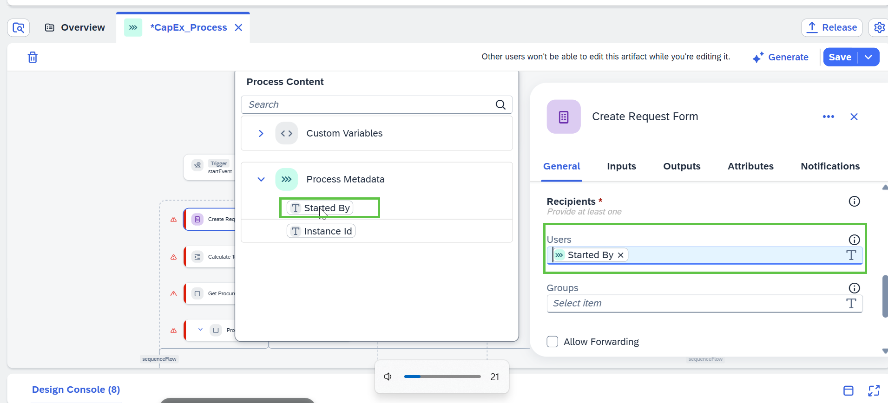
2.	Click on User and choose Process Metadata->Started By <br/>
</ul>
vi.	Save the project <br/>
</ul>
c.	Adjust the script task “Calculate Total Price of Items” <br>
<ul>
i.	Click on “Calculate Total Price of Items” script task <br/>
ii.	On the right hand side,Click on Open Editor to replace the code with the below one to make it a valid script <br/>

```
$.context.custom.totalProcurementCost = 0;
var itemsList = $.context.form_createRequestForm_1.lineItemSection;
for (var i = 0; i < $.context.form_createRequestForm_1.lineItemSection.length; i++) {
    $.context.custom.totalProcurementCost += itemsList[i].cost ;
}
$.context.custom.taxAmount = $.context.custom.totalProcurementCost * 0.05;
$.context.custom.totalProcurementCost  +=  $.context.custom.taxAmount;
```

iii.	Click on Apply  <br>
iv.	Script task is valid and ready now <br>
</ul>

### Replace the placeholder for “Get Procurement Approver” with SBPA subprocess
i.	Click on “Get Procurement Approver” placeholder <br>
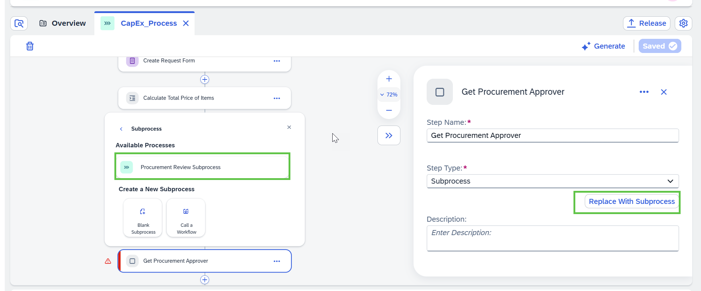
ii.	Click on “Replace with Subprocess” <br>
iii.	Choose “Procurement Review Process” from Available Subprocesses(Hint: You can create a subprocess from scratch using Create a new subprocess if there are no available subprocesses) <br>
iv.	Now the placeholder is replaced with actual subprocess .You can click on “Open Editor” to check the content of the subprocess  <br>
v. Click on Inputs tab to map the inputs from context to the subprocess <br><ul> 

  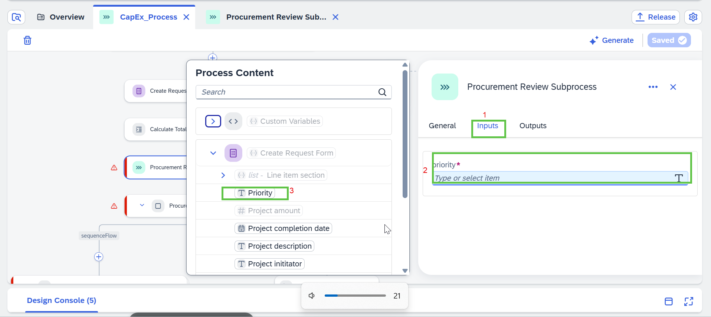
        Click on priority and map the attribute “priority” from the Create Request Form context <br>
</ul>
vi. Save the project <br>

### Replace the placeholder for “Procurement Review Approval” with SBPA approval form
i.	Click on “Procurement Review Approval” placeholder <br>
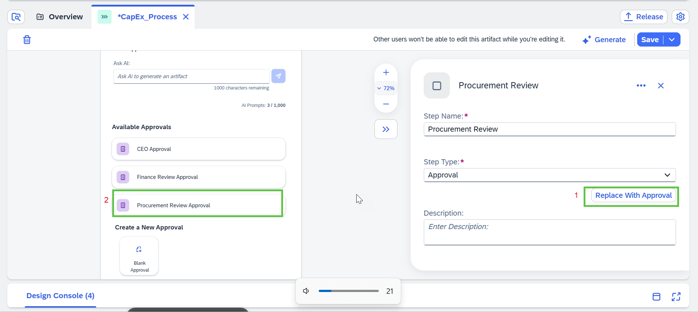
ii.	On the right side, change the Step Type from “Form” to “Approval” <br>
iii.	Click on “Replace with Approval” <br>
iv.	Choose “Procurement Review Approval” from Available Forms(Hint: You can create an approval form from scratch using Create a New Approval if there are no available forms) <br>
v.	Now the placeholder is replaced with actual approval form .You can click on “Open Editor” to check the content of the form  <br>
vi.	Click on General tab and <br>
<ul>
  
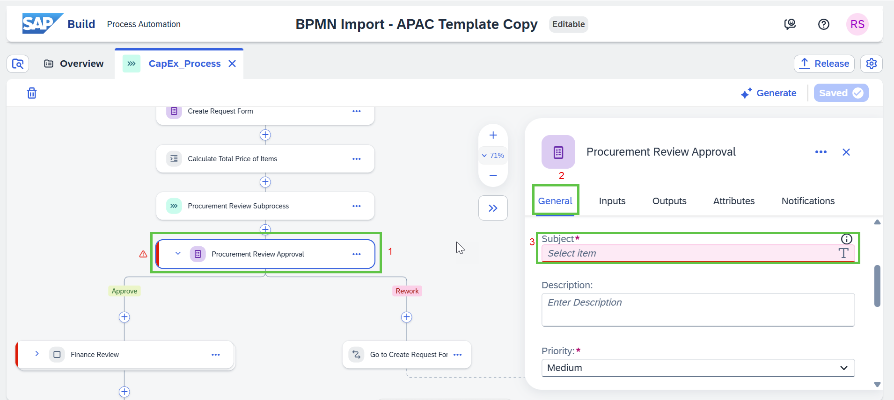  
1.	Click on Subject and enter “Procurement Approval” <br>
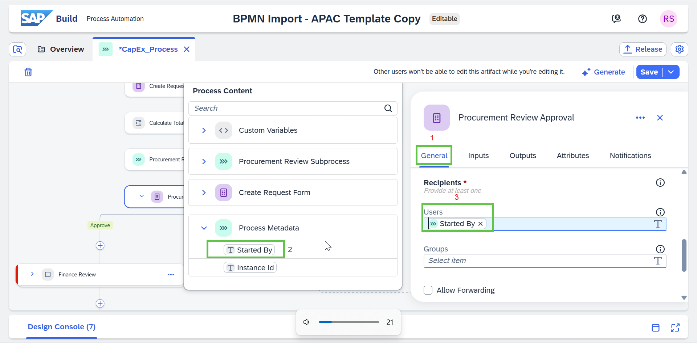
2.	Click on User and choose Process Metadata->Started By <br>
3.	Save the project <br>
</ul>
vii.	Click on Inputs tab to map the inputs from context to the approval form <br><ul>
  
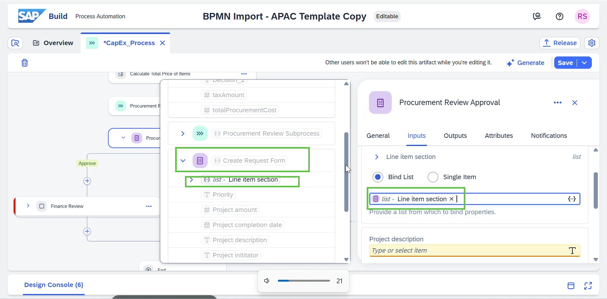
1.	Click on Line item section and map the list “Line item section” from Create Request Form context <br>
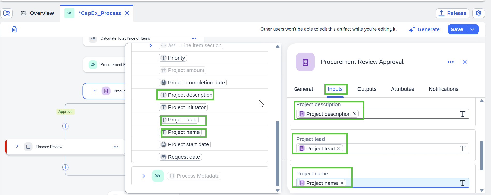
2.	Click on Project Description and map the attribute “Project Description” from Create Request Form context <br>
3.	Click on Project lead and map the attribute “Project lead” from Create Request Form context <br>
4.	Click on Project name and map the attribute “Project name” from Create Request Form context <br>
5.	Save the project <br></ul>

### Replace the placeholder for “Finance Review” with SBPA approval form
i.	Click on “Finance Review” placeholder <br>
ii.	On the right side, change the Step Type from “Form” to “Approval” <br>
iii.	Click on “Replace with Approval” <br>
iv.	Choose “Finance Review Approval” from Available Forms(Hint: You can create an approval form from scratch using Create a New Approval if there are no available forms) <br>
v.	Now the placeholder is replaced with actual approval form .You can click on “Open Editor” to check the content of the form <br>
vi.	Click on General tab and <br><ul>
1.	Click on Subject and enter “Finance Approval” <br>
2.	Click on User and choose Process Metadata->Started By <br>
3.	Save the project <br></ul>
vii.	Click on Inputs tab to map the inputs from context to the approval form <br><ul>
1.	Click on Line item section and map the list “Line item section” from Create Request Form context <br>
2.	Click on Priority and map the attribute “Priority” from Create Request Form context <br>
3.	Click on Project lead and map the attribute “Project lead” from Create Request Form context <br>
4.	Click on Project amount and map the attribute “Project amount” from Create Request Form context <br>
5.	Click on Project name and map the attribute “Project name” from Create Request Form context <br>

6.	Click on Total cost and map the attribute “totalProcurementCost” from Custom Variables <br>
7.	Click on Tax Amount and map the attribute “taxAmount” from Custom Variables <br>
8.	Save the project <br></ul>

### Replace the placeholder for “CEO Approval” with SBPA approval form
i.	Click on “CEO Approval” placeholder <br>
ii.	On the right side, change the Step Type from “Form” to “Approval” <br>
iii.	Click on “Replace with Approval” <br>
iv.	Choose “CEO Approval” from Available Forms(Hint: You can create an approval form from scratch using Create a New Approval if there are no available forms) <br>
v.	Now the placeholder is replaced with actual approval form .You can click on “Open Editor” to check the content of the form <br>
vi.	Click on General tab and <br><ul>
1.	Click on Subject and enter “CEO Approval” <br>
2.	Click on User and choose Process Metadata->Started By <br>
3.	Save the project<br></ul>
vii.	Click on Inputs tab to map the inputs from context to the approval form <br><ul>
1.	Click on Project amount and map the attribute “Project amount” from Create Request Form context <br>
2.	Click on Project lead and map the attribute “Project lead” from Create Request Form context <br>
3.	Click on Project description and map the attribute “Project description” from Create Request Form context <br>
4.	Click on Project name and map the attribute “Project name” from Create Request Form context <br>
5.	Click on Total cost and map the attribute “totalProcurementCost” from Custom Variables <br>
6.	Save the project <br></ul>	

### Adjust the Mail task  “CapEx Approval Status Mail”
i.	Click on mail task “CapEx Approval Status Mail” <br>
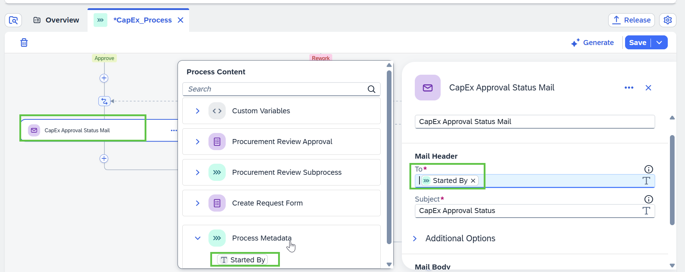
ii.	Click on Mail Header->To attribute with Process Metadata->Started By <br>
iii.	Click on Mail Body->Open Mail Body Editor <br>
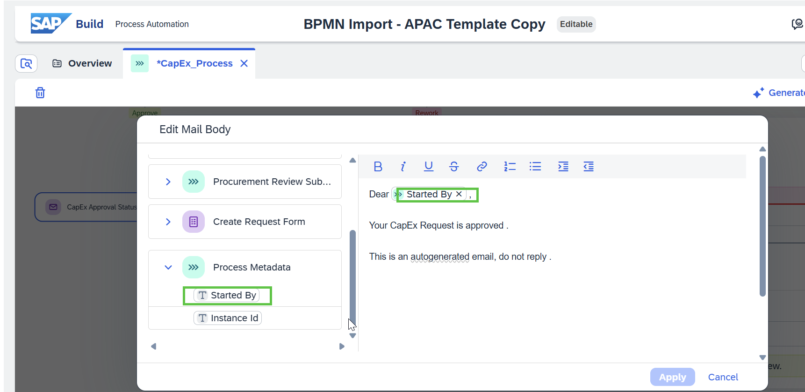
iv.	In the pre-filled mail body, replace {Sender} with “Process Metadata->Started 
By” from the context <br><ul>
Replace rest of the mail body with below content <br>
“Your CapEx Request is approved . <br>
This is an autogenerated email, do not reply” . <br></ul>
v.	Click on "Apply" <br>
vi.	Save the project <br>

### Add a trigger 
a.	Click on Add a Trigger <br>
b.	Choose Scheduled Trigger <br>
c.	Give it a name like Scheduled Trigger <br>
d.	Save the project <br>

### Release and Deploy the project 
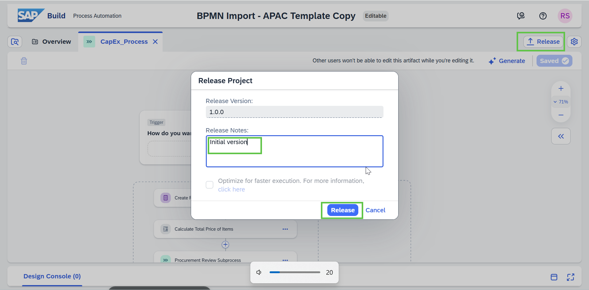
a.	Click on Release button <br>
b.	Provide description as “Initial Version” <br>
c.	Click on Release <br>
d.	Successful project release should be shown with a “Show project version” link <br>
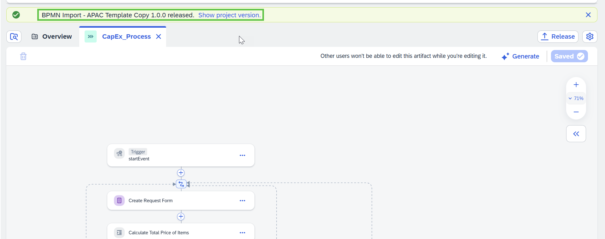
e.	Click on the “Show project version” link <br>
f.	Click on Deploy button <br>
g.	Choose the Environment with the same name as your user name - for example `builduser1`, `builduser2`, `...` <br>
h.	Click on Deploy <br>
i.	Created ScheduledTrigger will be shown with the option to Deploy <br>
j.	Click on Deploy button again shown here <br>
k.	Project should be deployed in the Environment successfully <br>

### Run the process
a. Go to `Control Tower -> Environments` <br>
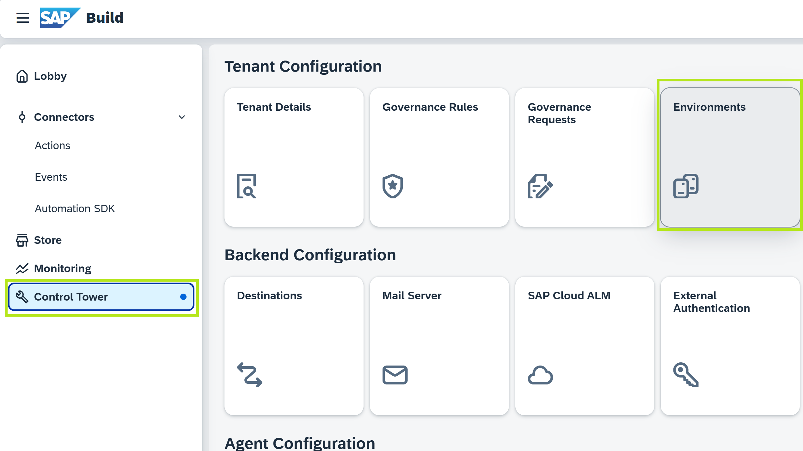
b. Select environment with the same name as your user name - for example `builduser1`, `builduser2`, `...` <br>
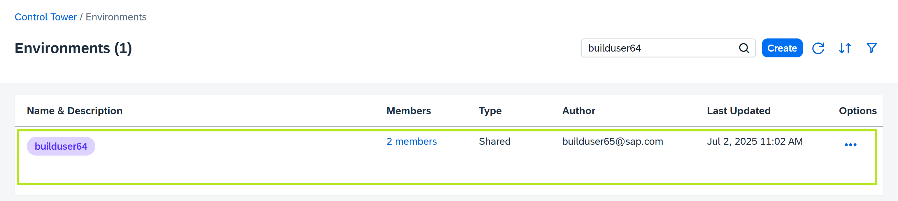
c. Click on `More -> Processes and Worklfows` <br>
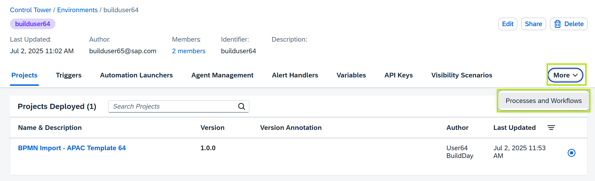
d. Filter by your project name <br>
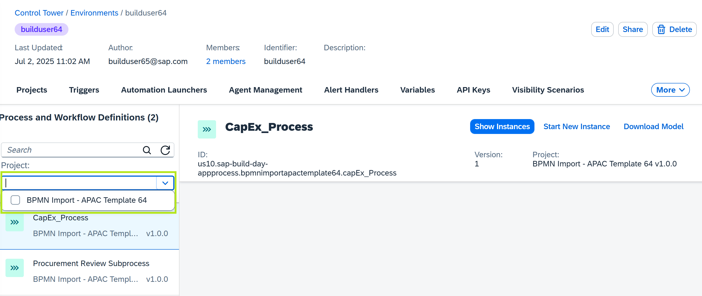
e. Select the process - `CapEx_Process` <br>
f. Click on `Start New Instance` <br>
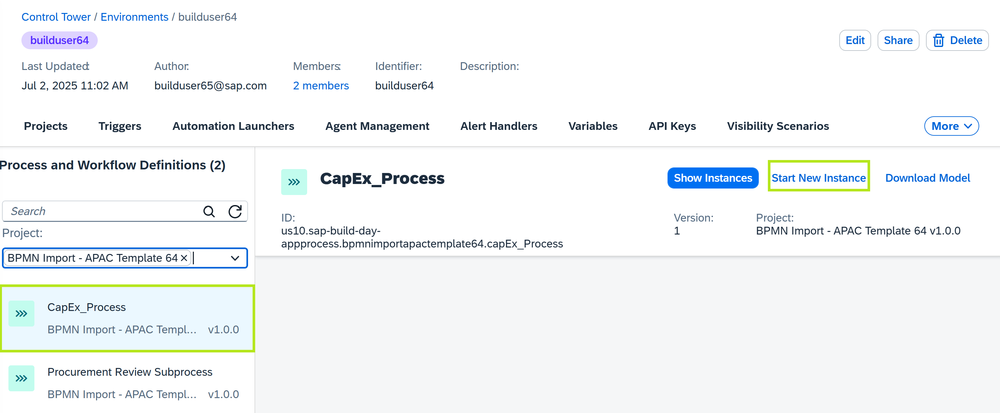
g. Relace the content in the editor with an empty JSON <br>
```
{}
```
h. Click on `Start New Instance and Close`
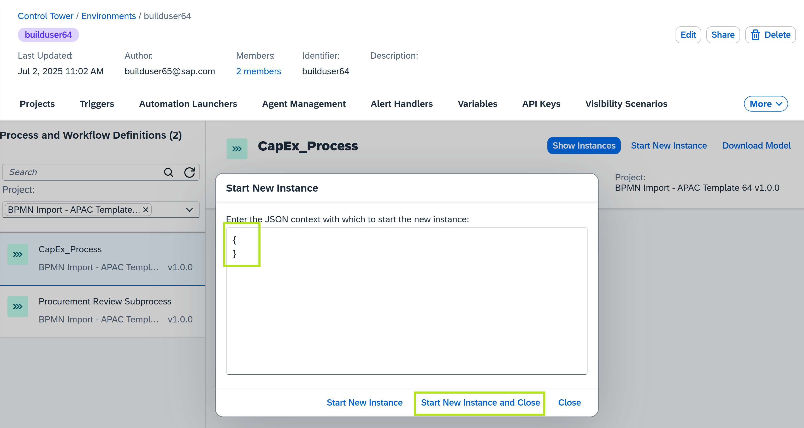

### Monitor the process
a. Go to `Show Instances` <br>
b. You can see the Logs and Context<br>
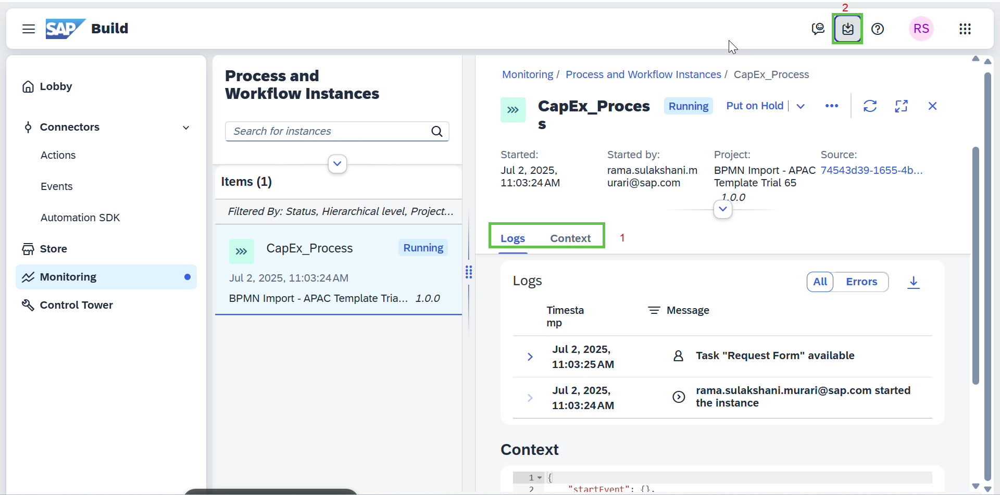
c.Click on Inbox link to see the Request Form <br>
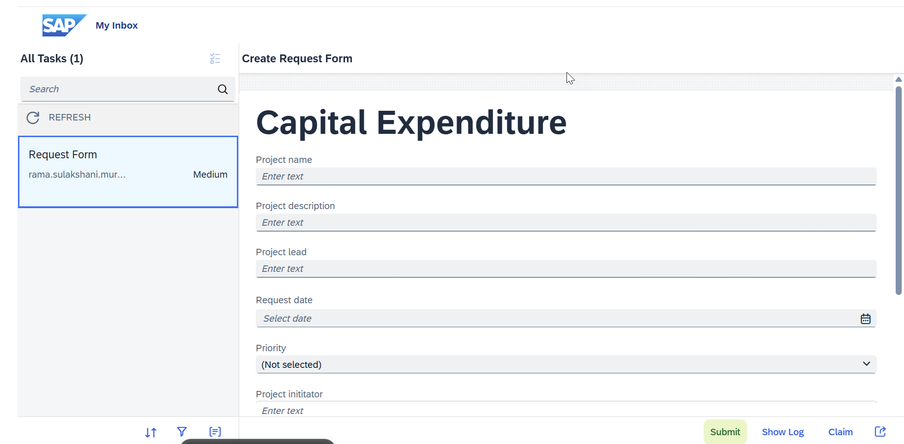
d.Fill in the Request Form and submit, make sure to give 1 or more Item details before you submit <br>

e. In the Show instances , you can see that process has proceeded to Procurement approval step now <br>
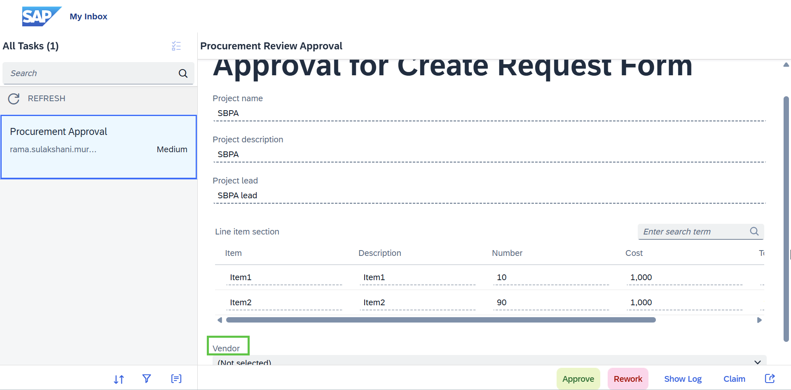
f. Go to MyInbox and see the form for Procurement Approval form <br>
g. Choose the Vendor from the dropdown and Approve <br>
h.Process proceeds to Finance Approval <br>
i.Go to MyInbox and see the Finance Approval form <br>
j.Check the Finance details and Approve <br>
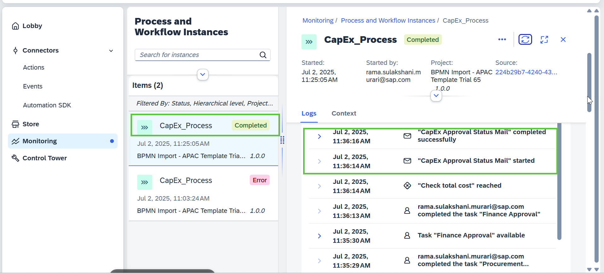
k.You can see that the process is completed successfully in the monitoring <br>

l.In addition, an email is seen in your inbox with the CapEx approval status if your email id is valid. In this exercise, test users do not have a valid email id associated and so this step might fail in that case <br>

## License
Copyright (c) 2022 SAP SE or an SAP affiliate company. All rights reserved. This project is licensed under the Apache Software License, version 2.0 except as noted otherwise in the [LICENSE](LICENSES/Apache-2.0.txt) file.
