## Description

This exercise contains the material for hands-on session called  "Modularize & localize processes with process variants ".

## Overview

You will learn how to :
- Create a Process Variant
- Create Start Conditions
- Create Step Conditions
- Save and Release the project
- Run the project

## Exercises
Exercise 1.1 [Create Variant Template & Variant Management ](https://github.com/SAP-samples/process-automation-enablement/blob/main/Workshops/APAC-2025/exercises/process%20variants/readme.md#create-variant-template-and-variant-management) <br>
Exercise 1.2 [Create Process Variant ](https://github.com/SAP-samples/process-automation-enablement/blob/main/Workshops/APAC-2025/exercises/process%20variants/readme.md#create-process-variant) <br>
Exercise 1.3 [Add Start Condition ](https://github.com/SAP-samples/process-automation-enablement/blob/main/Workshops/APAC-2025/exercises/process%20variants/readme.md#add-start-condition) <br>
Exercise 1.4 [Add Steps to Variants ](https://github.com/SAP-samples/process-automation-enablement/blob/main/Workshops/APAC-2025/exercises/process%20variants/readme.md#add-steps-to-variants) <br>
Exercise 1.5 [Add Step Condition ](https://github.com/SAP-samples/process-automation-enablement/blob/main/Workshops/APAC-2025/exercises/process%20variants/readme.md#add-step-condition) <br>
Exercise 1.6 [Add Step Configuration](https://github.com/SAP-samples/process-automation-enablement/blob/main/Workshops/APAC-2025/exercises/process%20variants/readme.md#add-step-configuration) <br>
Exercise 1.7 [Move Priority of Variants](https://github.com/SAP-samples/process-automation-enablement/blob/main/Workshops/APAC-2025/exercises/process%20variants/readme.md#move-priority-of-variants) <br>
Exercise 1.8 [Deactivate/Activate Variant ](https://github.com/SAP-samples/process-automation-enablement/blob/main/Workshops/APAC-2025/exercises/process%20variants/readme.md#deactivateactivate-variant) <br>
Exercise 1.9 [Release and Deploy the project ](https://github.com/SAP-samples/process-automation-enablement/blob/main/Workshops/APAC-2025/exercises/process%20variants/readme.md#release-and-deploy-the-project) <br>
Exercise 1.10 [Run the process](https://github.com/SAP-samples/process-automation-enablement/blob/main/Workshops/APAC-2025/exercises/process%20variants/readme.md#run-the-process) <br>

------  
Good luck!
  
### Create Variant Template and Variant Management
a.	Go to Lobby link https://sap-build-day-appprocess.us10.build.cloud.sap/lobby <br><br>
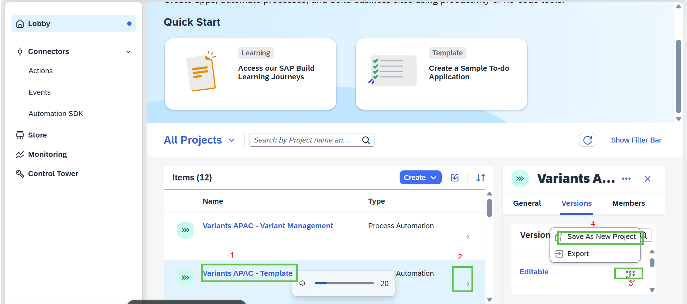<br><br>
b.	Locate the Process Automation type of application with name “
Variants APAC - Template” <br> 
<ul>
<li> Click on the arrow to Navigate </li>
<li> Choose <b>“Versions”</b> tab </li>
<li> Choose the option for Version as <b>“Editable”</b> </li>
<li> Click on <b>“Save as New Project”</b> </li>
<li> Give a different project name Variants <b>APAC– Template followed by your test user number</b> (say for example, Variants APAC - Template01) and description if required and click on <b>Save as New.</b> </li> 
<li> A new project is saved now. </li>
<li> Open the project and open the process <b> "Main_Capex_Process" </b> by clicking on it from the <b>Overview </b> tab.</li>
<li> Locate the <b> "Review Variant Template" </b> in the process and open the template by double clicking it (or from the 3 dots menu click on Open Editor).<br>
<i>Steps and the attributes available for the variants are exposed in the template. You can add or delete any step needed but in the interest of time for the current workshop leave it as such. </i>  </li>
<li> Click on <b>Release</b> button. </li>
<li> Provide description as “Initial Version”. </li>
<li> Click on Release. </li>
<li> Successful project release should be shown with a “Show project version” link. </li>
<li> Go to the Lobby and locate your project.</li>
<li> Click on the arrow next to your project and choose the <b>Versions</b> tab. </li><br>
  
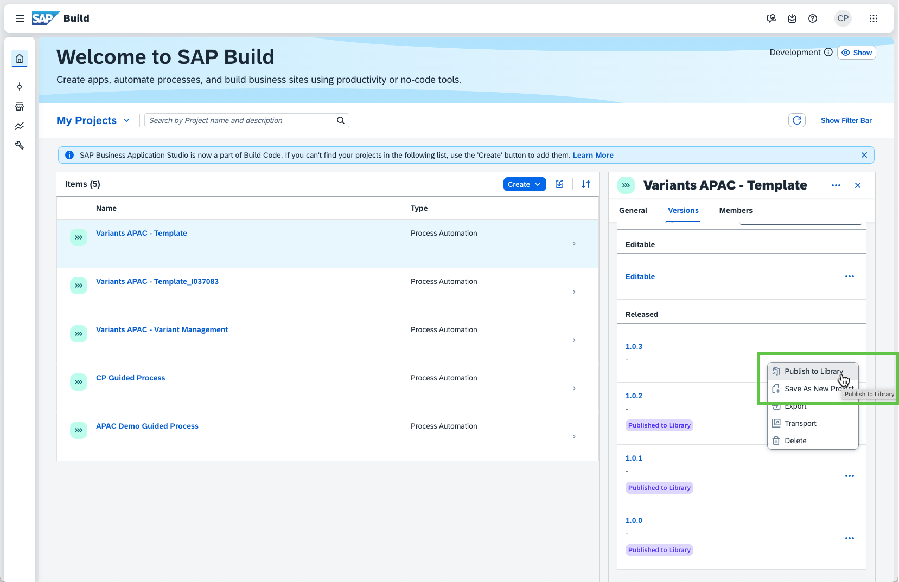<br><br>
<li> Locate the version of the project released and from the 3 dots menu choose the option <b>Publish to Library</b>. </li>
</ul><br>

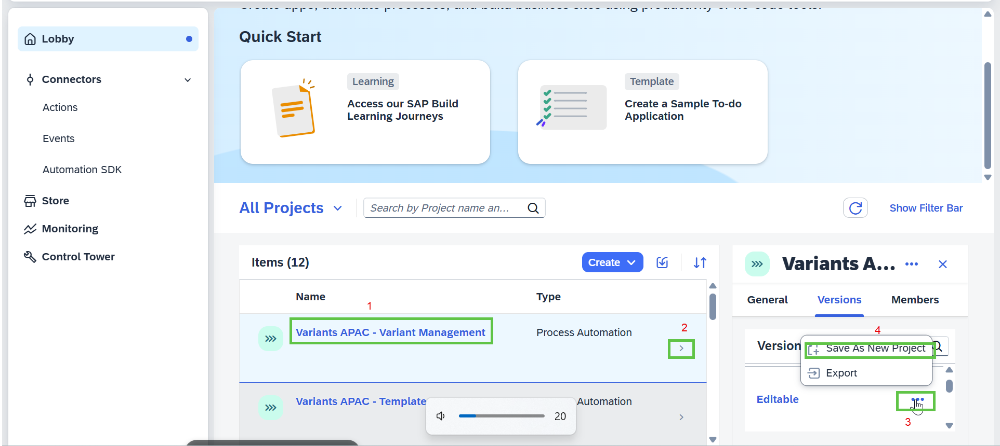 <br><br>
c.	Locate the Process Automation type of application with name “
Variants APAC - Variant Management” <br> 
<ul>
<li> Click on the arrow to Navigate </li>
<li> Choose <b> “Versions” </b> tab </li>
<li> Choose the option for Version as <b> “Editable” </b> </li>
<li> Click on <b>“Save as New Project”</b> </li>
<li> Give a different project name Variants APAC - Variant Management followed by your test user number (say for example, Variants APAC - Variant Management01) and description if required </li>
<li> Click on “Save as New” </li>
<li> A new project is saved now. </li> <br>
  
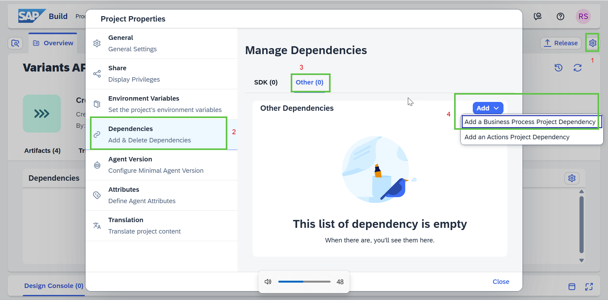 <br>
<li> Go to Settings -> Dependencies -> Others tab -> Add -> Add a Business Process Project Dependency </li>
<li> Add your template project which you created in previous step and click on Close </li>
</ul>

### Create Process Variant 
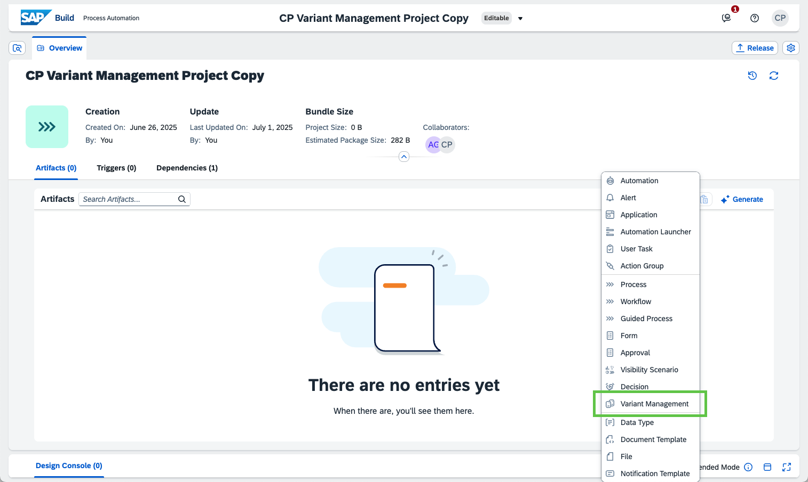 <br><br>

a.	For the creation of the variants first step is to create the Variant Management which is based on the template added as the dependency. To create the Variant Management, from the Overview tab, click on 
Create --> Variant Management. There can only be one Variant Management in a Project. In this project, in the interest of the time the Variant Management is already created for you. <br><br>
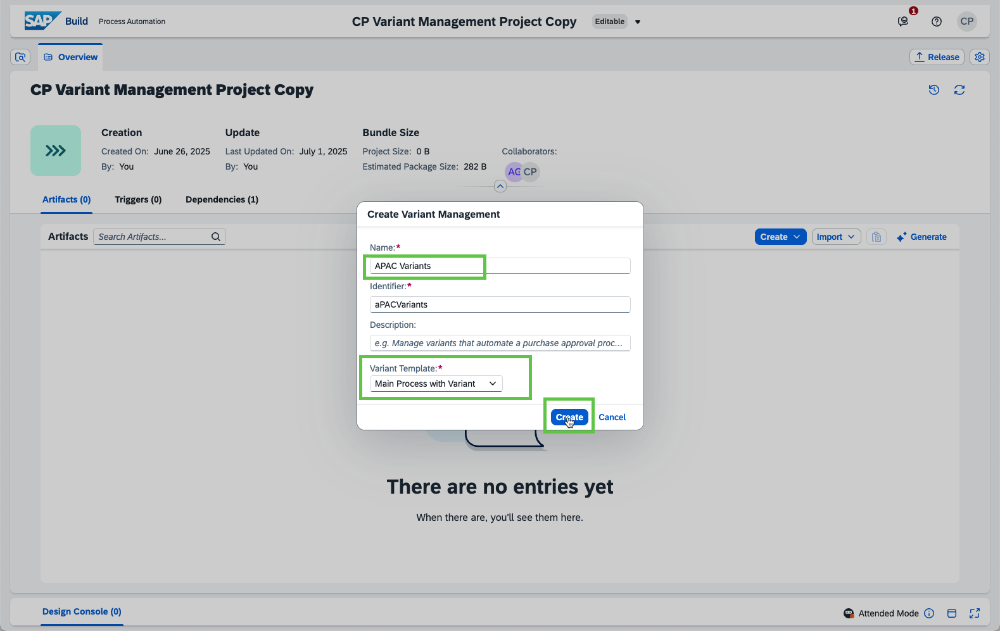 <br><br>
b. Give your Variant Management a name and choose the template. Please note this is the Variant template that you created in the project earlier. In this project, in the interest of the time the Variant Management is already created for you and we will proceed with the creation of Variants. <br><br>

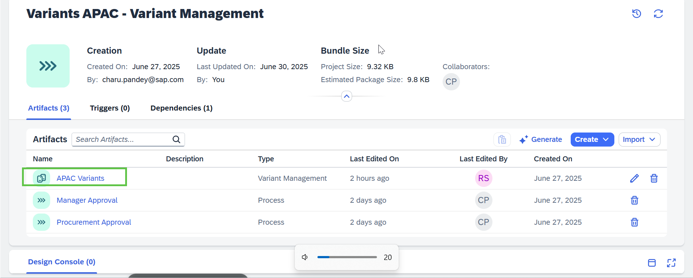<br><br>
c.	Click on APAC Variants. Here you can see that few variants are created already for you.<br> 
These variants have different start conditions. Based on the fulfillment of the condition, the relevant variant will start<br>

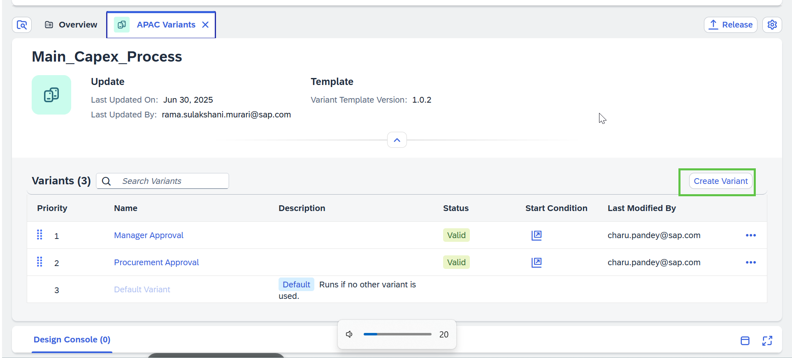<br><br>
d.	Click on “Create Variant” to create a new Process Variant <br><br>

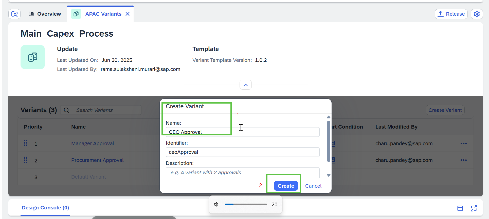<br><br>
e.	Enter the name of the variant as “CEO Approval_01” and click on Create button <br>
f.	Variant with name “CEO Approval_01“ is created now successfully <br><br>

### Add Start Condition 
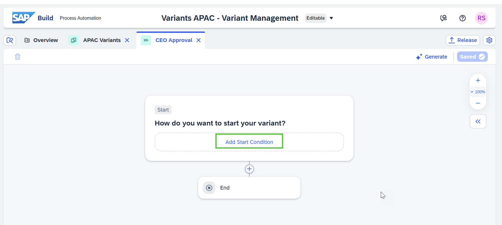<br><br>
a.	Click on “Add Start Condition” and it opens the Conditions Editor <br><br>
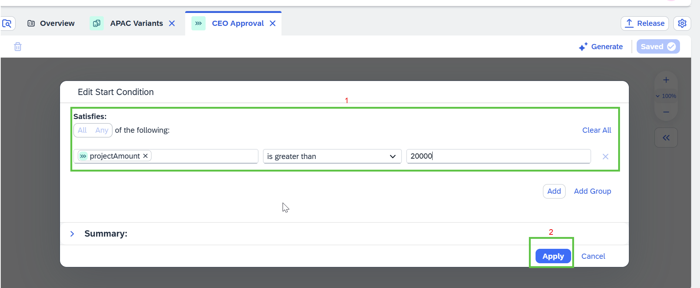<br><br>
b.	Give the condition as “projectAmount is greater than 20000” by choosing  <br>
<ul>
<li>projectAmount from Process input context</li>
<li>is greater than from dropdown </li>
<li>type 20000 for the actual amount to be compared </li>
</ul>              

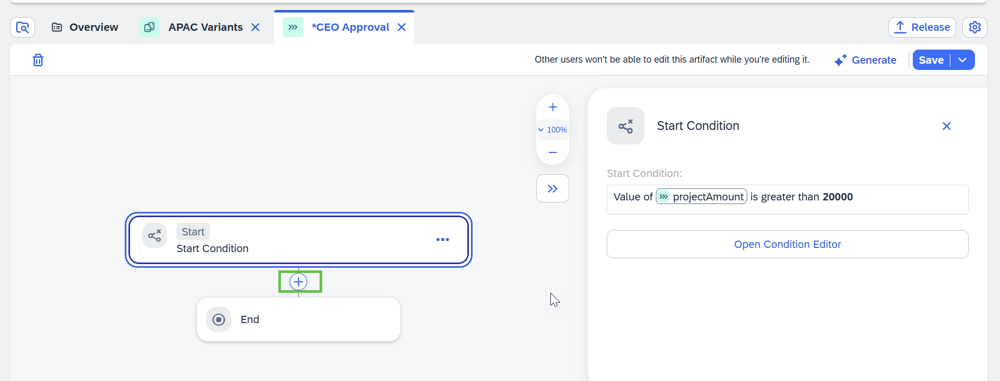<br><br>
Start Condition is all set now for the variant <br>

### Add Steps to Variants
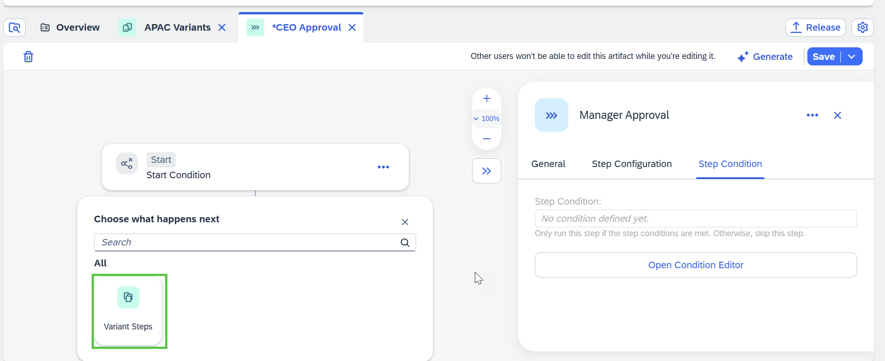<br><br>
a.	Click on + sign to add steps to variant. Here you will see the steps that has been exposed in the Variant Template <br>
b.	Choose Manager Approval Step <br>
c.	Manager Approval Step gets added <br><br>

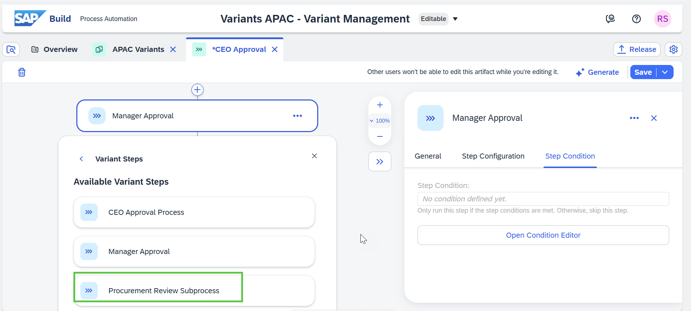<br><br>
d.	Again press on +sign below Manager Approval Step <br>
e.	Choose “Procurement Review Subprocess” step <br>
f.	Again press on +sign below Manager Approval Step <br>
g.	Choose “CEO Approval Process” step <br><br>


### Add Step Condition 
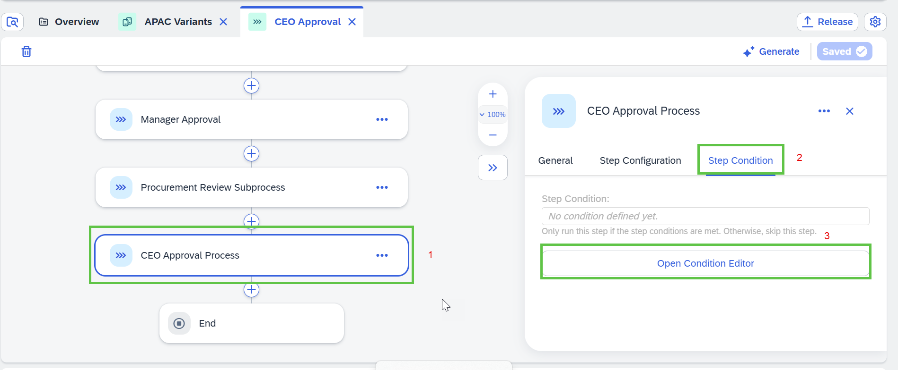<br><br>
a.	Click on “CEO Approval Process” step <br>
b.	Click on “Step Condition” tab <br>
c.	Open Condition Editor <br><br>
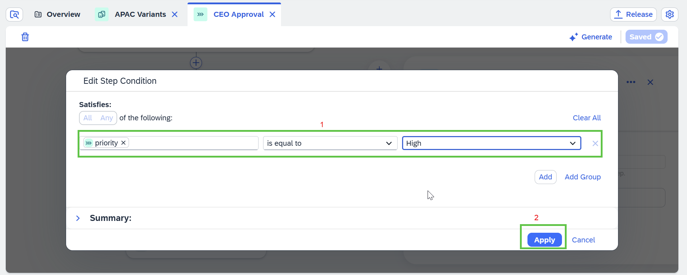<br><br>
d.	Set the step condition as “priority is equal to High” <br>
<ul>
<li>Choose “priority” from the Process Input Context </li>
<li>Choose “equal to” from drop down </li>
<li>Choose “High” from next drop down </li>
</ul>
e.	Click on Apply and close the Conditions Editor. <br>
f. Save the project<br><br>

### Add Step Configuration
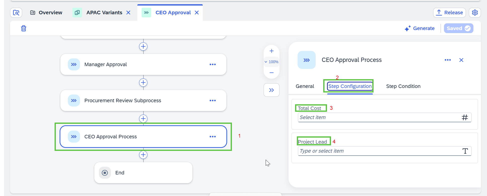<br><br>
a.	Click on “CEO Approval Process” step <br>
b.	Click on “Step Configuration” tab <br><br>
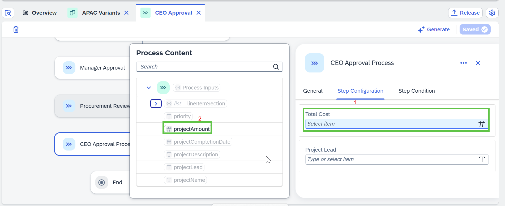<br><br>
c.	Click on Total Cost and choose “projectAmount” <br>
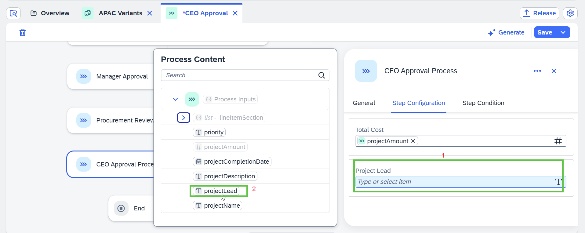<br><br>
d.	Click on Project Lead and choose “projectLead” <br>
e.	Save the project <br>

### Move Priority of Variants
a.	Click on APAC Variants  from Overview->Artifacts <br><br>
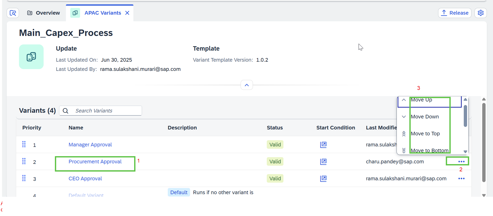<br><br>
b.	Click on --- at the end of “Procurement Approval” which has priority as 2 currently <br>
c.	Click on Move Up <br>
d.	Procurement Approval should get priority 1 now <br>
e.	Again Click on --- at the end of “Procurement Approval” which has priority as 1 currently <br>
f.	Click on Move Down<br>
g.	Procurement Approval should get priority 2 again now <br>
h.	On similar lines, you can try out Move to Top and Move to Bottom<br>

### Deactivate/Activate Variant
a.	Click on APAC Variants  from Overview->Artifacts <br><br>
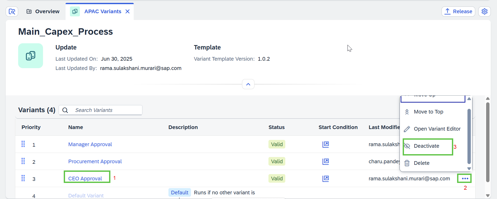<br><br>
b.	Click on --- at the end of “CEO Approval_01” Variant <br>
c.	Click on Deactivate <br>
d.	This variant becomes deactivated with status Invalid <br>
e.	Now , click on --- at the end of “CEO Approval_01” Variant <br><br>
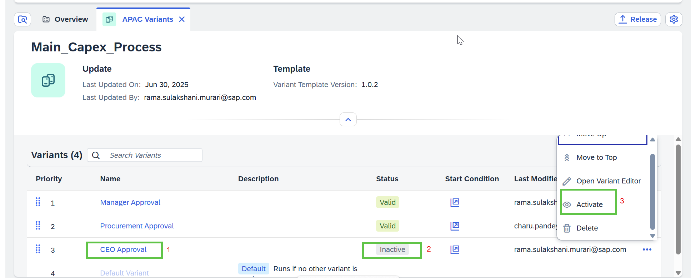<br><br>
f.	Click on Activate to activate the variant back <br>

### Release and Deploy the project 
a.	Click on Release button <br>
b.	Provide description as “Initial Version” <br>
c.	Click on Release <br>
d.	Successful project release should be shown with a “Show project version” link <br>
e.	Click on the “Show project version” link <br>
f.	Click on Deploy button <br>
g.	Choose an Environment same as your user name <br>
h.	Click on Deploy <br>
i.	Created Trigger will be shown with the option to Deploy <br>
j.	Click on Deploy button again shown here <br>
k.	Project should be deployed in the Environment successfully <br>

### Run the process
a. Go to `Control Tower -> Environments` <br>
b. Select environment - Choose the environment same as your user name <br>
c. Click on `More -> Processes and Worklfows` <br>
d. Filter by your project name <br>
e. Select the process - `Main_CapEx_Process` <br>
f. Click on `Start New Instance` <br>
g. Replace the content in the editor with an empty JSON <br>
```
{}
```
h. Click on `Start New Instance and Close`

### Check the Process Instance

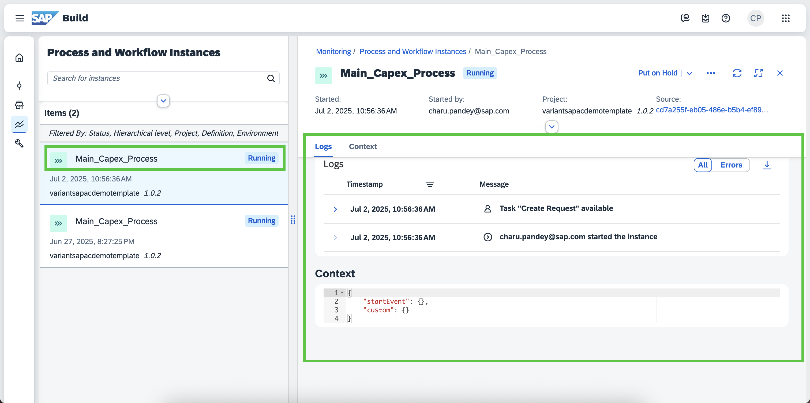<br><br>
a. Click on 'Show Instance'<br>
b. In the monitoring tab, locate your process and click on it.<br>
c. You will see the status of the running process.<br>
d. Task 'Create Request' will be available in your inbox. Click on My Inbox and locate the form.<br>
e. Fill the form and click on Submit.<br>
f. Based on the Start condition the relevant variant process starts as can be seen in the screenshot below. <br><br>
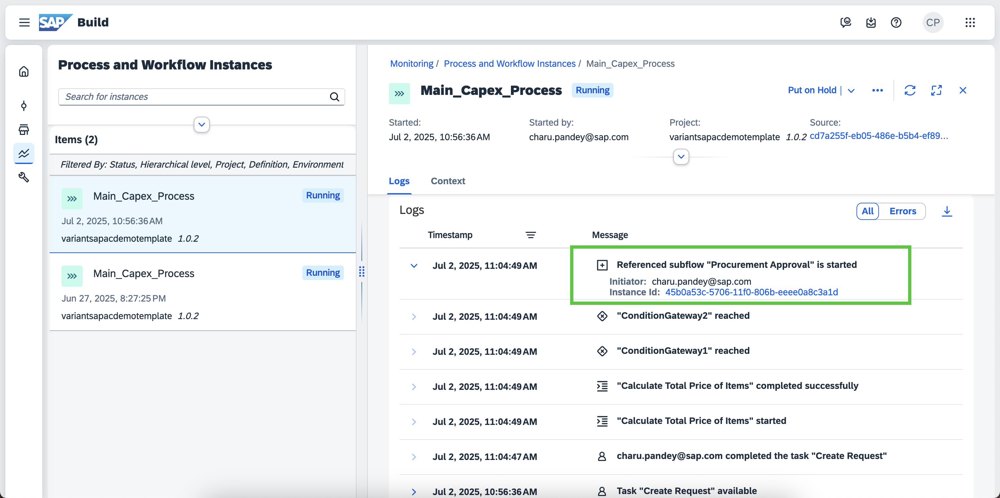<br><br>
g. Click on the instance to see the details of the running variant process
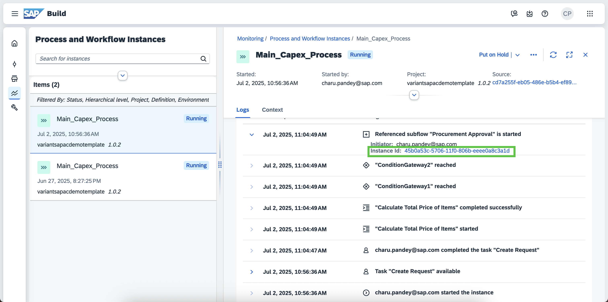<br><br>
h. You will get the approval form in your Inbox. Go to Inbox and open the Form received. You can fill the details like Vendor and Comments. Click on Approve. <br>
i. Come back to the Monitoring window and click on refresh icon.<br>
j. You will see that the variant execution is completed.<br><br>
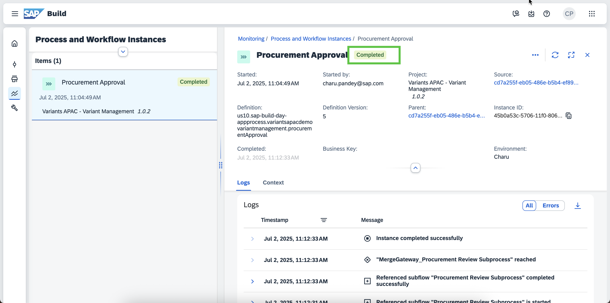<br><br>
k. Variant triggered is completed and you should see the execution moving to Post Variant steps <br><br>
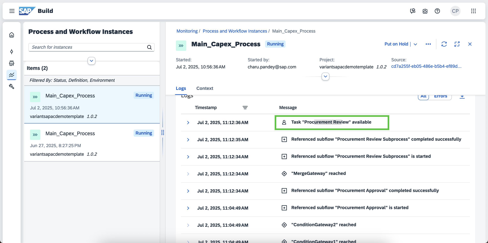<br><br>
l. You will get the series of forms. Please approve them and come to Monitoring tab click on Refresh<br><br>
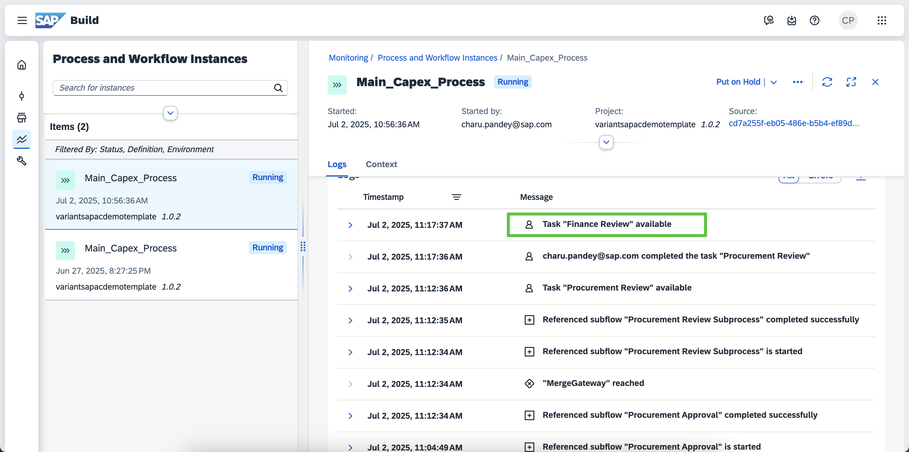<br><br>
m. Once all the steps are completed, the process execution will complete successfully.<br>
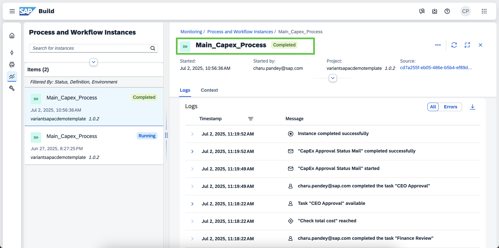<br><br>


## License
Copyright (c) 2022 SAP SE or an SAP affiliate company. All rights reserved. This project is licensed under the Apache Software License, version 2.0 except as noted otherwise in the [LICENSE](LICENSES/Apache-2.0.txt) file.
