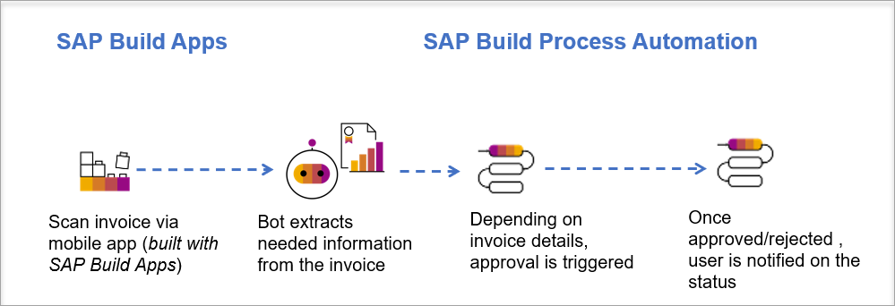

***Please click here to access the exercise:*** [Übung DSAG AK BPM 22.06.202](https://github.com/SAP-samples/process-automation-enablement/tree/main/Workshops/Sales%20Order%20Process%20and%20App)

<!---

# Prozesse und Anwendungen mit SAP Build – einfach mal machen

## Description

This repository contains the material for the DSAG hands-on session called "Prozesse und Anwendungen mit SAP Build – einfach mal machen".

## Overview

This session covers how to build apps, processes, and extract invoice data with bots. Leverage pre-built sample content package and enhance the sample process to integrate with the app. Finally, test your integrated scenario.

Scenario: Invoice Approval with SAP Build Apps & SAP Build Process Automation

  

## Requirements

There are no dedicated requirement for this exercise. But in case you want to gain some further knowledge around SAP Build Process Automation, please feel free to attend these virtual SAP TechEd workshops:
- Learn how to build a process, decisions and RPA bots from scratch in [AD182 - Build Process Automations and Extensions to SAP Solutions](https://go3.events.sap.com/sapteched/hybrid/2022/reg/flow/sap/saptech2022/sapteched2022catalog/page/catalog/session/1661198036950001EHbd)
- Learn how to build a process, decisions and extract the data from documents with RPA bots in [AI180 - Automate Your Invoice Processing with SAP Build Process Automation](https://go3.events.sap.com/sapteched/hybrid/2022/reg/flow/sap/saptech2022/sapteched2022catalog/page/catalog/session/1661198041428001ExKO)

## Exercises

- [Exercise 1 - Create SAP Build Apps Project](exercises/1_CreateBuildAppProject)
- ~~[Exercise 2 - Install Desktop Agent 3](/exercises/2_InstallDesktopAgent3)~~ ***not needed as already done for you***
- [Exercise 3 - Import Sample Business Process from SAP Build Process Automation store ](exercises/3_ImportSampleProcess)
- [Exercise 4 - Modify the Process](exercises/4_TriggerProcess)
- [Exercise 5 - Modify Automation](exercises/5_ModifyAutomation)
- [Exercise 5a - Update Decision](exercises/5a_UpdateDecision)
- [Exercise 6 - Release, Deploy and Test Business Process](exercises/6_ReleaseDeployProcess)
- [Exercise 7 - Test SAP Build Apps and Business Process](exercises/7_TestingEndToEndScenario)

## How to obtain support

Support for the content in this repository is available during the actual time of the online session for which this content has been designed. Otherwise, you may request support via the [Issues](../../issues) tab.

## License
Copyright (c) 2022 SAP SE or an SAP affiliate company. All rights reserved. This project is licensed under the Apache Software License, version 2.0 except as noted otherwise in the [LICENSE](LICENSES/Apache-2.0.txt) file.
--->
