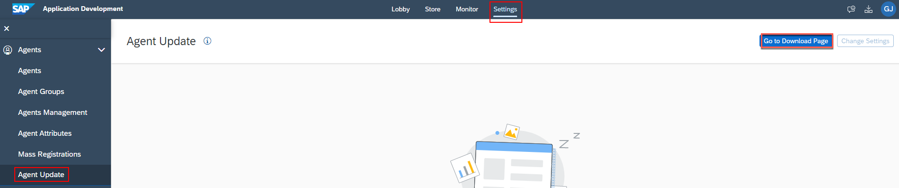

- [Overview](#overview)
- [Prerequisites](#prerequisites)
- [Download the Desktop Agent 3](#download)
- [Install the Desktop Agent 3](#install)
- [Register the Desktop Agent on your Tenant](#register)
- [Add your agent](#add)
- [Summary](#summary)

### Overview 

The Desktop Agent 3 is an on-premise component of SAP Build Process Automation that is installed locally on user desktops. It executes automation projects that launch and run applications of various kind, read information from screens, enter data, click options, and process data.

In this exercise you will learn:
- How to install the Desktop Agent 3 to run your automations
- How to register a tenant in the Desktop Agent 3

## Download the Desktop Agent 3 

The setup program is provided in the form of an industry standard Windows MSI installer.

1. You can install the Desktop Agent 3 from SAP Application Development. Navigate to the **Settings** on your tenant, choose **Agent Update** under **Agents**. Select **Go to Download Page** button.

    

2. Download the file.

    

## Install the Desktop Agent 3 

When you install the Desktop Agent 3, it will automatically set up the SAP Process Automation web browser extension for Google Chrome and Edge.

>To prevent issues during the installation, please close all the Chrome or Edge tabs opened on your machine.

>The minimum version of the Desktop Agent supported by SAP Process Automation is **3.7.41**.

1. Open the downloaded file with **administrator rights**. Select **Next** to begin the installation process.

    

2. Make sure you install the service, and confirm.

    

3. Wait for the installation process to complete.

    

4. Once the installation is successfully completed, choose **Finish** and launch the Desktop Agent 3.

    >A Google Chrome extension and an Edge add-on are installed when you install the Desktop Agent but you have to enable them (at least the Google Chrome extension).

6. On Google Chrome, select **Manage extensions** under Extensions.

    

7. Enable SAP Process Automation extension.

    

## Register the Desktop Agent on your Tenant 

Once the installation steps of the SAP Robotic Process Automation setup wizard are completed, you need to register your agent and connect it to a SAP Process Automation tenant in order to execute automations.

> The Agent icon will be available on your System Tray, when the Desktop Agent 3 is installed.

1. After Step 3 completed. Open the **Download Page**. If the **Register Agent** is enabled, refresh the page.

    

2. Once the process is completed, open the **Desktop Agent 3** and confirm the tenant configuration.

    

3. The tenant is active.

    

4. Once you completed the previous actions, log in to your tenant with your user name or e-mail and password.

    

5. The Agent should be in **Idle** state, waiting to start a project. To check, go to **Settings**, and select **Agents**.

    

## Add your agent 

1. Navigate back to the **Application Development**. Select **Settings**. Choose **Agents Management** then **Add Agent**.

    

2. When the pop-up window opens, select your agent and choose **Add agent**.

    

3. Your agent is now added and ready to run.

  

## Summary 

You have now successfully installed and configured your Desktop Agent 3.

Continue to - [Exercise 3 - Import Sample Process from SAP Build Process Automation Store](../3_ImportSampleProcess/Readme.md)
