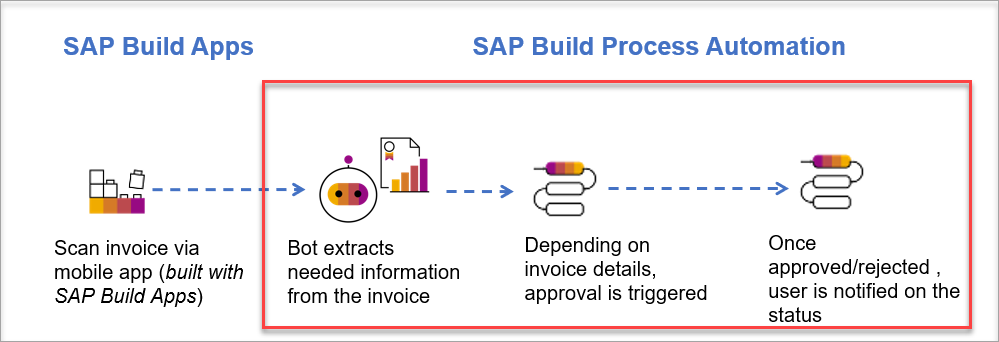
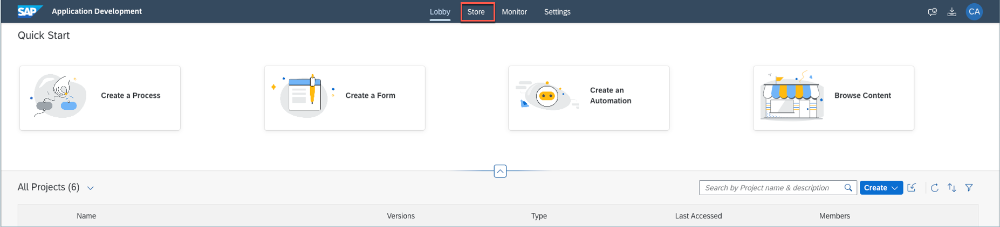
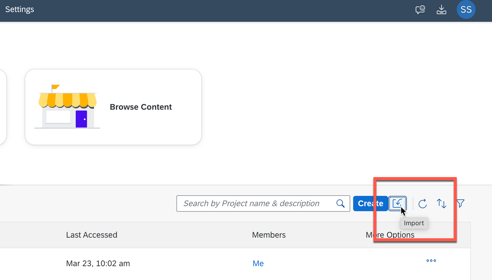
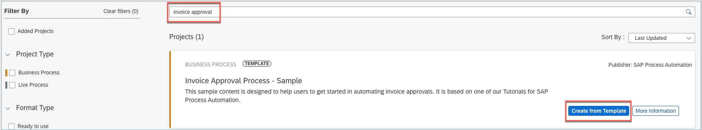
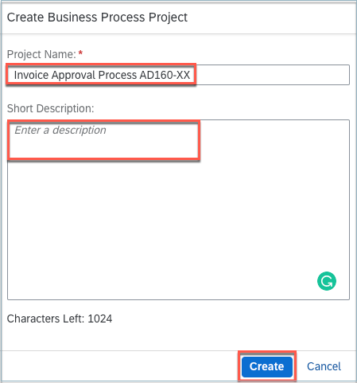
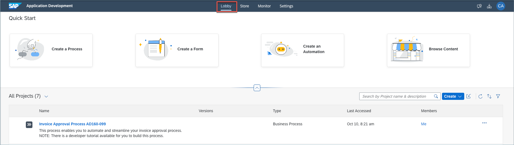

## Table of Contents
 - [Overview](#section1)
 - [Explore the store](#section2)
 - [Acquire a Project](#section3)
 - [Summary](#summary)

### Overview 

In this exercise, you will  acquire Invoice Sample Process from SAP Build Process Automation Store.
This sample content helps users to get started in automating a simple invoice approval process that includes the extraction of data from documents and approval steps required to approve the invoice.
This sample process includes the following:
- Sample request form to start the invoice processing.
- An automation (and respective data types) to extract the data from an invoice.
- An approval step to decide for approval or rejection of the invoice.
- Confirmation and rejection forms to notify the requester about the decision.

    

## Explore the store 

>The Store offers predefined content for your automation. Packages are categorized by catalog which let you choose between Business Content, Learning Content and Automation SDK.

1. Open [SAP Build Process Automation - Application Development Lobby](https://lcnc-roadshow-applicationdevelopment.lcnc.cfapps.eu10.hana.ondemand.com/lobby).
  Navigate to the store in your Tenant, to find sample content.

    

## Acquire a Project 

<!---
-------
**Hint:** in case the store is not coming up, please just download the project here and import it via the Lobby: [Sample Content](https://github.com/SAP-samples/process-automation-enablement/blob/main/Workshops/DSAG%202023/exercises/3_ImportSampleProcess/Invoice%20Approval%20Process%20-%20Sample%20Copy%201.mtar)

------
--->
1. Acquire the **Invoice Approval Process - Sample** application package:

  - Search for **Invoice Approval Process - Sample**.
  - Select **Create from Template** button.

    

2.	Create a Business Process Project from the template.

  - Under **Project Name** field, type: Invoice Approval Process AD160-XXX (replace `XXX` with your User ID to identify the project later).
  - Under **Short Description** field, type: Invoice Approval Process.
  - Choose **Create**.

    

4. To see the newly created project, navigate back to the **Lobby** from the top menu.

    

## Summary

You have now acquired Invoice Sample Process from the SAP Build Process Automation Store.

Continue to - [Exercise 4 - Trigger Process](../4_TriggerProcess/Readme.md)
