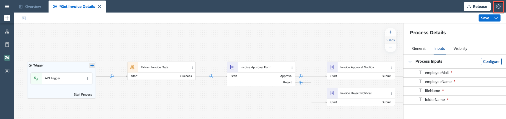
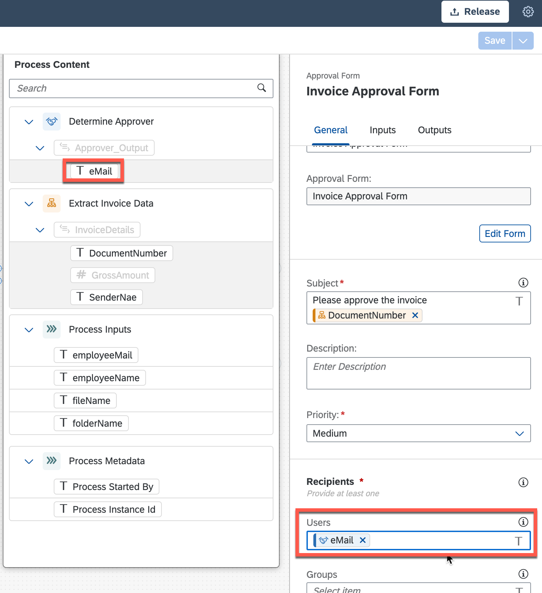

## Table of Contents
 - [Overview](#overview)
 - [Modify the Project](#modifyProject)
 - [Create an API Trigger for Process](#configureInputs)
 - [Map API parameters to Process parameters](#mapParameters)
 - [Summary](#summary)

### Overview 

In this exercise you will learn:

- How to configure the API Call to Trigger Process
- How to modify the Process to map the other artifacts
- How to map Automation and Process parameters

## Modify the Project 

1. Open your project **Invoice Approval Process AD160-XXX**. Choose process **Get Invoice Details**.

    

2. Select the **Invoice Request Form**, choose the 3 dots and then **Remove** to delete the form.

    
    
    Confirm the "Warning" window and click **OK**.

## Create an API Trigger for Process 

1. In the process builder canvas, on the Trigger tile, select **+**. Then choose **API** and finally **New Api Trigger**.

    

2. In the Create API Trigger window do the following:

- Enter the name: API Trigger.
- Choose **Create**.

    > The identifier is generated based on the name.

    

3. Click on the **Canvas** in the background.

    

4. In the **Process Details** side panel, choose **Inputs** and then **Configure** to configure inputs.

    

5. Configure four inputs. Enter the following names and types:

    |  **Name**    | **Type**
    |  :------------- | :-------------
    |  `fileName`       | string
    |  `folderName`     | string
    |  `employeeName`   | string
    |  `employeeMail`   | string

    **Apply** changes.

    

6. Select Project Properties.

    

7. Choose **Configure Agent Version** and select Agent version: **Agent 2.0.00** (Registered) and **Save**.

    

8. Choose **Dependencies**, select **Add Dependency** and then **Add a Business Process project dependency**.

    

9. Under **Package**, select **Document Management Repository**.

    

10. Select **Add** button.

    

11. **Close** the Project Properties window.

    

    > With this package you can automate some operations on your Document Management Service repository.

## Map API parameters to Process parameters 

1. Map parameters for **Invoice Approval form**. Select **Invoice Approval Form** and map:
    - Under **General**, map underneath "Determine Approver" **eMail** with Users.
    

    - Under **Inputs**, map **Employee Name** with **employeeName**.
    

2. Map parameters for **Invoice Approval Notification Form**. Select **Invoice Approval Notification Form**, under **General**, map **employeeMail** with Users.

    

3. Map parameters for **Invoice Reject Notification Form**. Select **Invoice Reject Notification Form**, under **General**, map **employeeMail** with Users.

    

4. **Save** changes.

    

## Summary 

You have now created API Triggers for the Business Process.

Continue to - [Exercise 5 - Modify the Automation](../5_ModifyAutomation/Readme.md)
