## Table of Contents
 - [Overview](#overview)
 - [Modify the Automation](#modifyAutomation)
 - [Map Automation parameters to Process parameters](#mapParameters)
 - [Summary](#summary)

### Overview 

In this exercise you will learn:

- How to modify and add an automation as a dependency.

The pre-built automation extracts the data from the Invoice document using AI.

## Modify the Automation 

1. Once the dependency is completed, choose **Extract Invoice Data**, select three dots, and then **Open Editor**.

    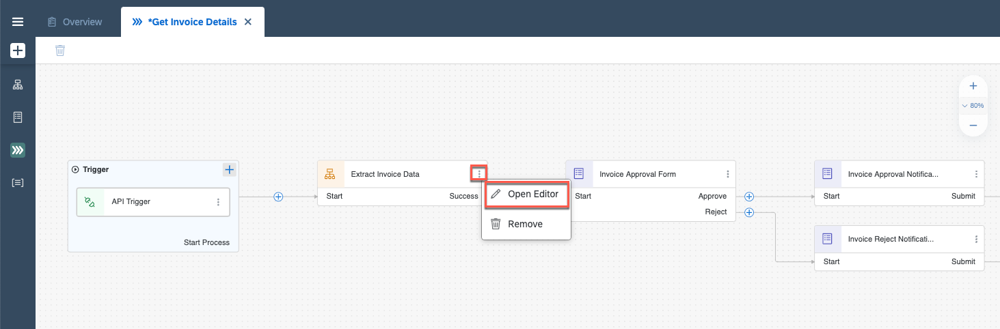

2. In **Automation Details**, go to **Input/Output** to modify the parameters.

- Rename **FilePath** to **fileName**.
- Select **Add new input parameter** and name it **folderName**.

    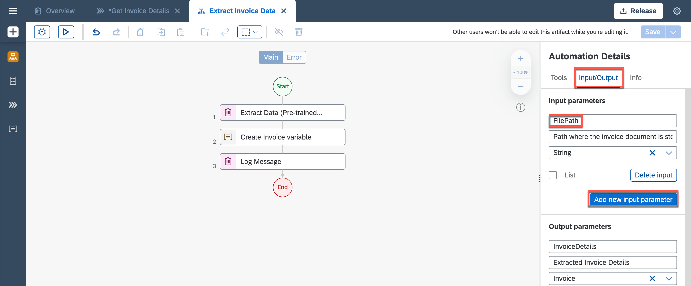

    After the changes the parameters should look like this:

    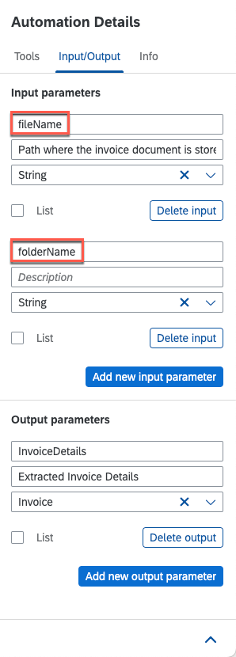

3. Go to **Tools**, select **Automations** and drag and drop the **Download document** automation into the canvas, just before **Extract Data** activity.

    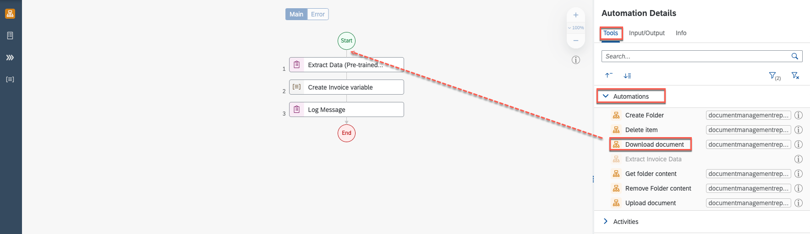

4. Select **Download document** automation.

5. You will now map the **Input Parameters**. Select **Edit Expression** next to **uploadedFileName** field.

    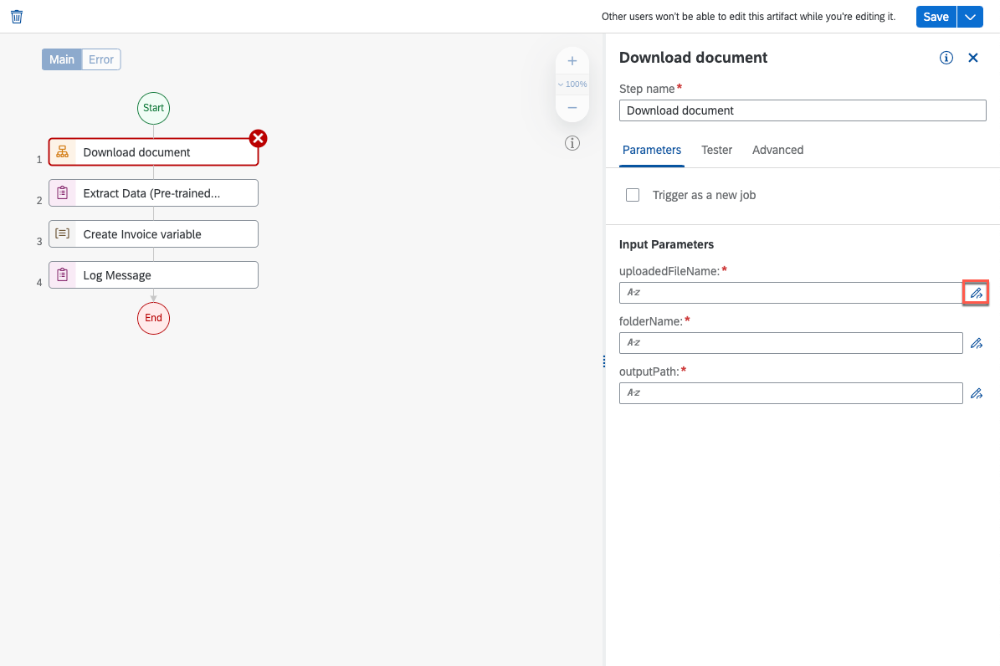

6. Map with variable **fileName** and select **Save Expression**.

    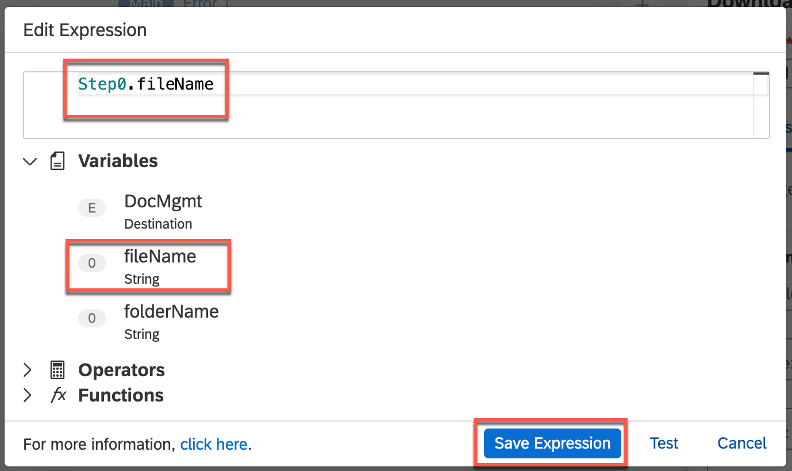

7. Select **Edit Expression** next to **folderFileName** field.

    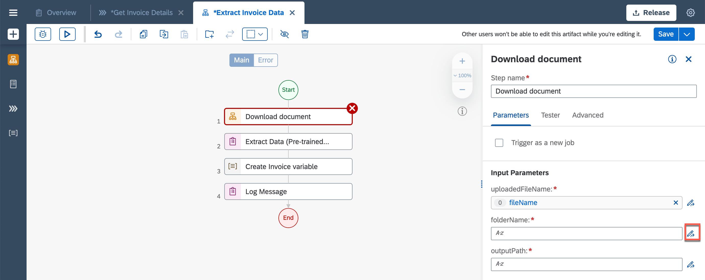

8. Map with variable **folderName** and select **Save Expression**.

    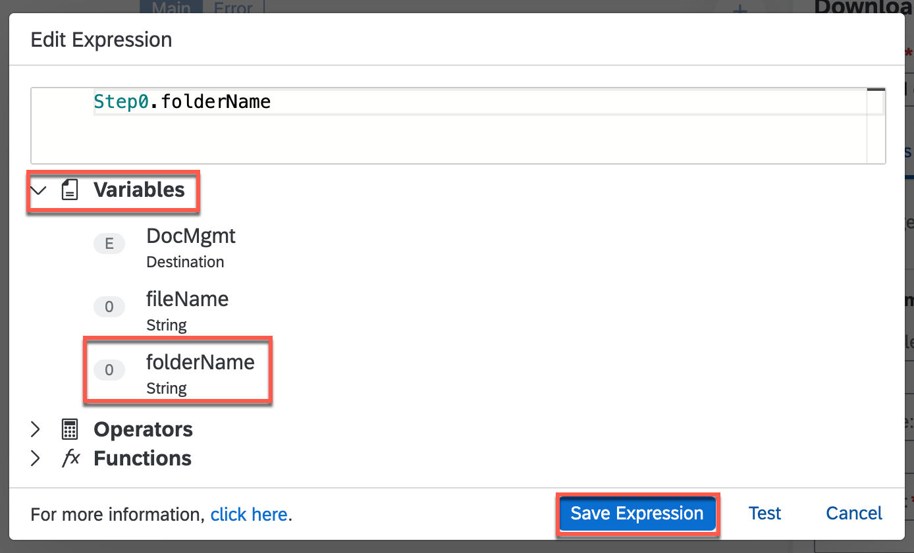

9. The **outputPath** needs to be hard-coded:

    - Open the expression editor.

    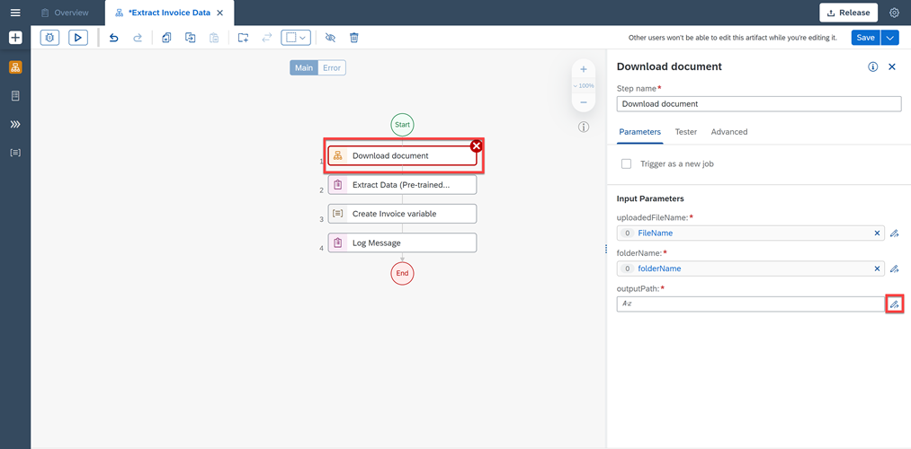

    - In the Edit Expression window paste following value:

      <pre> "C:\\Users\\Public\\" + Step0.fileName </pre>

      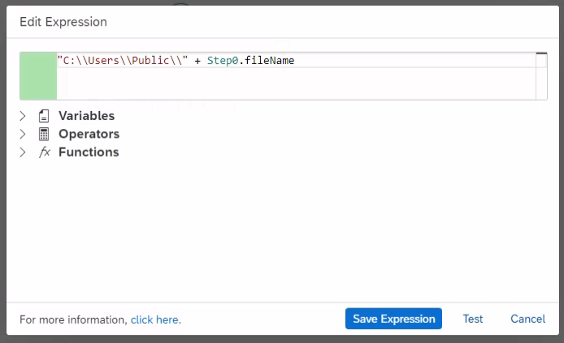

      > To check if the Expression is correct, click on Test button. If it is highlighted in green, it means the expression is correct.

10. Choose **Save Expression**.

11. Select **Extract Data**. In Input Parameters, next to **documentPath** open the Expression Editor.

    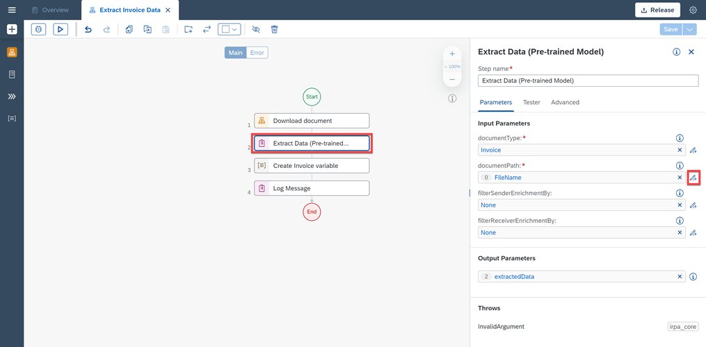

12. Once the **Edit Expression** window opens, replace the value with:

    <pre> "C:\\Users\\Public\\" + Step0.fileName </pre>

    > To check if the Expression is correct, click on Test button. If it is highlighted in green, it means the expression is correct.

13. Choose **Save Expression**.

14. **Save** your work.

## Map Automation parameters to Process parameters 

1. Go to the process tab **Get Invoice Details**. Select **Extract Invoice Data** and map the following inputs:

- Map **fileName** with **fileName**.
- Map **folderName** with **folderName**.

    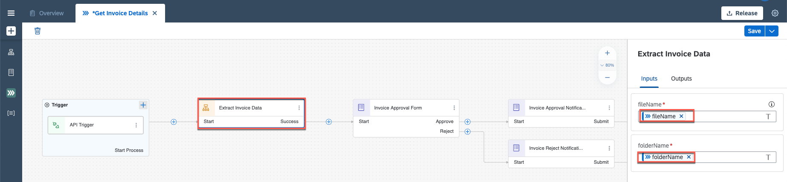

2. **Save** your work.

## Summary 

You have now modified the project.

Continue to - [Exercise 5a - Update Decision](../5a_UpdateDecision/readme.md)
