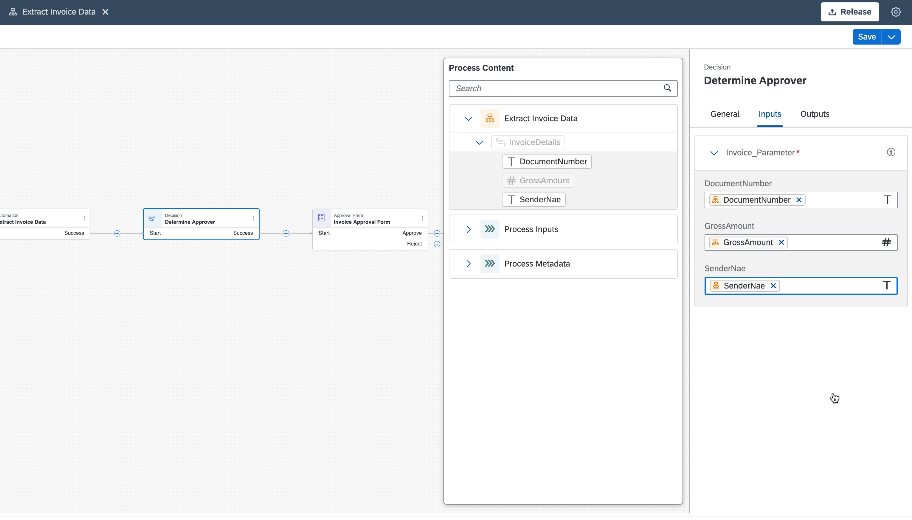
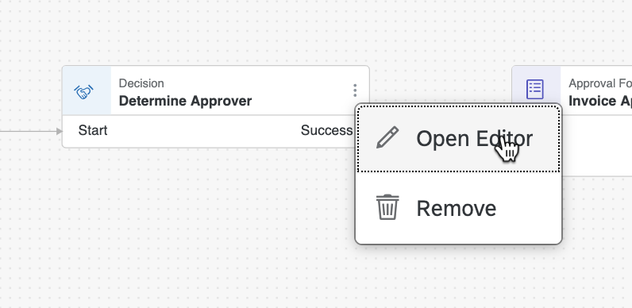
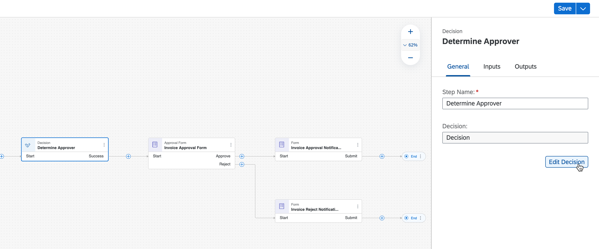
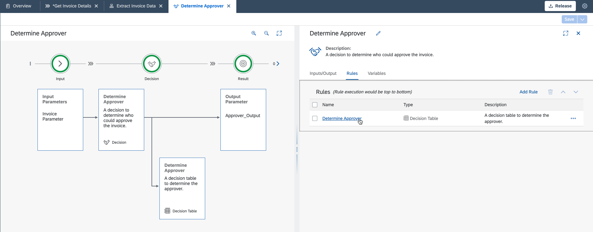
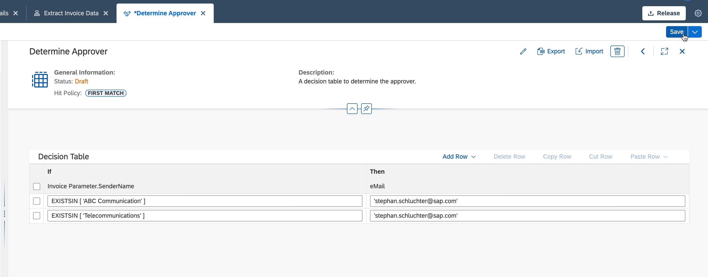
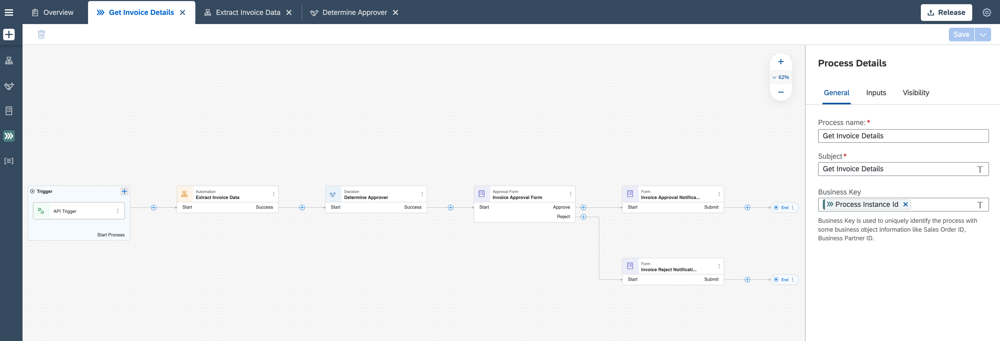

## Table of Contents
 - [Overview](#overview)
 - [Update Business Rule](#updateBR)
 - [Summary](#summary)

### Overview 

In this exercise you will learn:

- How to udpate the business rule and related decision

## Update Business Rule 

1. Choose **Release** to release the project.

    
    
    
    
    
    
    
    
    
    
    
    
    
    
    
    
    
    
