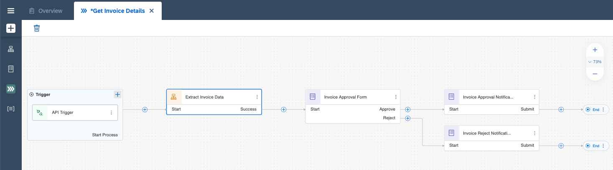
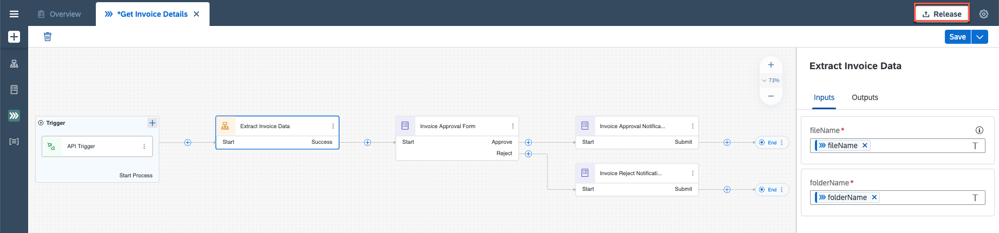
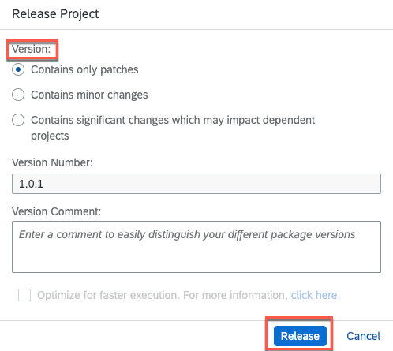
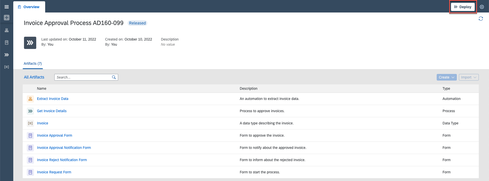
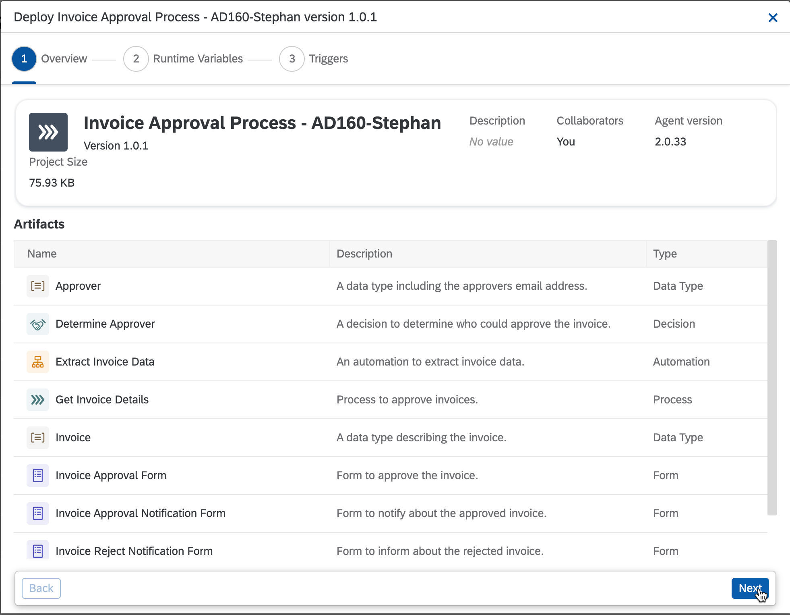
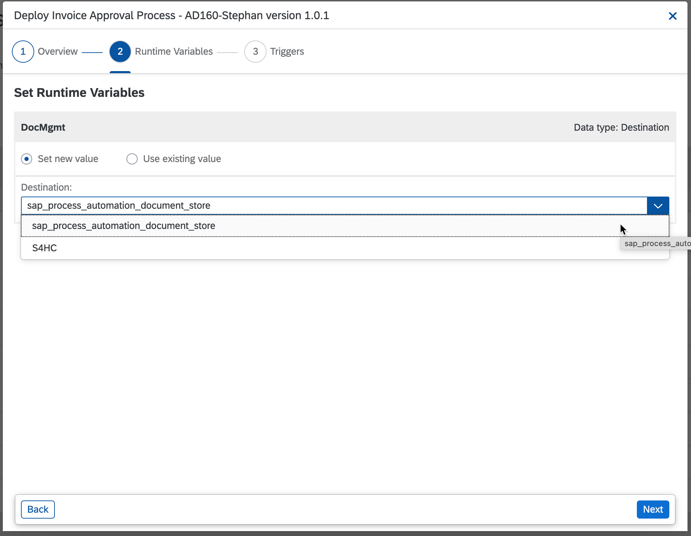
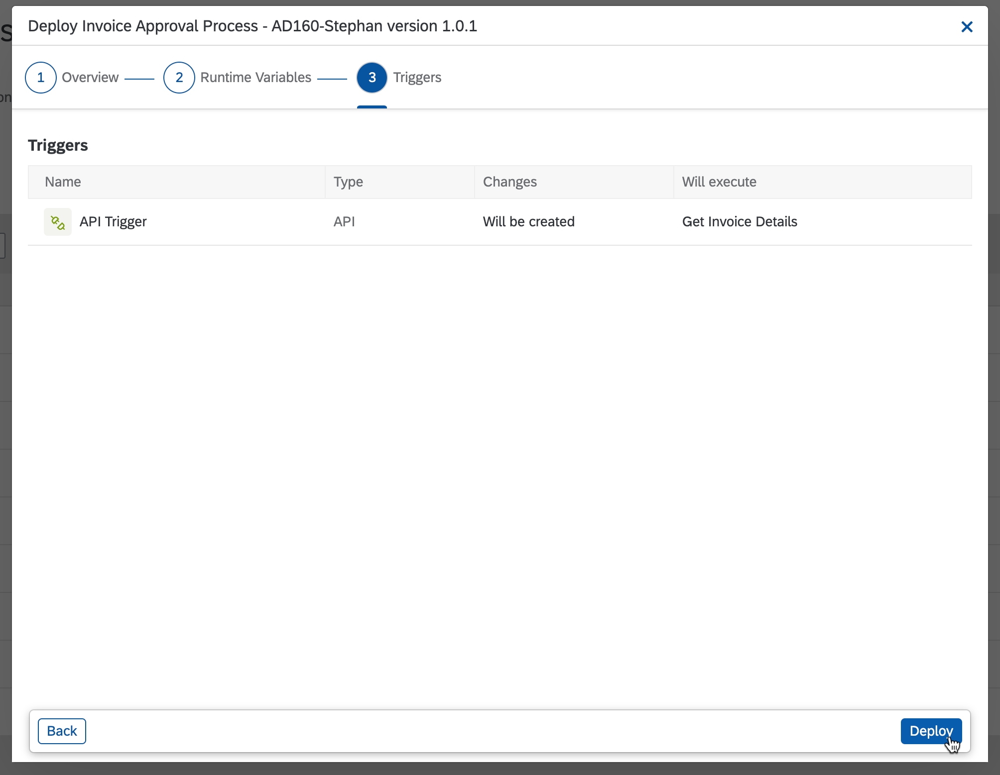
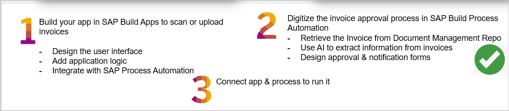

## Table of Contents
 - [Overview](#overview)
 - [Release and deploy Business Process](#releaseDeploy)
 - [Summary](#summary)

### Overview 

In this exercise you will learn:

- How to release and deploy the Business Process

## Release and deploy Business Process 

After completing Modify Automation exercise your process looks like this:

> Before releasing your project, please make sure there are no error messages in the Design Console indicating that your project contains errors.

1. Choose **Release** to release the project.

    

2. Select the **Version** and confirm **Release**.

    

3. Choose **Deploy** the project.

    

4. All the created and updated artefacts are listed here. Click **Next**.

    

5. In the window **Set Runtime Variables** select **Set new value**, as the destination select **sap_process_automation_document_store** and then click **Next**. 

    
    
6. Select **Deploy** to deploy your project.

    

## Summary 

You have now successfully released and deployed your project and completed the below steps in your process.

Continue to - [Exercise 7 - Test End to End Scenario](../7_TestingEndToEndScenario/README.md)
