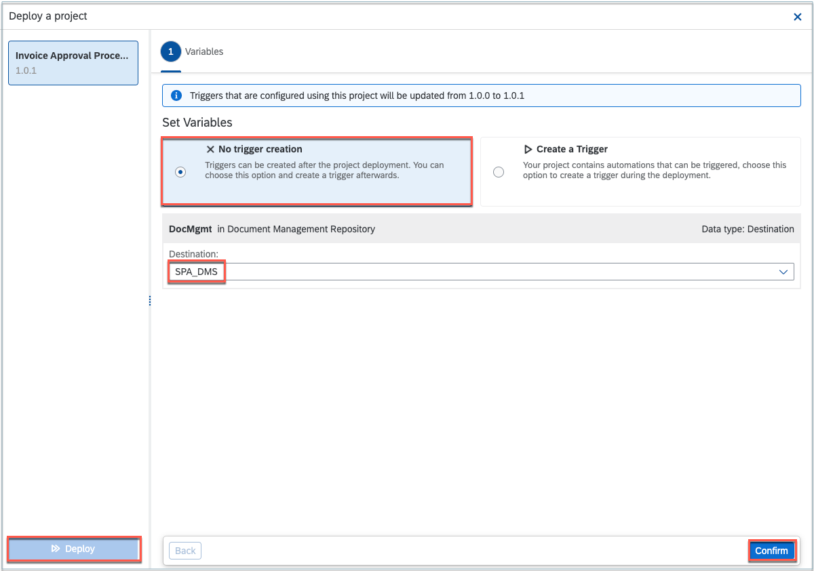

## Table of Contents
 - [Overview](#overview)
 - [Release and deploy Business Process](#releaseDeploy)
 - [Summary](#summary)

### Overview 

In this exercise you will learn:

- How to release and deploy the Business Process

## Release and deploy Business Process 

After completing Modify Automation exercise your process looks like this:

> Before releasing your project, please make sure there are no error messages in the Design Console indicating that your project contains errors.

1. Choose **Release** to release the project.

    

2. Select the **Version** and confirm **Release**.

    

3. Choose **Deploy** the project.

    

4. Once you have successfully [configured Document Management Repository and Destination in SAP BTP Cockpit](https://help.sap.com/docs/PROCESS_AUTOMATION/a331c4ef0a9d48a89c779fd449c022e7/3da3846d0da94d96a4f38688cd2e936a.html?locale=en-US&version=Cloud) in the **Deploy a project** window do the following:

    - Under **Set Variables**, choose **No trigger creation**.
    - Under **Destination** choose **SPA_DMS**.
    - Choose **Confirm**.
    - Select **Deploy** to deploy your project.

    

## Summary 

You have now successfully released and deployed your project and completed the below steps in your process.

Continue to - [Exercise 7 - Test End to End Scenario](../7_TestingEndToEndScenario/README.md)
