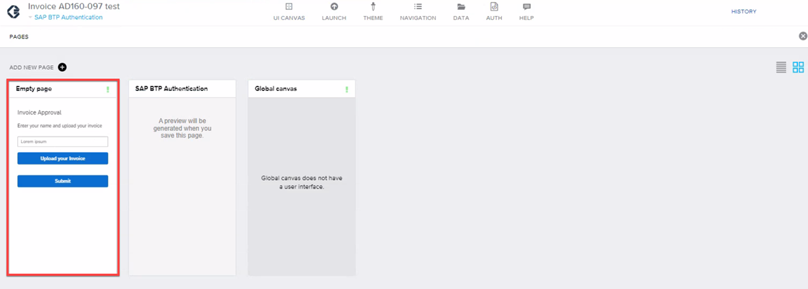
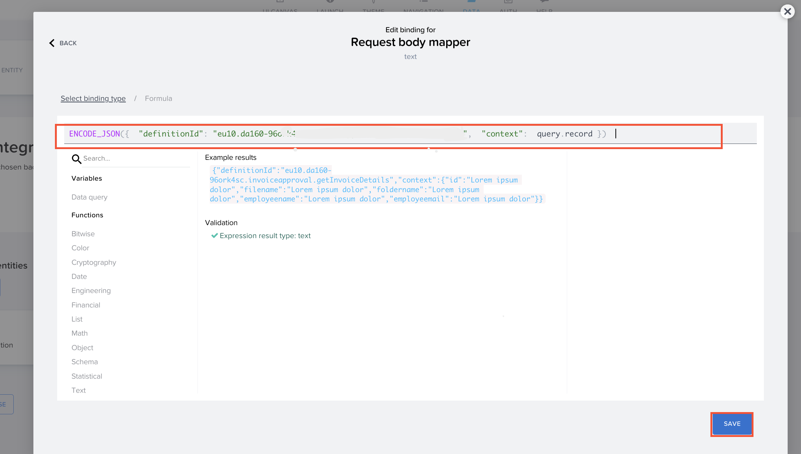
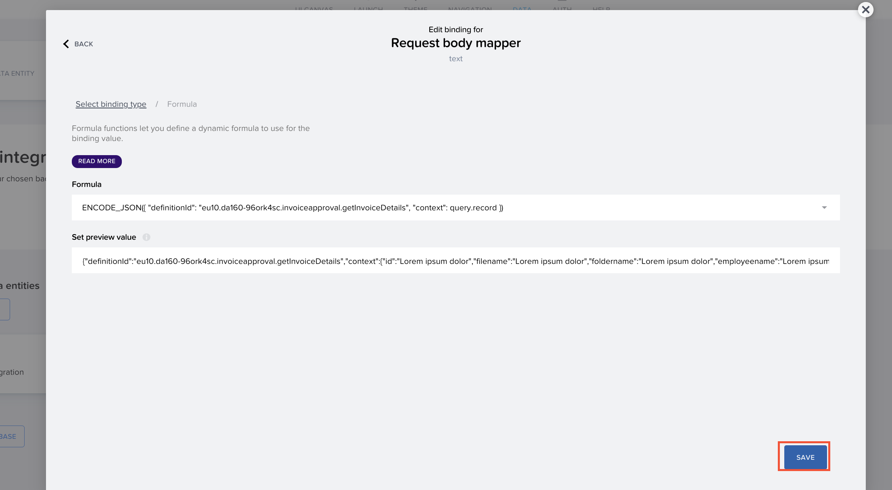
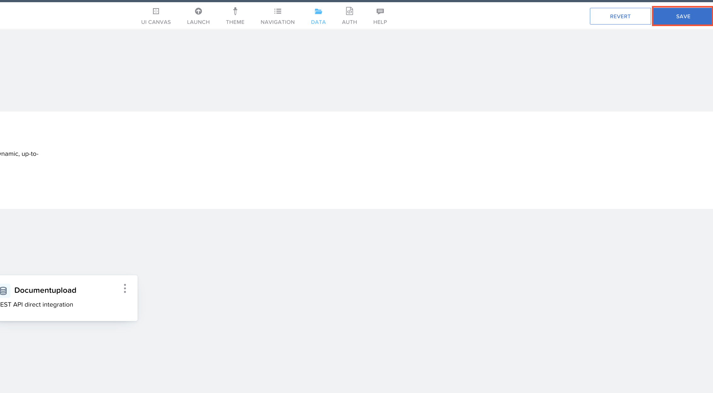
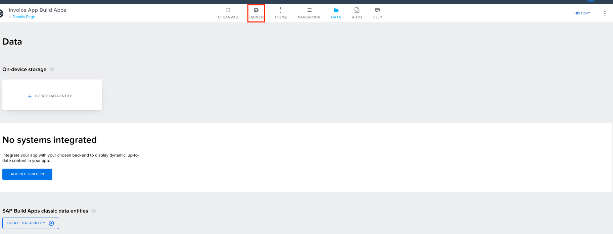
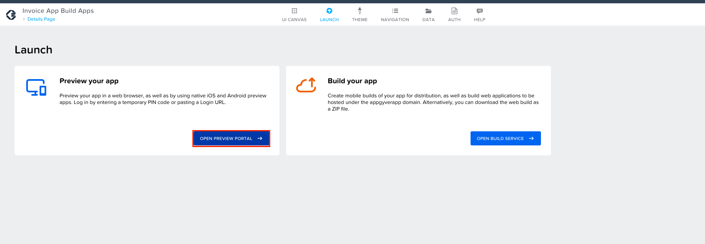
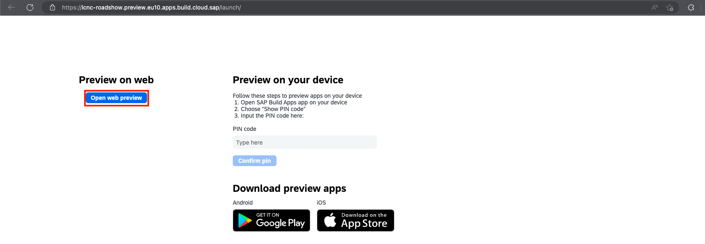
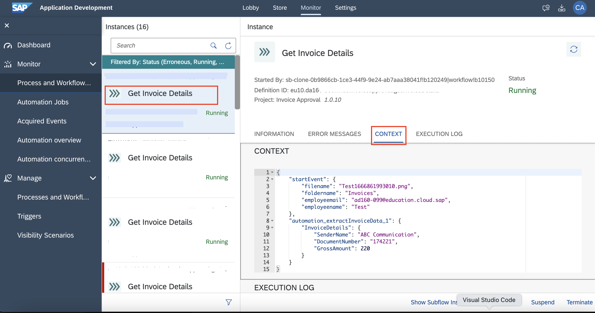
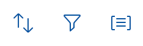

## Table of Contents
- [Overview](#overview)
- [Definition ID from SAP Build Process Automation](#SPA)
- [Definition ID to SAP Build Apps](#build)
- [Testing the app](#Test)
- [Monitoring and approving the process](#name)

## Testing the End to End Scenario 
Although, your application is connected to SAP Build Process Automation service, it is not connected to the process you created yet. At this stage, you will see how to connect your app and process.

## Copy Definition ID from SAP Build Process Automation 

1. Open the <b>SAP Build</b> lobby. Choose the <b>Monitor</b> tab.  

2. Click on <b>Process and Workflow</b> under the <b>Manage </b> section.  

3. Search for your project name under <b>Project</b>. Select the project you created with the ID provided to you. For example: <b>Invoice Process AD160-XXX</b>.  

4. After you find your process, copy its <b>Definition ID</b>.  

## Enter the Definition ID in SAP Build Apps. 

1. Go back to the **Lobby** and open your Build Project. Choose **SAP BTP Authentication** to go back to your project.  

2. Choose **Empty page** to view your project.  

3. Click on <b>DATA</b> tab.   

4. Select the <b>SendtoSPA</b> data entity.  

5. In the <b>create</b> tab, open the binding menu for <b> Request body mapper</b>.  

6. Open the formula editor. Enter the following formula:

    <pre>ENCODE_JSON({  "definitionId": "<b>Your Definition ID copied from SPA</b> ",  "context":  query.record })  </pre>

    Click on <b>SAVE</b>.  
    

7. Click on <b>SAVE.</b>  
    

8. You can test if this Data connection is working. Switch to <b>TEST</b> tab and enter the below values in the following fields to test the connection:
    - filename: <i>Test1666861993010.png</i>
    - foldername: <i>Invoices</i>
    - employeemail: <i>Test</i>
    - employeename: <i>Test</i>

    Click on <b>RUN TEST</b>.

    

10. Scroll down and check the Status of the Response.

    > If you are getting any error please recheck the steps 1-6, else request help from the presenters.
If you get the response as <b>Status:OK</b>, then the connection is successful. 

    Select **SAVE DATA RESOURCE**.

    

11. Click on <b>SAVE</b> on the top right corner to save the changes.

    

## Testing the App 

1. Open the <b>Launch</b> tab.  

2. Click on <b> OPEN APP PREVIEW PORTAL</b>.  

3. Click on <b>Open web preview</b>.  

3. Select the Build Apps project you created.  

4. Enter the name and upload the invoice to test the process.
The invoice can be downloaded <a href="https://github.com/SAP-samples/process-automation-enablement/blob/main/Workshops/DSAG%202023/exercises/1_CreateBuildAppProject/images/Invoice.png?raw=true">**HERE**</a>.

    

5. After uploading the invoice, click on **Submit** button.  

6. If the invoice is submitted successfully, you should receive a success toast message.  

## Monitoring and approving the Process 

1. Navigate back to the **SAP Build Lobby**, choose the **Monitor** tab, and then **Process and Workflow Instances**.

    

2. Choose **Get Invoice Details** instance, to check the status of the **CONTEXT** to see the details of approval request, and **EXECUTION LOG** to see the steps executed by the process.

    

    > In the **EXECUTION LOG**, you can see how the process instance progresses further to the approval step in the business process.

    

3. Open **My Inbox** application by selecting the button at the top right corner.

    

4. After opening the **My Inbox** application, you will see on the left-hand side all the tasks listed. Select the task with the invoice number with which you triggered the process.

    

5. Move on with one of the actions:
      - **Approve**, **Reject**,
      - **Show Log** (to see what has been done so far),
      - **Claim** (to reserve this task for you),
      - **Mail** (to forward this task via email).

      

10. You could also **sort**, **filter** or **group** the tasks at the bottom of the task list with these buttons:

    

11. Depending on your selected actions and the information you have provided at the start of the process, the next task would be to **Approve** the invoice.

    

## Summary

Congratulations!!! You have successfully completed the excercise, by connecting your app with process and also tested it End-to-End.

