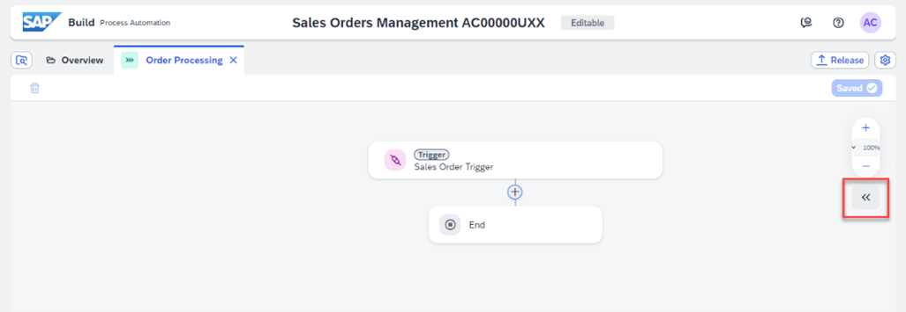
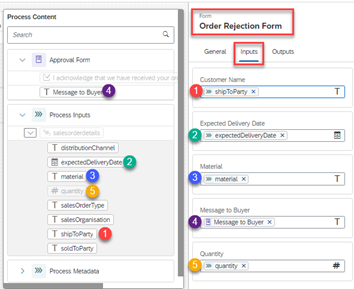
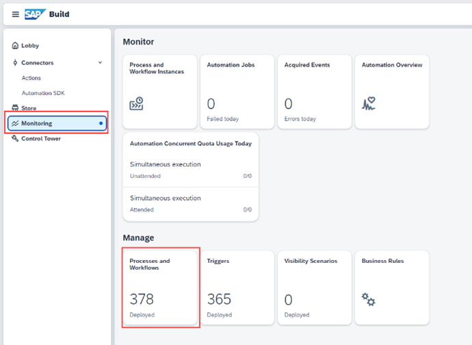

# Create Sales Order Business Process


## Create a business process project
If you are not already in the SAP Build Lobby - click [Lobby](https://sap-build-academy-eu10.eu10.build.cloud.sap/lobby) to open the entry page of SAP Build.  

1. In the Lobby, please search for the project **Sales Order Management Template DSAG**. Make sure that you **search in all projects** and not only in your own projects. Once you have found the project, click the **Navigate** symbol **>**.
    
      
  
2. In the menu, select **Versions** and click the three dots **...** to open the context menu. There select **Save As New Project**.

    

3. On the next screen, replace **Sales Order Management Template DSAG** with `Sales Orders Management [your user name]`. 
 ***Note***: or any other unique identifier, just ensure consistency during the exercise.  
 Select **Save As New**.

      

1. Wait a few seconds until your new project is created and the toast message appears. **Open** your new project.  **Important:** Only work on your newly created project. **DO NOT CHANGE THE TEMPLATE!**
  
      
  
5. **Accept** the **Disclaimer** 

       
   
   and then you should see the following screen with your newly created project. Check the project name.
  
      
  
5. Click on **Create** and select **Process**.  

      

6. In the **Create Process** dialog box, enter the following values and click **Create**.  
  

      | **Input Field** | **Input Value**  |
      | :------------------- | :---------- | 
      | Name             | Order Processing     | 
      | Description         | A process to handle sales orders      |
  
  
7. If you see the below prompt please click **Close**.  

     
  
  
  
## Create and configure API trigger
  
1.	You are now in **Order Processing** page, click on **Add a Trigger**  
  
        
  
  
2.	Click on **Call an API**
  
      
  
  
3.	Enter the name as **Sales Order Trigger** and click **Create**
  
      
  
  
4.	A trigger has been added to your process. Click the << icon to open the **Process Details** screen.
  
      
  
  
5.	Click on **Variables** then choose **Configure** (under **Process Inputs**) to configure inputs.
  
      
  
  
6.	In the **Configure Process Inputs** window, choose **Add Input** to add parameters.
Add the following parameter:
  
	| **Name** | **Type**  | **Required** |
	| :--------- | ---------- | :---------- | 
	| salesorderdetails             | Sales Order      | true          |
  
    

7.	Click on **Apply**.
  
      
  
  
8.	**Save** the Process.
  
      
  
  
  

## Process Conditions
  
Create and configure Process Condition Once the trigger is created, define which process flow should run based on if/else condition criteria.
1.	To add a condition to a process open the Process Builder. Choose (+) next to the Trigger. Select **Controls and Events**
  
      
  
  
2.	Select **Condition**.
  
      
  
  
3.	To configure the condition, choose **Open Condition Editor**.
  
      
  
  
4.	Edit your branch condition:
      a.	Select **quantity** from the Process Content.
      b.	Select is **greater than**.
      c.	Enter **10** as the value.
      d.	Choose **Apply**.
  
      
  
  
You have configured your if branch to: if **Quantity is greater than 10**.
  
  
  
## Create and configure Approval form
  
Navigate back to the Process Builder canvas to create an Approval Form.
  
1.	On the If branch, click on **(+) > Approval > Blank Approval**.  
  
      
  
  
2.	Enter the name as **Approval Form** and click **Create**.  
  
      
  
  
3.	Select **Approval Form** and click **Open Editor**.  
  
      
  
  
4.	Design the form by dragging and dropping the corresponding form elements as shown below.  
  
  
	| **Field Settings with Label**                                                                  | **Form Fields**     | **Configuration (Read Only)** |
	|--------------------------------------------------------------------------------------------|-----------------|---------------------------|
	| Approve Sales Order                                                                        | HeadLine 1      |                           |
	| A new order has been received. Please review and confirm whether the requirements can be met or not. | Paragraph       |                           |
	| Material                                                                                   | Text            | X                         |
	| Quantity                                                                               | Number          | X                         |
	| Customer Name                                                                              | Text            | X                         |
	| Expected Delivery Date                                                                     | Date            | X                         |
	| I acknowledge that we have received your order and will process it based on the availability | Checkbox        |                           |
	| Message to Buyer                                                                           | Text Area       |                           |
  
  
      The Approval form should be the same as below
  
       
  
  
5.	**Save** the form.
  
  
6.	Back within the process, click on the **Approval Form** and configure the **Subject** and **Recipients**.
  
      In the Subject section:  
  
      -	Enter the subject as - **Please review the**  
      -	Map the **material** from the **salesorderdetails** Process Content popup to **Subject**.  
      -	In the **Recipients/Users** section, enter your email address (i.e. ac121055u**XX**@sapexperienceacademy.com).  
                  **Note**: Replace the XX with last two digits of your user number.  
      -	You can copy and paste the text: Use **paste as plain** text to paste the text!  
  
       
  
  
       
  
  
7.	Configure the inputs of **Approval Form**. Navigate to **Inputs** and map the fields accordingly.
      See below:
  
       
  
  
8.	**Save** your work. You should see the following: 
  
       
  
  
  
## Add and Configure Order Approval Notification Form
  
1.	After **Approve**, click on (+)
  
       
  
  
2.	Click on **Form** and on **Order Confirmation Form**.  
        Note: As you have experienced the  creation of Forms in the previouse steps, we have preconfigured additional Forms for you. 
   
       
  
  
       
  
  
3.	Back in the process, click on the **Order Confirmation Form** and configure the **Subject** and **Recipients**.  
  
      In the Subject section:
      -	Enter **Your order has been approved for**
      -	Map **material** from the **salesorderdetails** Process Content pop-up to **subject field**
      -	Please do not copy and paste the text. Enter the text yourself!
      -	In the **Recipients/Users** section, enter your email address (i.e. ac099201u**XX**@sapexperienceacademy.com). 
                  **Note**: Replace the **XX** with last two digits of your user number.
  
  
4.	Save your work  
  
         
  
  
5.	Configure the inputs of **Order Confirmation Form**. Navigate to Inputs and map the fields accordingly.
            See below:  
  
         
  
  
6.	Click **Save**.  
  
  
  

## Create and configure Order Rejection Notification Form
  
In this step, you will send out a notification form if the order is rejected.  
1.	Click on the (**+**) after the **Reject** node.
  
       
  
  
2.	Click on **Form** and on **Rejection Notification Form**.  
        Note: As you have experienced the creation of Forms in the previouse steps, we have preconfigured additional Forms for you.  
  
       
  
  
3.	Go back to the process select the **Rejection Notification Form**
  
  
4.	Click **General** tab
  
  
5.	In the **Subject** field:
      -	type **Your order has been rejected for**
      -	click to map **material** from **Process Content** => salesorderdetails
      -	In the **Recipients/Users** section, enter your email address ((i.e. ac099201u**XX**@sapexperienceacademy.com). 
                  **Note**: Replace the **XX** with last two digits of your user number.
  
     
6.	**Save** your work
  
7.	Configure the inputs of **Rejection Notification Form**. Navigate to Inputs and map the fields accordingly.
  
       
  
  
8.	**Save** the form.
  
  
  
## Add and configure Auto Approval Notification Form
  
In this step, you will add a notification form which would be received by supplier if the order is approved automatically without any approvals.
  
1.	Go to the Process Builder and add the **Auto Approval Notification** form to the **Default** node.
  
       
  
  
3.	Click (**+**) choose Form then Auto Approval Notification
  
       
  
  
3.	Configure the **General** section.
  
4.	Under Subject:
      -	Enter the text: **Your order has been approved automatically for**
      -	Map material from **Process Content => salesorderdetails**.
      -	In the **Recipients/Users** section, enter your email address ((i.e. ac099201u**XX**@sapexperienceacademy.com). 
                  **Note**: Replace the **XX** with last two digits of your user number.
    
5.	Save your work.
  
       
  
  
6.	Configure the **Inputs** section.
  
      | **Form Input Field** | **Process Content Entry**  |
      | :------------------- | :---------- | 
      | Customer Name             | shipToParty     | 
      | Expected Delivery Date         | expectedDeliveryDate      | 
      | Material Name             | material     | 
      | Quantity        | quantity     | 
  
  
           
  
  
 7.	**Save** your work. Your final process looks as below.        
  
           
  
  
       This completes the process design with condition criteria that will decide what process flow is executed and whether there will be an auto-approval or a one-step approval route.
  
  
  
## Release business process project
  
To run the process you have to first release and then deploy the business process project.
  
Releasing a project creates a version or snapshot of the changes and deploying the project makes it available in runtime to be consumed. You can only deploy a released version of the project, and at a given time there can be multiple deployed versions of the same project.
  
1.	In the Process Builder, to release a project, click **Release** button on the top-right corner of the screen and provide a description in the popup dialog.
  
          
  
  
      If you are releasing for the first time, then the version will start with **1.0.0.** Next time you release, the version numbers will be automatically updated.
  
  
2.	Click **Release**.
  
          
  
  
  
## Deploy released project
  
1.	Once the project is released successfully, Click **Deploy** button on the top-right corner of the screen.
  
          
  
  
2.	Select the **Public** environment and click **Deploy**.
  
          
  
  
3.	Click **Deploy**
  
          
  
  
       Deployment will take a couple of seconds/minutes depending upon how big your project is and how many different artifacts it has. 
       Any errors during the deployment will be shown in the Design Console at the bottom of the screen.
  
  
4.	Once the deployment is successful, you will see a changed status.
  
          
  
      You cannot edit released or deployed projects. 
      To continue working on your project, you need to select the Editable version of your project (at the top of the page).
  
  
  
## Publish to the SAP Build Library
  
1.	After you released and deployed the process, go to SAP Build Lobby and find your project (i.e. Sales Orders Management AC099201U**XX**).
  
2.	Click on the 3 dots under options and **Publish to Library**.
  
        
  
  
 3.	Select the version (you can select the most recent version) and click on Publish.  
        Now, your process will be visible from SAP Build Apps in SAP Build Library section.
  
        
  
  
You have successfully released, deployed and published your process. It is time to run the process and see the results.
  
  
  

## Run business process
  
1.	Let’s test the API Trigger in the **Monitoring** tab of the SAP Build Lobby.
      - Click on the **Manage > Process and Workflows** tile.
  
        
  
  
2.	Search for AC099201U**XX** to display your project.
  
        
  
  
3.	Click on **Start New Instance**.
  
        
  
  
4.	Remove the example payload in the dialog. Use the following JSON in the dialog.
 ```
      {
            "salesorderdetails": 
            {
            "distributionChannel": "10",
            "expectedDeliveryDate":"2024-02-25",
            "material": "MZ-FG-S200",
            "quantity":11,
            "salesOrderType":"OR",
            "salesOrganisation":"1710",
            "shipToParty":"SAP",
            "soldToParty":"1000292"
             }
      }
 ```
   
The quantity must be entered as a number (no quotes) and dates must be entered in the format above for the expected delivery date.
  
  
Click **Start New Instance and Close**.    
  
 
  
  
Don’t modify the payload when you integrate with SAP Build Apps.
  
You did successfully run your project. It is time to monitor the process flow and access the tasks.
  
  
  

## Monitoring the process flow
  
Monitoring business process is one of the key aspect of the automated processes. Technical monitoring is an administrator job where a process admin proactively and consistently monitors the process performance, identifies any issues in the process and takes necessary actions to ensure business process continuity.
  
**SAP Build** provides different applications to monitor and manage different process artifacts. These applications are available under the **Monitor** tab.
  
1.	Earlier, we accessed **Processes and Workflows** under the **Manage** section to see all the deployed processes.
  
	To monitor all the running instances of the process, you must go to **Process and Workflow Instances** under the **Monitor** section.
  
	 
        
  
  
       In there, you will see all the running, erroneous and suspended process instances. 
       Use the filter bar to get a more customized view of the process instances based on different statutes like running, completed, suspended, terminated and so forth.
  
	The best way to find your process is to search for your user number or initials, depending on how you named it.
  
  
2.	Search for the project **Sales Orders Management AC099201UXX** using the Project dropdown. All the instances of the selected project is displayed in the table below. Select the latest one as it was the one created in the previous lesson.
  
        
  
  
       Explore different process monitoring options. Observe the process instance information, process context which is the actual process data flowing across different activities in the process and the execution logs where you can see entire trace of how the process has been progressing with some basic runtime information of each activity.
  
	Since the quantity is greater 10, the process requires an approval. You can check the Logs and Context for this instance.
  
        	
  
  
3.	As you can see the process is waiting for the task to be completed. These tasks are generated from the forms that are added in the process and can be accessed via the **My Inbox** application. Click on the icon on the top right corner to open the **My Inbox** applicaiton.	
  
        	
  
  
  
## Accessing the tasks
  
1.	Tasks are the request for the users to participate in an approval or review process. These tasks appear in the **My Inbox** application shipped with **SAP Build**. Users can claim, approve and reject the task from their inbox. You can add a message to the buyer.
  
  
2.	Click **Approve**.
  
        
  
  
3.	Once you **Approve/Reject** the order, **refresh** the inbox again to get the notification of Order Confirmation with the created sales order in the system.
  
	Click on **Submit** to acknowledge the order and complete the process.
  	 
        
  
  
4.	Once you acknowledge the notification sent via the approval process, the process will be completed. The Logs can be seen in the **Monitor** section.
  	 
        
  
  
  
**Congratulations!**
You successfully completed this unit and are ready to create a Sales Order App using SAP Build Apps. Please go to the next tutorial: [Create a Sales Order App Using SAP Build Apps](https://github.com/SAP-samples/process-automation-enablement/blob/main/Workshops/DSAG%20JK%202024/exercises/ex1/README.md)
