# Exercise  0 - Setting Up Action for Sales Order API

> Action in SAP Build Process Automation allows the connection of processes with external systems, whether SAP or non-SAP. This is crucial for automating or expanding business processes for various LoB processes such as S/4HANA, Ariba, and SuccessFactors. With SAP Build Process Automation, these extensions can be easily built, and through actions, connections can be made to S/4HANA, Ariba, or other SAP LoB systems for GET, POST, PATCH, and other types of calls.
## Exercise

In this exercise, you will learn how to create an action project based on the Sales Order API, with the following steps:

## Table of Contents 
  - Exercise 0.1 - Set up Communication Management in SAP S/4HANA Cloud 
  - Exercise 0.2 - Configure Destination for SAP Build Process Automation
  - Exercise 0.3 - Create Action Project in SAP Build Process Automation 
  - Exercise 0.4 - Test the Action Project 
  - Exercise 0.5 - Release and Publish the Action Project

## Exercise 0.1 - Set up Communication Management in SAP S/4HANA Cloud  

Prerequisite: please make sure you should have an **administrator access** for SAP S/4HANA system.

> For the following setup, we will use communication scenario for **Sales Order Integration (SAP_COM_0109)**.

Optional: You can learn more about communication scenarios [here](https://help.sap.com/docs/SAP_S4HANA_CLOUD/03c04db2a7434731b7fe21dca77440da/a5550ea977b24a6eb6ce1ce832088567.html).

**1. Create Communication User**

1.1 Login to SAP S/4HANA Cloud System and select **'Communication Management'** group:

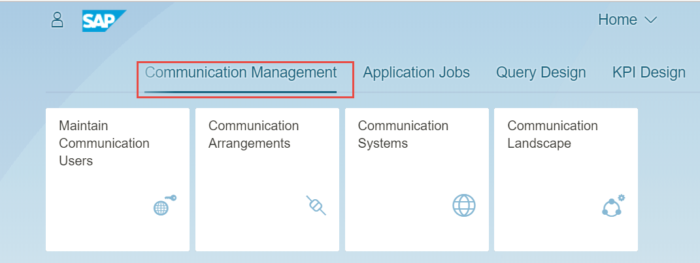

1.2 Select **‘Maintain Communication Users’** App and click **'New'**:

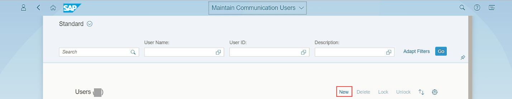

1.3 Afterwards, go ahead and provide User Name, Description & Password and click 'Create':

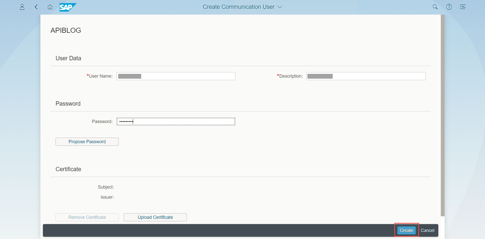

1.4 Once you click 'Create', the Password Status becomes Productive. Now click 'Save':
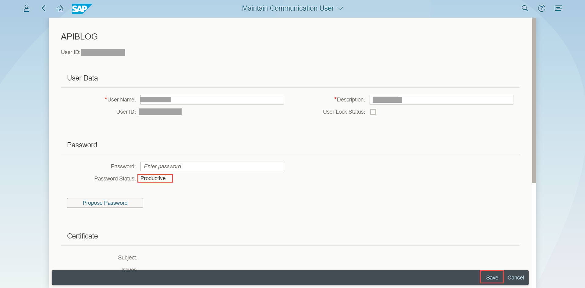

Great! The **Communication User** is now successfully created.

Next up, Communication System and Communication Arrangement need to be created.

**2. Create Communication System:**

2.1 Login to SAP S/4HANA Cloud System, select 'Communication Management' group and Click **'Communication Systems'** app (similar to step 1.1).

2.2 Here you would see the list of already existing Communication Systems if any. Click **'New'** to create a new Communication System:

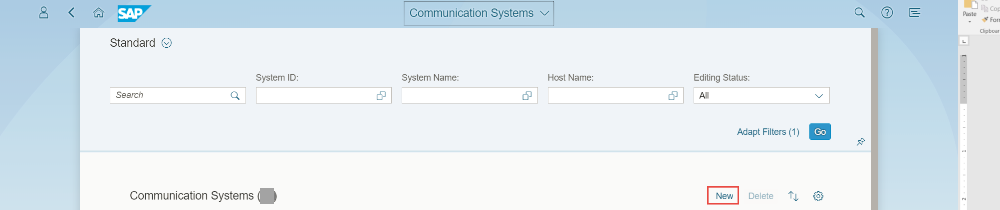

2.3  Enter a **System ID** and **System Name** and click **'Create'**:

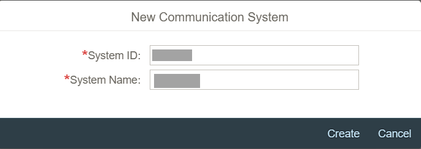

2.4  Provide the **Host Name** and **HTTPS Port** of the system you want to connect to.

We will use a hypothetical name and port here.

Click **'Add'** button for inbound communication to add the user for authenticating inbound request:

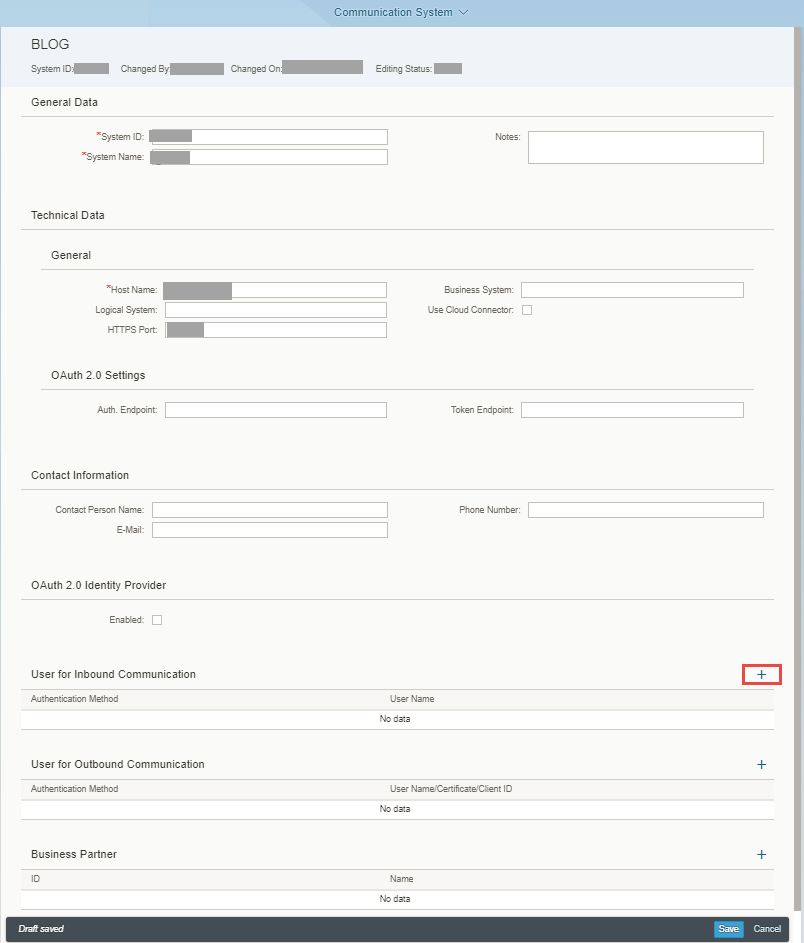

> Note: Here we are using inbound service hence the 'Logical System' is optional but when we make use of outbound service then 'Logical System' plays an important role and is mandatory to be filled.

2.5 Select the **Communication User** (from value help) which we had just created. The assigned Communication User will now automatically appear in User Name field. Click **'Save'**.

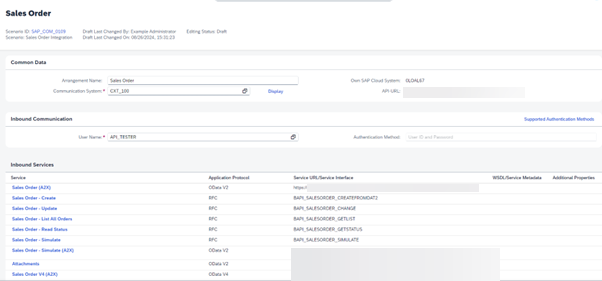

2.6 Click **'Save'** and the Communication System is created: 

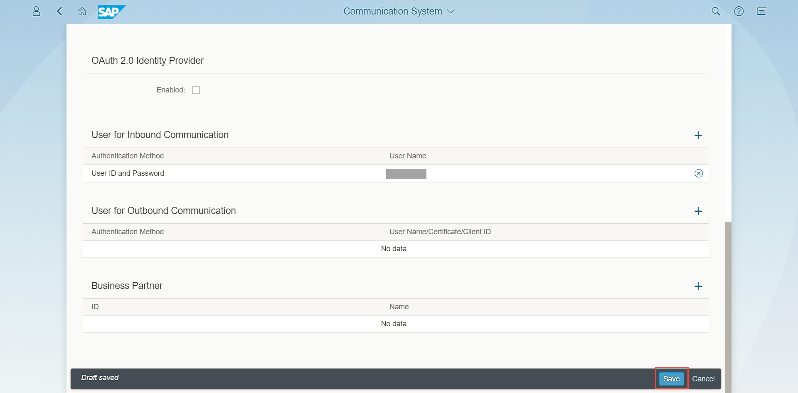

Now we have successfully created a **Communication System** with a **Communication User** assigned to it.
 
**3.  Create Communication arrangement based on the relevant Communication Scenario:**

3.1  Login to SAP S/4HANA Cloud System, select 'Communication Management' group and Click **‘Communication Arrangement’** app (similar to step 2.1).

3.2 Once you are within the 'Communication Arrangements' application you would see the existing Communication Arrangements if any. Click 'New':

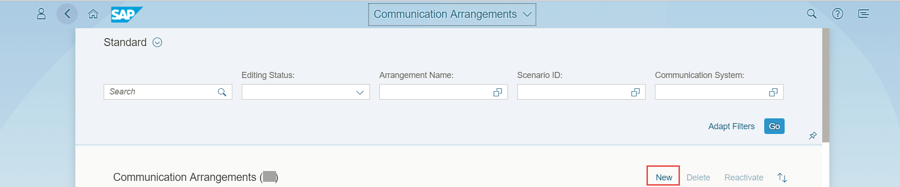

3.3 Here select the relevant 'Communication Scenario' (from value help) based on the API you would want to access. Like in our example we will use **Sales Order Integration (SAP_COM_0109)** for this case and click **'Create'**:

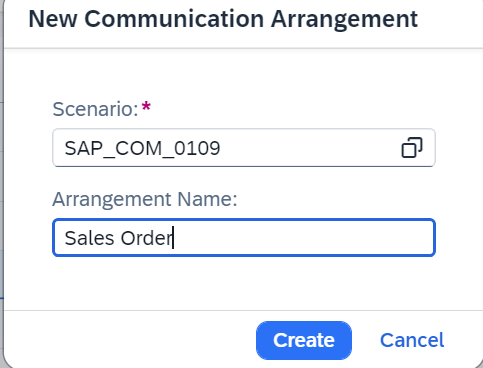

Note: You would be able find relevant Communication Scenarios in the API documentation from SAP API Business Hub.

3.4  Select the **'Communication System'** (from value help) which we have just created. The assigned Communication User will now automatically appear in User Name field. Click **'Save'**:

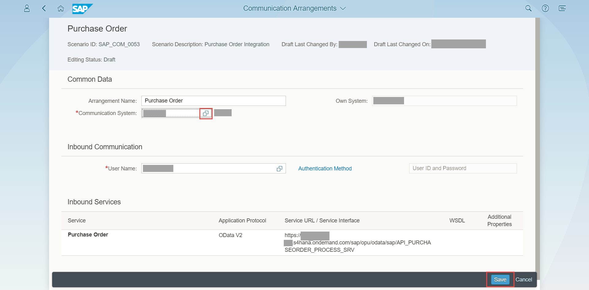

Great work! The Communication Arrangement is now created successfully.

## Exercise 0.2 - Configure Destination for SAP Build Process Automation

In this exercise, you will create the destination for Sales Order APIs.

1. First, head over to your **SAP BTP Cockpit -> Subaccount -> Destinations**. You will see the available destination listed.
Make sure that the additional properties are provided as below:
- sap.applicationdevelopment.actions.enabled = true
- sap.processautomation.enabled = true

and finally, click on **Check Connection** to test it.

In this example, we are using the destination DCOM_Sales_Order. 

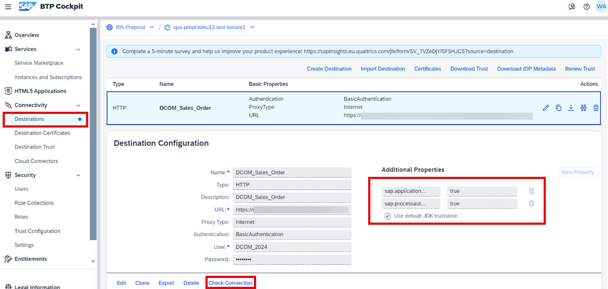

2. Afterwards, the connection should indicate **OK**:

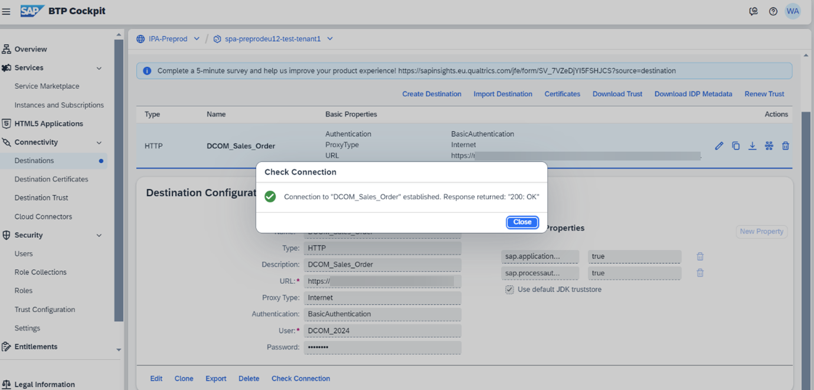

3. Next, to use this destination, we will connect it to SAP Build Process Automation. 
From the SAP Build lobby, click on **Control Tower**.

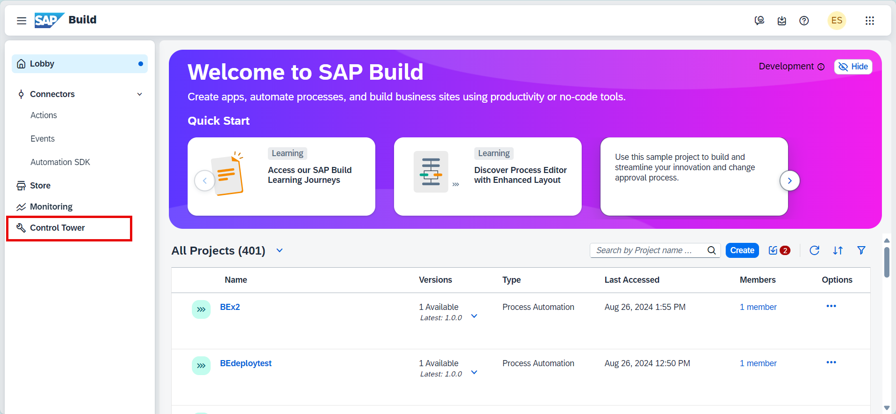

Click on Destinations, to configure the destination with SAP Build:

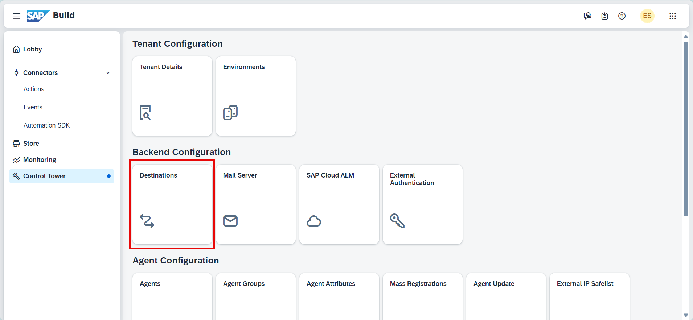

Look for the Destination name from the previous step in the search bar and click on the 3 dots:
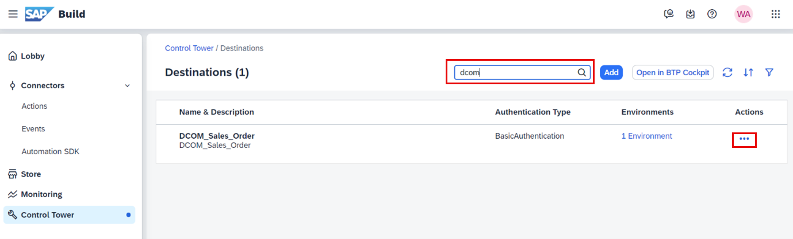

Afterwards, we specify the Environment in which the destination will be configured to. Choose **Public** and Add Destination.

> Environments refer to the different stages or platforms where the automated processes will run, such as development, testing, and production. Each environment may have different sets of configurations and requirements.

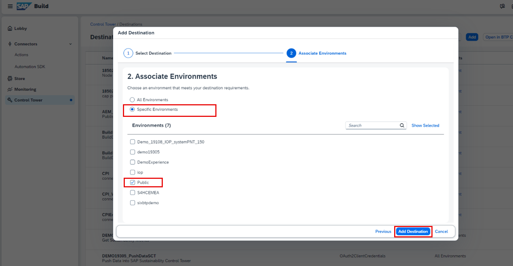

## Exercise 0.3 - Create Action Project in SAP Build Process Automation

> **Please download the pre-configured Action Project by clicking [here](https://github.com/eagorbunov/EAEnablement/blob/main/exercises/0_SetUpActions/Sales%20Order_1.1.0.mtar).**

Follow the steps, download the file:

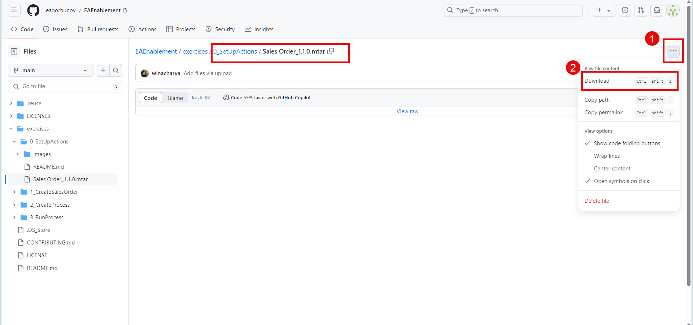

## Exercise 0.4 - Test the Action Project

Once the action project is saved on your system, it is time to test the changes and output. 

The destinations are fetched from the SAP Business Technology Platform. The selected destination is already created in the account configured for this workshop.

To test the Action, do the following:

- From the SAP Build lobby, click on Actions under Connectors
- Click on the Action you've configured and it will open in a new tab

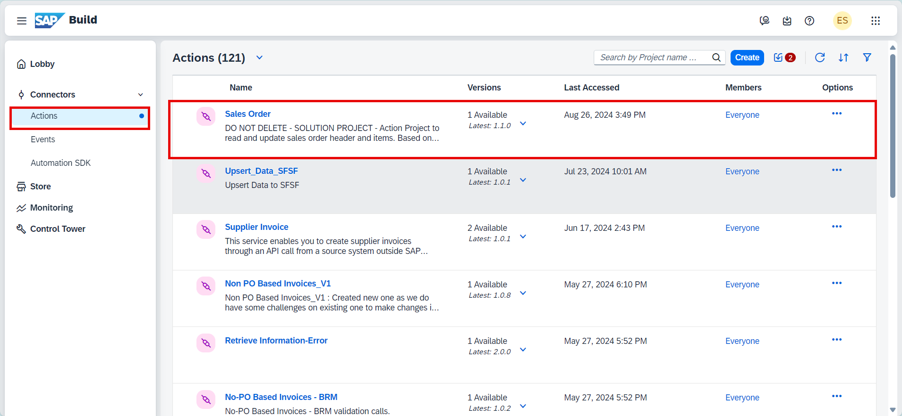

Let's now test the GET API: Reads the header of a sales order:

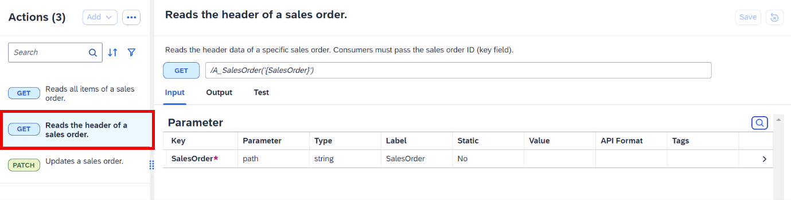

After clicking on the configured destination, click on the **Test** tab and provide a valid **SalesOrder** number. Click on the **Test** button:

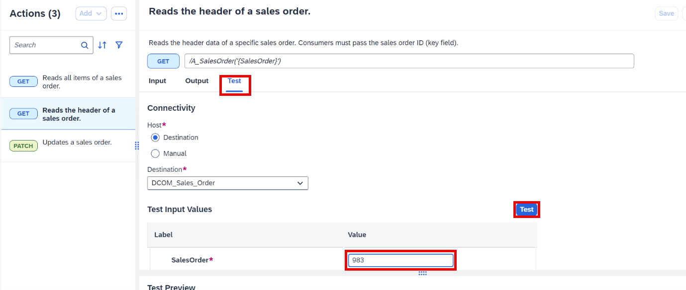

Test response reading the header of the relevant  Sales Order will be provided as the following:

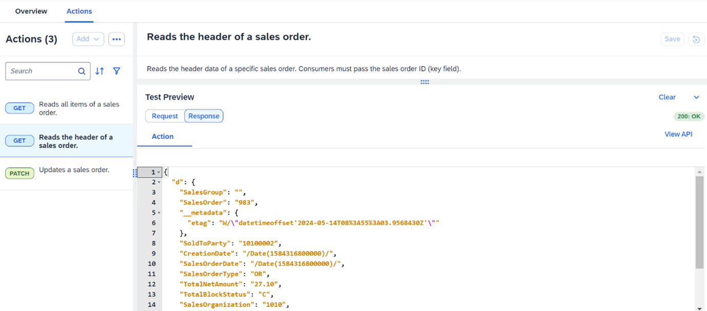

Now, from the Actions tab, and let's test the other **GET API: Reads all items of a Sales Order** by following the same steps as before:

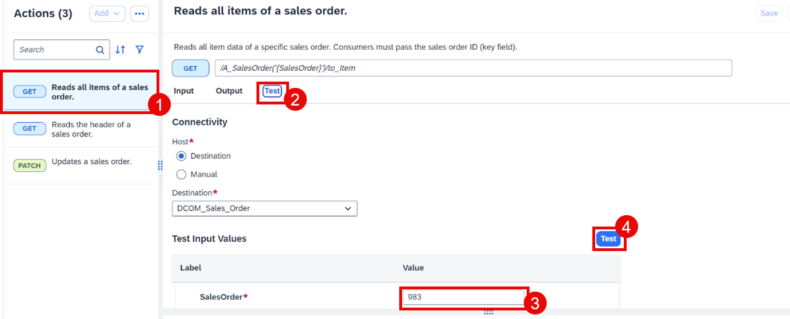

Check Response:

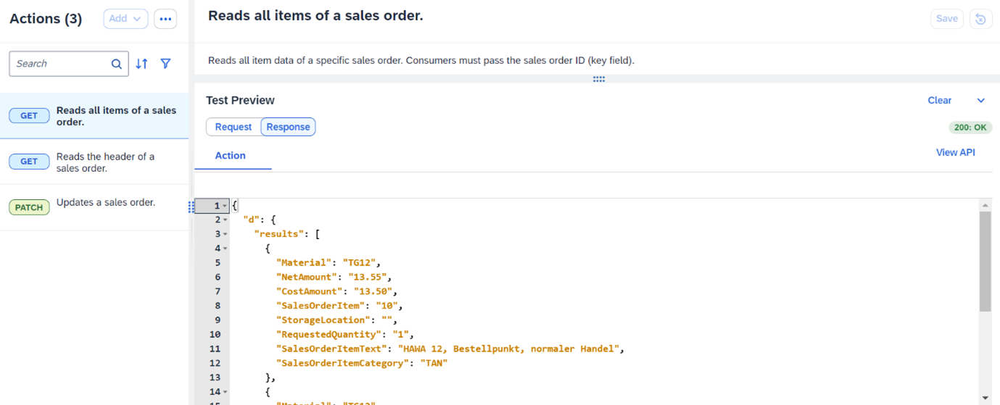

Great job! We have now configured and tested the actions successfully. 

## Exercise 0.5 - Release and Publish the Action Project

> You will now release the action project to create version(s) and then publish that version in the action repository. It is then these published actions that can be used in different processes and applications to connect to external systems.

To release a version of the action project, click **Release** from top-right corner.

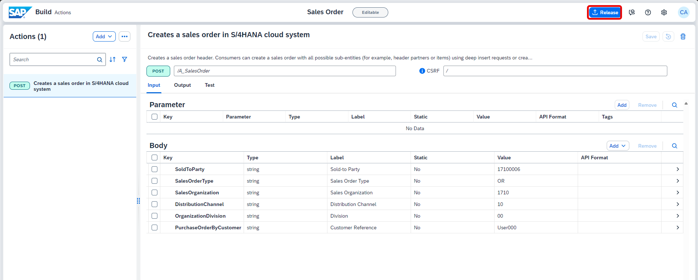

In the release popup, enter the Release Notes of your choice and click **Release**. 

If you have *Publish to Library* button instead of Release, please directly Publish as prescribed in the next step.

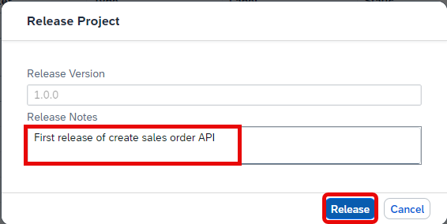

Once the action project is released, you can then publish any release version of the action by clicking **Publish to Library** from top-right corner.

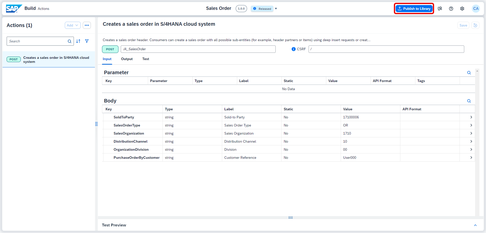

With this you have successfully completed creating, configuring, releasing and publishing of action project. Now you will use these published actions to connect process to external systems via APIs.

Continue to - [Exercise 1 - Create Sales Order](../1_CreateSalesOrder/README.md)

