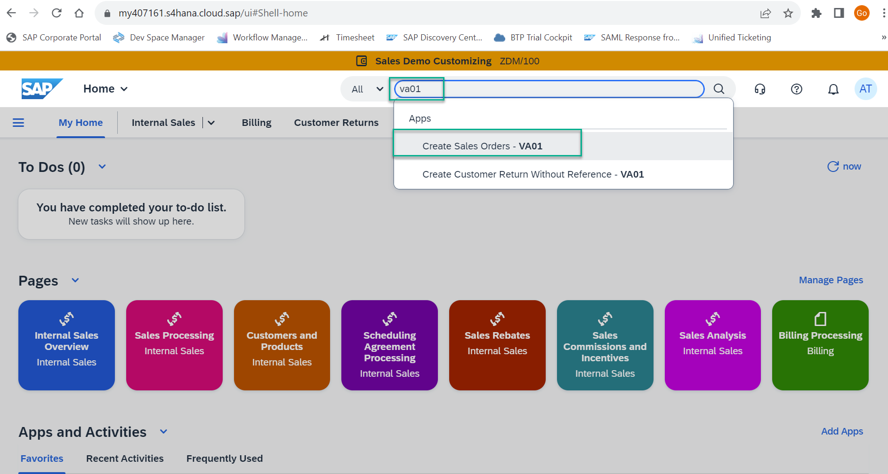
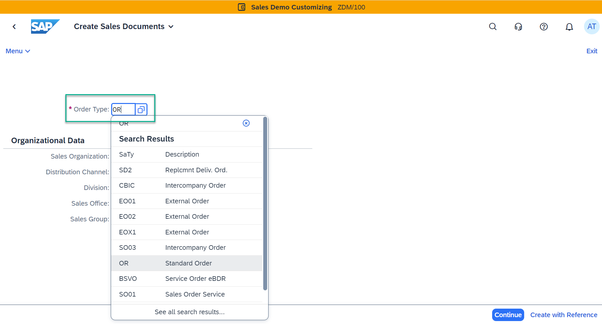
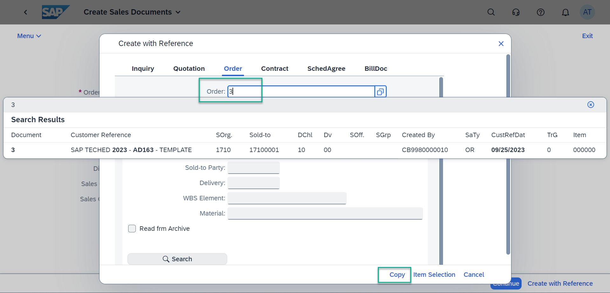
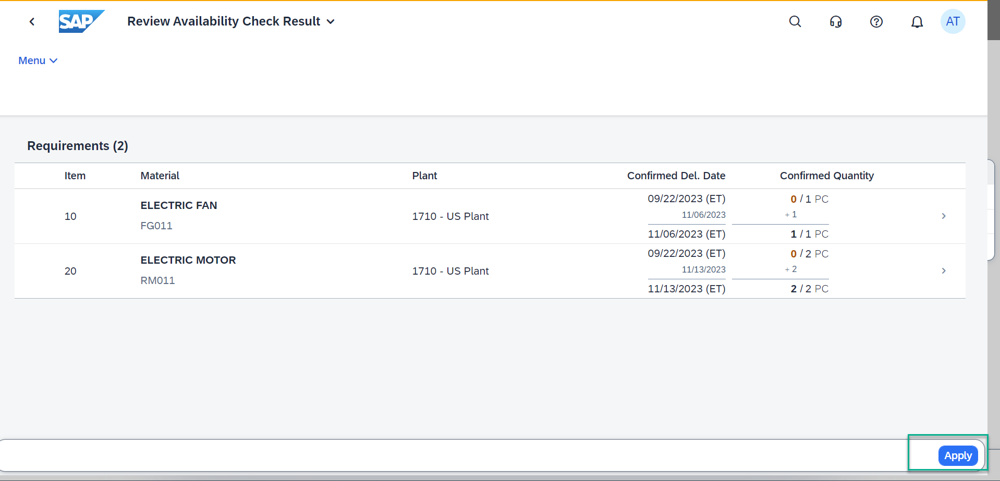
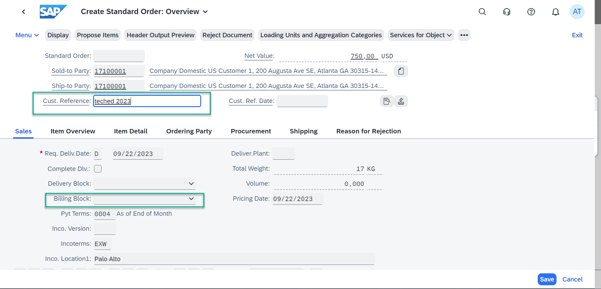
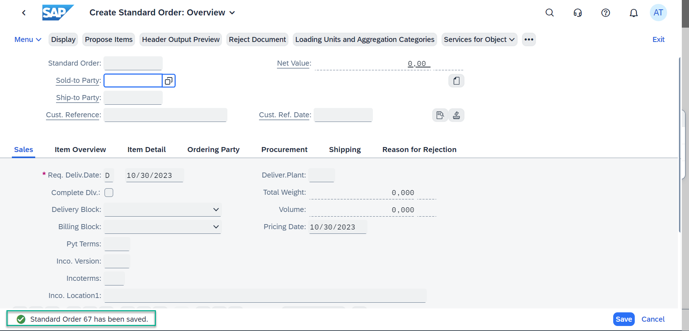

# Exercise 1 - Create Sales Order

In this exercise, you will create a Sales Order by referring to an existing Sales Order. This Sales Order will not have a billing block. Please note down the Sales Order number generated at the end of the exercise. This is needed later for designing the process and end-to-end testing.

## Exercise

After completing these steps you will have a Sales Order number created without a billing block.

1.	Logon to your S/4HANA system

2. Search for va01 and click "Create Sales Order - VA01"
    

   > **Create the sales order using your desired data and configuration, below steps and data are for reference only.**

3.	Enter Order Type as “OR” and click on “Create with Reference”.
    

4. In the “Order” tab, enter Order as 3 and click on “Copy”.
    

5. In the “Review Availability Check” page, click “Apply”.
    

6. In “Create Standard Order:Overview” page enter a customer reference text and note that the “Billing Block” is blank.
    This means there is no billing block on the Sales Order.
    

7. Click “Save” and note down the Sales Order number. We will use this later while designing and executing the end-to-end process.
    
## Summary

Now that you have created the Sales Order,
Continue to - [Exercise 2 - Create Process](../2_CreateProcess/README.md)
