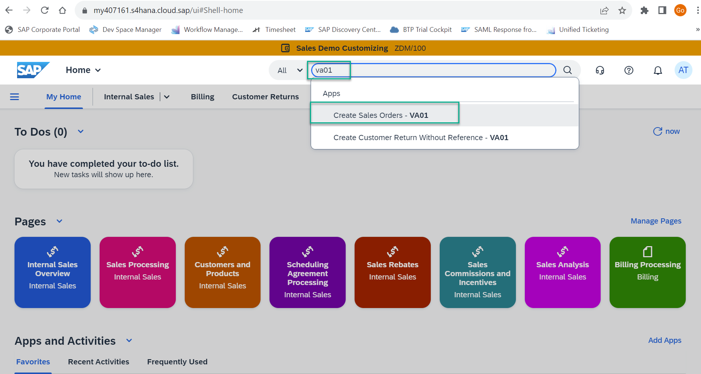
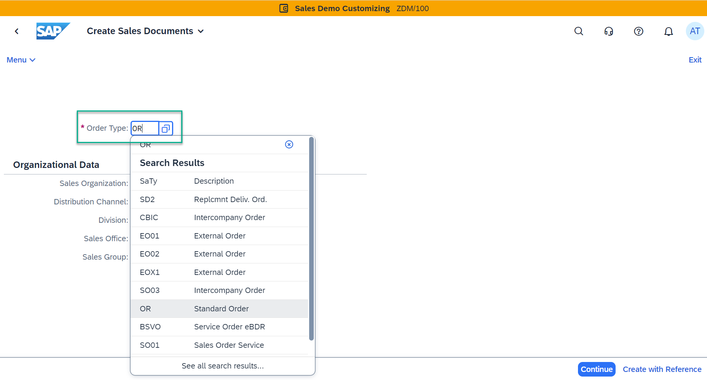
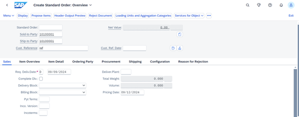
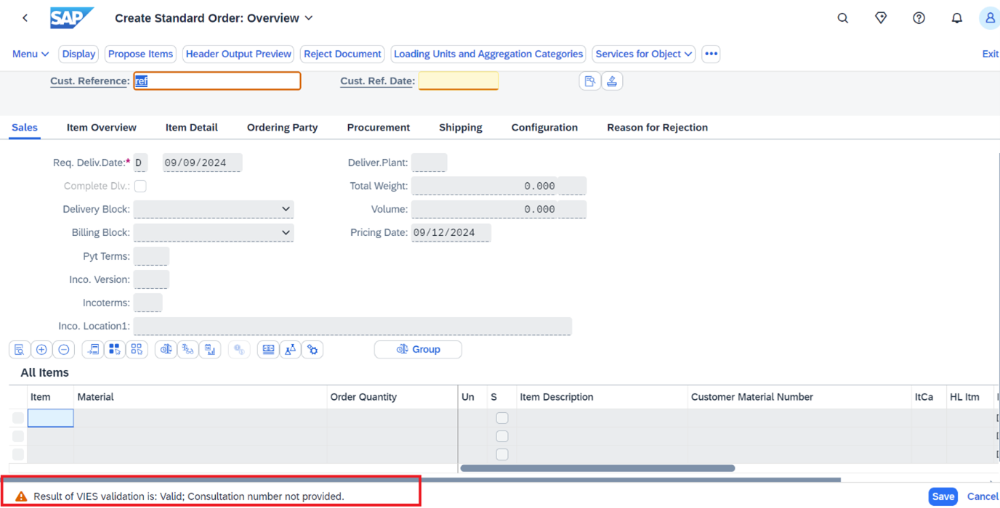

# Exercise 1 - Create Sales Order

In this exercise, you will create a Sales Order by referring to an existing Sales Order. This Sales Order will not have a billing block. Please note down the Sales Order number generated at the end of the exercise. This is needed later for designing the process and end-to-end testing.

> Make sure to fulfill the pre-requisites before this part: **[Pre-requisites](https://github.com/SAP-samples/process-automation-enablement/tree/main/Workshops/EAEnablement/0_SetUpActions/README.md)**

## Exercise

After completing these steps you will have a Sales Order number created without a billing block.

1.	Logon to your S/4HANA system

2. Search for va01 and click "Create Sales Order - VA01"
    

   > **Create the sales order using your desired data and configuration, below steps and data are for reference only.**

3.	Enter Order Type as “OR” and other required details and click on “Continue”.
    

4. Enter Sold-To-Party, Ship-To-Party, Customer Reference and ensure that the “Billing Block” is blank. This means there is no billing block on the Sales Order. 
.
    

5. Click Save and if you get the following warning message below, see if you need to make required corrections. If you still get the same error, press Enter on your keyboard.
    

6. Click “Save” and note down the Sales Order number. We will use this later while designing and executing the end-to-end process.
    
## Summary

Now that you have created the Sales Order,
Continue to - [Exercise 2 - Create Process](../2_CreateProcess/README.md)
