# Exercise 3 - Run Process
***PLEASE LOGOUT and re-login in incognito mode with your user to run the process***
In this exercise, we will update the Sales Order that was created and add a billing reason to block the Sales Order for billing. The required event is dispatched from SAP S/AHANA and the process in SAP Build Process Automation is triggered. User approves the billing block removal via an approval form and the billing block in removed in  SAP S/4HANA.

## Exercise 3.1 Change Billing Block Status in S/4HANA
After completing these steps you will have changed the billing block status for the Sales Order.

1. Enter Order as the Sales Order number that was created in “Create Sales Order” exercise and click on “Continue”.
 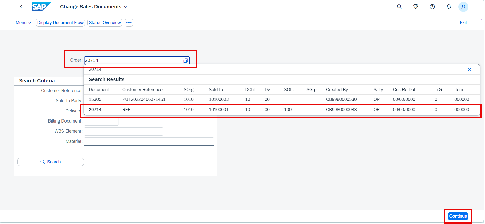

2. In the “Sales” tab, enter Billing Block as any value from the drop down and “Save”. Note: The sales order is blocked only when any of the reasons are selected.
 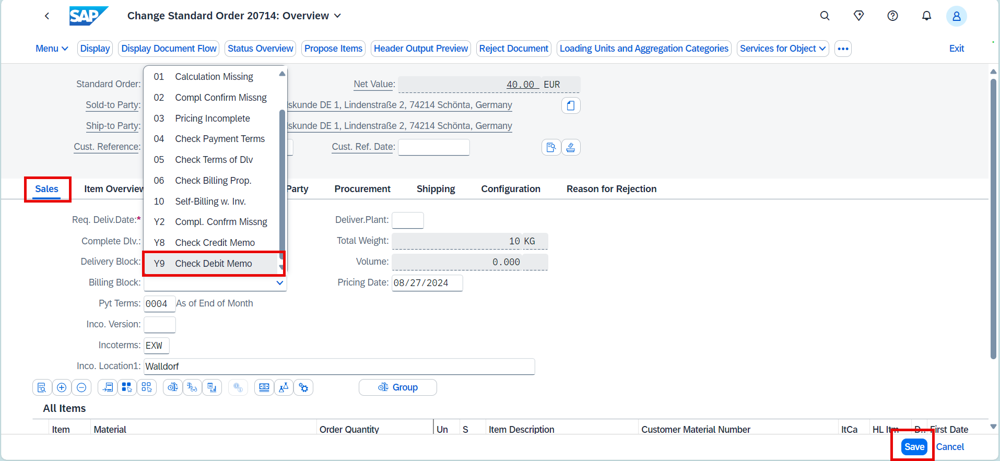

3. Check the confirmation that the Sales Order was saved.
 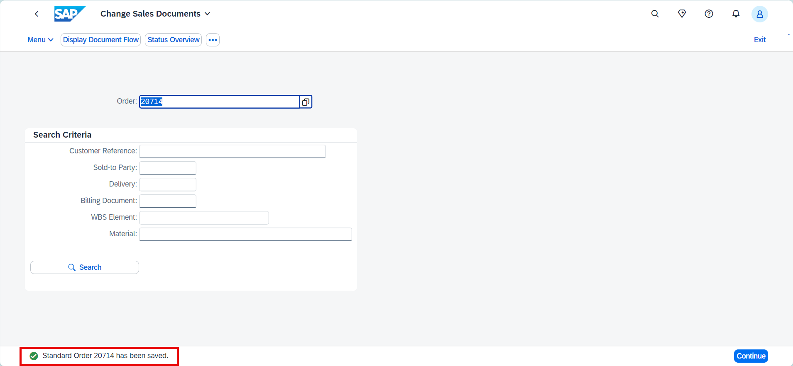

Note: Now the event “Billing block status changed” will be triggered from SAP S/4HANA which will trigger the process that is created in SAP Build Process Automation.

## Exercise 3.2 Monitor Process

1.	Login to the [SAP Build Lobby](https://ad163-hxj0v9xc.eu10.build.cloud.sap/lobby) 

 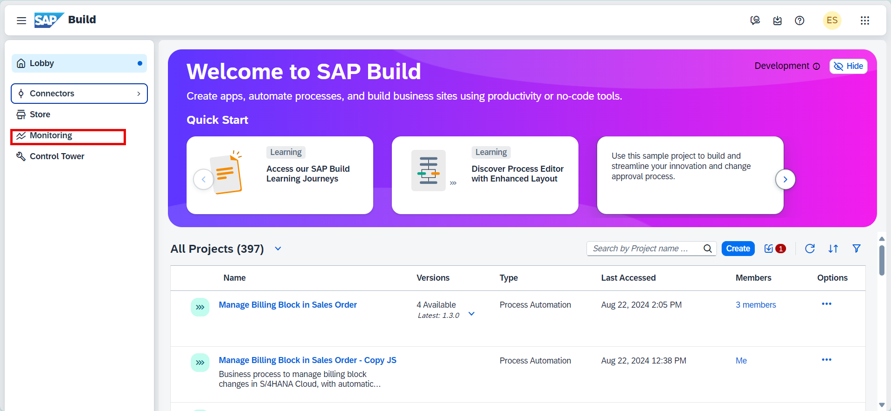

3.	Click on “Monitor” and then click on “Process Workflow and Instances”. 
 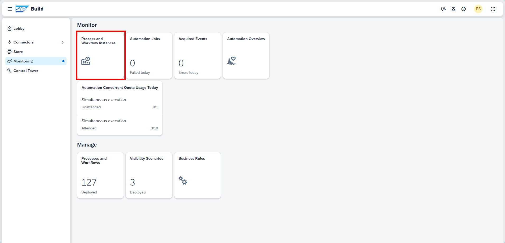

4.	All the processes are listed in the logs. Search for your project by giving your **Project Name in Project** and select your Project.
 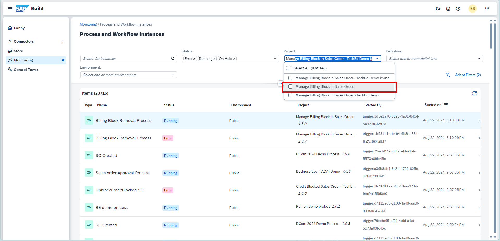

5.	Click on the instance with Running status to view the details of the logs 
 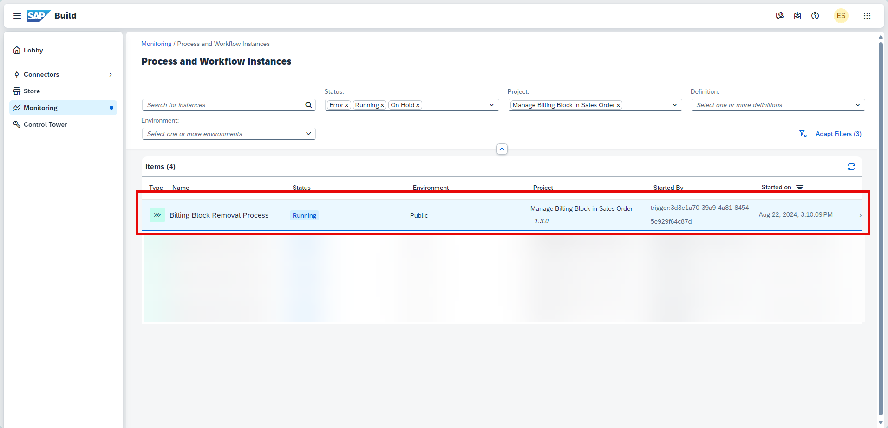

6.	Check that event trigger has started the process from the Context section 
 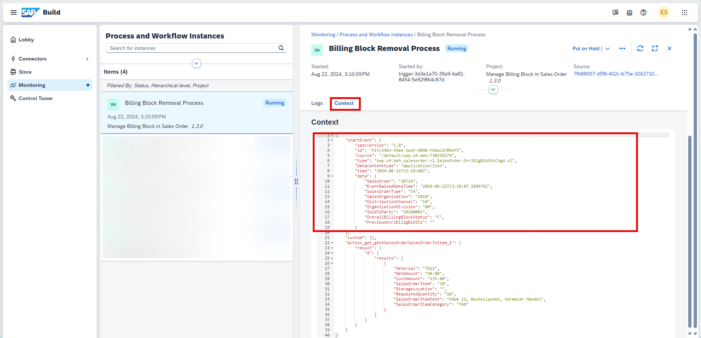

7.	Check the rest of the steps in the Logs section.

8.	Details of the process are shown in the Logs. There is approval task in My Inbox. Click on My Inbox to go to the approval form. 
 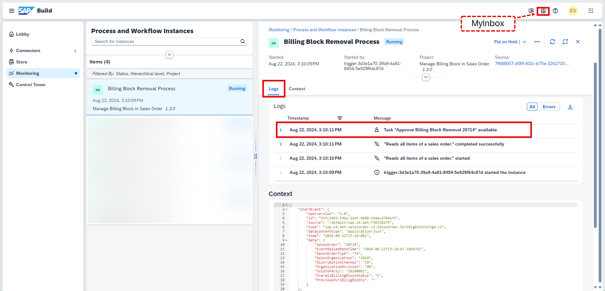

## Exercise 3.3 Approves Sales Order Update from Inbox

1. In My Inbox, the approval form shows the details for the Sales Order. Review , add comments, select the approve checkbox and click on **Approve Billing Block Removal** button.
 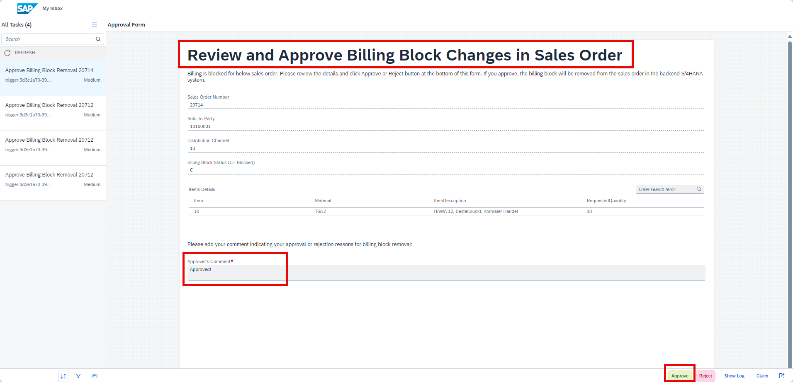

2. The process is completed successfully.
 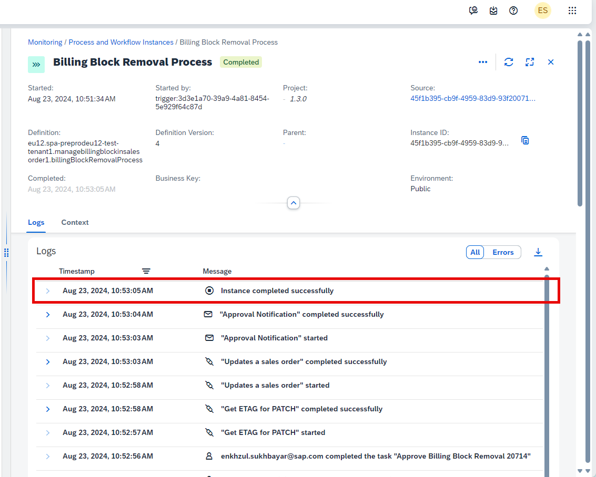  

## Exercise 3.4 View updated billing block in SAP S/4HANA

1. Click on Display Sales Order (VA03) from your Workspace.  
 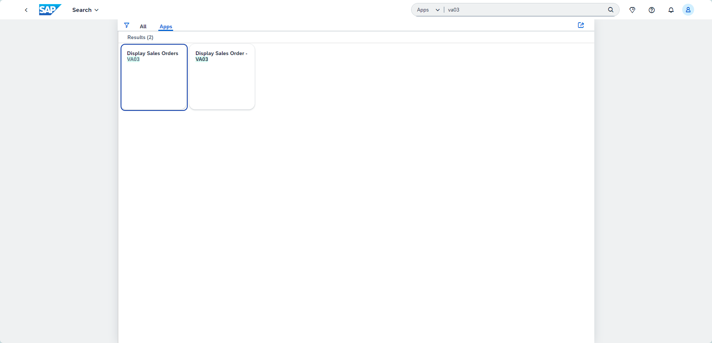  

2. Enter the Sales Order number that you created and updated and click on Continue.  
 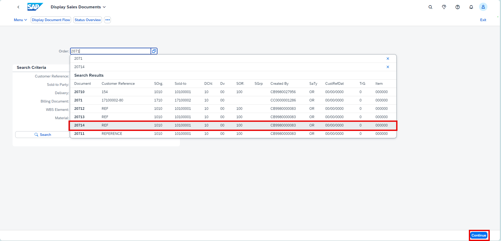  

4. Check that the Billing Block is now removed by the process.  
 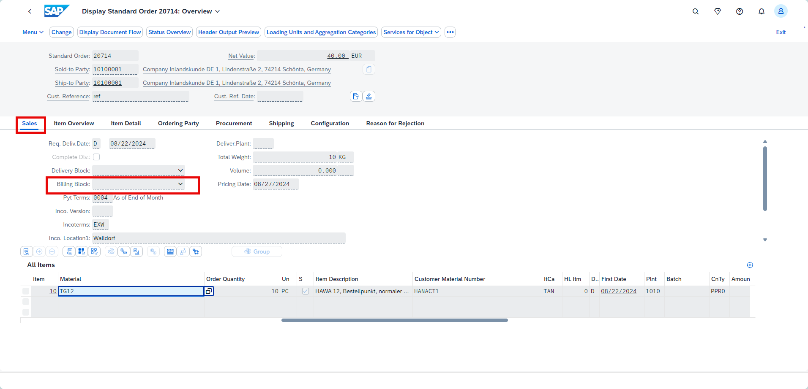  

## Summary

You've now tested the end to end process and also checked the status update in the SAP S/4HANA. This marks the completion of hands-on for today's session.
