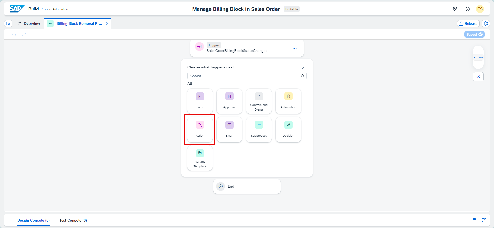

# Exercise 2 - Create Process 

<!-- description --> In this exercise, you will create a process in SAP Build Process Automation to update the billing block based on the approval.

## Table of Contents 
- [Exercise 2 - Create Process ](#exercise-2---create-process-)
  - [Table of Contents ](#table-of-contents-)
  - [Overview ](#overview-)
  - [Exercise 2.1 - Add Event Trigger to Process ](#exercise-21---add-event-trigger-to-process-)
  - [Exercise 2.2 - Add Action to Read Sales Order Items ](#exercise-22---add-action-to-read-sales-order-items-)
  - [Exercise 2.3 - Add Approver Form with Sales Order Items Table ](#exercise-23---add-approver-form-with-sales-order-items-table-)
  - [Exercise 2.4 - Add Action to Read Sales Order Header ](#exercise-24---add-action-to-read-sales-order-header-)
  - [Exercise 2.5 - Add Action to Update Sales Order ](#exercise-25---add-action-to-update-sales-order-)
  - [Exercise 2.6 - Add Approval and Rejection Emails ](#exercise-26---add-approval-and-rejection-emails-)
  - [Exercise 2.7 - Release and Deploy the Process ](#exercise-27---release-and-deploy-the-process-)
  - [Summary](#summary)

## Overview 

In this exercise you will learn:

- How to add an event trigger to a process
- How to add action to read sales order items
- How to add action to update sales order
- How to add approval and rejection emails
- How to release and deploy the process
 
## Exercise 2.1 - Add Event Trigger to Process 
 First, navigate to your SAP Build Lobby.

1. In the SAP Build lobby, click on **Create** button: 

   

2.  Select the **Build an Automated Process**:

  
  
  Next, choose the **Business Process** option:
    

3. Let's name our new project to
   **Manage Billing Block in Sales Order** and click **Create**.

  

 Great! Your project is now created and you will be able to create your Process.
 

4. In the **Create Process** pop-up:

  - Enter **Name:** Billing Block Removal Process
  - Enter **Description:** Process to update the billing block based on the Approval
  - Choose **Create**

  

  The Process gets added in the process builder. Now you will add an Event Trigger to the Process.

  > Event Triggers onboard and listen to back-end events emitted from an external source system and react to such events by triggering artifacts such as processes and automations.

5. Select the **Add Trigger** and then **Wait for an Event**.

  

  

6. In the **Create Event Trigger** pop-up:

  - Enter **Name:** SalesOrderBillingBlockStatusChanged
  - Select **Event Object:** Sales Order Events
  - Select **Event:** SalesOrder Billing Block Status Changed
  - Choose **Create**

  

7. The **Event Trigger** is now created. Please make sure to save your work.

  

8. Now that you have the Event Trigger created, click on the **Event Trigger** step to open the side-panel. This side panel opens the outputs that are populated from the event trigger. 

 

## Exercise 2.2 - Add Action to Read Sales Order Items 

Next, you will add an Action to the Process that will read the sales order items.

> With Actions, you can embed external skills and capabilities into your business process projects by uploading an open API specification file in JSON format. Action projects allow external systems and solutions to communicate with SAP Build Process Automation.

1. In the Process Builder, select the **+** underneath the Trigger created, then choose **Action > Browse library**.

  

  

2. In the **Browse library** pop-up, select the **Reads all items of a sales order** Action and choose **Add**.

  

  

3. The **Action** is now added. When you click on the **Action** step, on the side panel, you can see the outputs coming from the Action in the outputs tab.

Note that the Action step shows an Error icon on its left because we must now configure the Action accordingly using the side-panel function.

  

4. In the **General** section of the Action:

  - Change the **Step Name** to Reads Sales Order Items
  - Enter the **Destination variable**: S4HANADestination

  

5. In the **Inputs** section of the Action, select the **SalesOrder** Process Input.

6. Choose **Save**.

  

## Exercise 2.3 - Add Approver Form with Sales Order Items Table

You will now add the Approval Form with Sales Order Items Table to the Process.

1. In the Process Builder, select the **+** under the Action and choose **Approvals > Blank Approval**.

  

2. Choose **Save** and then click on the **Open Editor**.

  

  The Form Builder opens. You will now create an approval form with a Sales Order Items Table.

3. Select the **H1** for Heading 1 and drag and drop on the top section. Write **Review and Approve Billing Block Changes in Sales Order**. This is the name of our approval form which the recipient receives.

  

4. Afterwards, drag and drop the sections as below and type the following texts to enrich the form:

-  **Paragraph**: Sales Order Billing is blocked for below sales order. Please review the details and click Approve or Reject button at the bottom of this form. If you approve, the billing block will be removed from the sales order in the backend S/4HANA system.
- **Text**: Sales Order Number
- **Text**: Sold-To-Party
- **Text**: Distribution Channel
- **Text**: Billing Block Status (C= Blocked)

5. For all text **Items Details > Configuration, check Read Only**

6. Now, we will add a sales order new table underneath as below.

  - Enter **New Table:** Items Details
  - Under **Items Details > Configuration**, check Read Only
  - Select the **+**
  - Select **Text** to add a new Text to the table

  

7. Enter **New Text:** Item and add a new Text.

  

8. Enter **New Text:** Material and afterwards repeat step 7 to add two other Texts: ItemDescription and RequestedQuantity.

You should now have a table that looks like below with 4 columns: 

  

  9. Now we will add a section where the Approver leaves a comment when approving or rejecting the form. 
  
  - Drag and drop New **Paragraph**, and a New **Text Area** as below.

  

  - Paste the following texts into the sections created.
**"Please add your comment indicating your approval or rejection reasons for billing block removal:"** and **"Approver's Comment"**

- Make the comment a required step.
  
- Save your form.

  

10. Navigate back to the **Billing Block Removal Process**.

11. Select the Approval Form. In the **General** section of the Form:

  - Under **Subject**, enter: **Approve billing block removal:** and select **SalesOrder** from the **Process Inputs**
  - Under **Recipients**, type in your own **Email**

  

12. Click on the Approval Form step and go to the **Inputs** section and map the inputs with the Process Content:

  - **BillingBlockStatus** to Process inputs > SalesOrderInfo > OverallBillingBlockStatus
  - **Distribution Channel** to Process inputs > SalesOrderInfo > DistributionChannel
  - **Items Details** to Process Inputs > select listResults
  - **Sales Order** to Process inputs > SalesOrderInfo > SalesOrder
  - **Sold-To-Party** to Process inputs > SalesOrderInfo > SoldToParty
  - Choose **Save**

  

## Exercise 2.4 - Add Action to Read Sales Order Header 

Navigate back to the **Billing Block Removal Process**, select the + sign to create conditional flows as to what happens when an approval form is **approved** or **rejected**.

  

1. You will now add an Action to the Process to read the sales order header.

  

2. In the **Available Actions** pop-up, select the Action named **Reads the header of a sales order** .

  

3. In the **General** section of the Action:

  - Change the **Step Name:** Get ETAG for PATCH
  - Select the **Destination variable:** S4HANADestination

> The GET Call is necessary before the Update(PATCH) call to fetch the latest etag. The etag should be updated every time you trigger a POST request that changes data. 

> This is necessary since the etags are used for concurrency control.  If you have a UI, for example, then the UI reads data and a user may trigger updates to the business data. If another user changed something in the meantime, then our first user would trigger a change based on outdate information. This is why optimistic locking is used for concurrency control.
 

  

4. Go to the **inputs** section of the Action and map **SalesOrder** to **Process Inputs > data > SalesOrder**.

5. Choose **Save**.

  

## Exercise 2.5 - Add Action to Update Sales Order 

Now, you will add an Action to the Process to update the sales order.

1. Like to previous exercise, in the Process Builder, select **+** under the previous Action and choose **Actions**.

  

2. In the **Available Actions** pop-up, select **Updates a sales order**.

  

3. In the **General** section of the Action:

  - Change the **Step Name** to: Updates a sales order
  - Select the **Destination variable:** S4HANADestination

  

4. Go to the **Inputs** section of the Action and map **ifMatch** to **Get ETAG for PATCH > result > Sales Order Header > metadata > etag**.

  

5. Map **SalesOrder** to **Process Inputs > data > SalesOrder**

6. Choose **Save**.

  

## Exercise 2.6 - Add Approval and Rejection Emails 

You will add approval and rejection email to notify the requestors. 

> Note: In order for this step to work, you need to have an email server configured in your SAP Build Process Automation tenant. For more, see [here](https://help.sap.com/docs/build-process-automation/sap-build-process-automation/configuring-smtp-mail-destination).
> If you do not have it configured, please skip to  [Exercise 2.7 - Release and Deploy the Process ](#exercise-27---release-and-deploy-the-process-)

1. In the Process Builder, select **+** under the **Updates a sales order** Action and choose **Email**.

  
  

2. In the **General** section of the Email:

  - Under **Step Name**, enter: **Approval Notification** 
  - Under **Recipients**, enter your own email by simply typing it.
  - Under **Subject > Approved: Removal of Billing Blocks**

  Afterward, **Open Mail Body Editor** to create what the email contains.

  

3. In the **Edil Mail Body** popup:

  - Type email text such as **The request for removal of billing block has been approved for Sales Order.**
  - Map **Sales Order Number** to **Process Inputs > data > SalesOrder**
  - Choose **Save**

  

  You will now create your **Rejection Notification** Email.

4. Click on the + under Reject and Select **Email**

  

5. In the **General** section of the Email:

  - Under **Step Name**, enter: **Rejection Notification** 
  - Under **Recipients**, enter your own email by simply typing it.
  - Under **Subject > Rejected: Removal of Billing Blocks**

  Afterward, **Open Mail Body Editor** to create what the email contains.

  

6. In the **Edit Mail Body** popup:
- Type email text such as **The request to remove billing block on the sales order has been rejected.**
- Map **Sales Order Number** to Process Inputs > data > SalesOrder
- Choose **Apply**.

7. Save your work.

  

  Your Notification Emails are now added to the process.

## Exercise 2.7 - Release and Deploy the Process 

Once your project is free of errors, you may release and deploy it.

1. Choose the **Release** button on the top right.

  

2. In the **Release Project** pop-up, choose **Release**.

  

 You will see a change of status indicating that your project is released.

 3. Choose the **Public** Environment and **Deploy** button to deploy the project.

  

4. Select the **Destination** which you have already created previously and choose **Deploy**.

  

  Great work! Your project is now deployed.

  

## Summary

Your project is released and deployed in SAP Build and you can head to the SAP S/4HANA system to run the process.

Continue to - [Exercise 3 - Run Process](../3_RunProcess/README.md)
