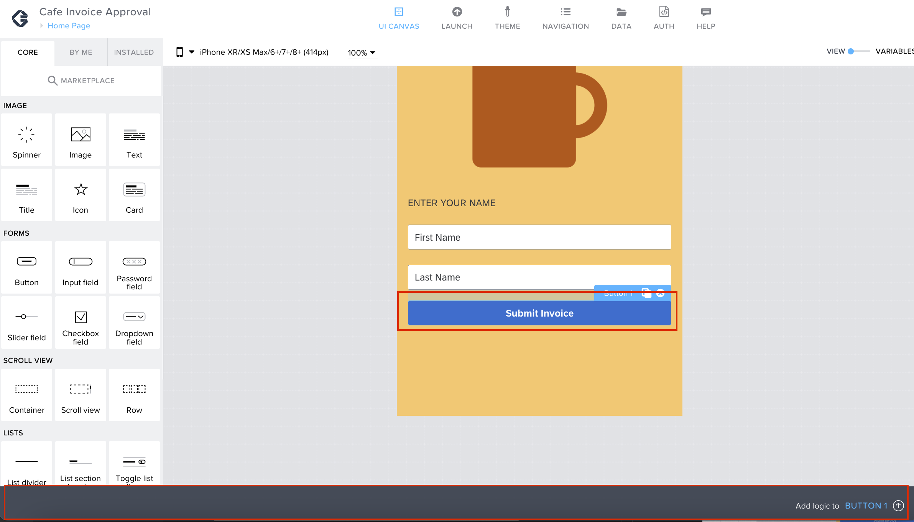

Previous Step: <a href="https://github.com/SAP-samples/process-automation-enablement/blob/main/Workshops/LCNC_Roadshow%20-%20simplified/Build%20Apps/2%20Home%20Page/2_1%20UI%20Building/readme.md">  2_1 UI Building for Home Page</a>

# Logic Building for the Home Page

You have successfully created the UI for the home page of your application. Now, let’s build logic for your application

1. Switch to <b>VARIABLES</b> view.
  

2. By default, you will be on <b>APP VARIABLES</b> tab. Now click on <b>ADD APP VARIABLE</b>. 
   These app variables can be used across all the pages in your application.  

3. Change the name of the variable to “<i>FirstName</i>” in the properties tab of the variable.
  

4. Similarly, add another app variable and rename it as “<i>LastName</i>”.  
	
  
5. Switch back to <b>Canvas</b> view.  

6. Now, we can save the values from the input field to the App variables that was created in last step. 
Select the first input field, and under the properties of the input field component click on <b>X</b> icon under <b>Value</b> to bind a value to the component.  

7. A binding menu will open. Select <b>Data and Variables</b>.  

8. Now select <b>App variable</b>.  

9. Here, you can see the list of App variables available in your application. 
 Since, the current input field component is for the first name, select <b>FirstName</b> app variable and click on <b>SAVE</b> button.  
 
 
10.  Similarly, select the Input field 2 and click on click on <b>X</b> icon under <b>Value</b> to bind a value to the component.  
 

11. A binding menu will open. Select <b>Data and Variables</b>.  

12. Now select <b>App variable</b>.  

13. Select <b>LastName</b> app variable and click on <b>SAVE</b> button.  

14. We need to create a new page now.  Before that click on <b>SAVE</b> on the top right corner to
save the progress of your application.  

15. Select <b>Home Page</b> on the top left to open the page dashboard of your application.  

16. Click on <b>ADD NEW PAGE</b> to add a page for your application.  

17. Under the <b>Name</b>, enter "<i>Details</i>". 
 click on <b>OK</b> button.  
 

18. We can work on this page later, Click on <b>SAVE</b> and switch back to <b>Home Page</b>.  

19. To switch back to Home page click on <b>Details</b> on the top left corner to open the page dashboard.  

20. Now select the <b>Home Page</b> to open the home page.  

21. Select the button component and click anywhere on the grey bar on the bottom to open the logic composer.  

22. The logic composer for button component will pop-up now.  You can see the default trigger <b>Component tap</b> on the logic canvas. So, the flow will trigger when you tap on the button component. 
Drag and drop <b>Open page</b> logic from the logic component library to the logic canvas.  

23. Connect the nodes of the two components to create a flow between these two logic components.  

24. Now select <b>Open Page</b> component. On right-hand side you can see the properties of the logic
component. Since your app only has two pages for now, by default other page will be selected.  

25. Click on <b>SAVE</b> to save your progress.  

#### Home Page has been created successfully. Next you will develop the details page. 

Next Step: <a href="https://github.com/SAP-samples/process-automation-enablement/blob/main/Workshops/LCNC_Roadshow%20-%20simplified/Build%20Apps/3%20Details%20Page/readme.md">3 Details Page</a>
