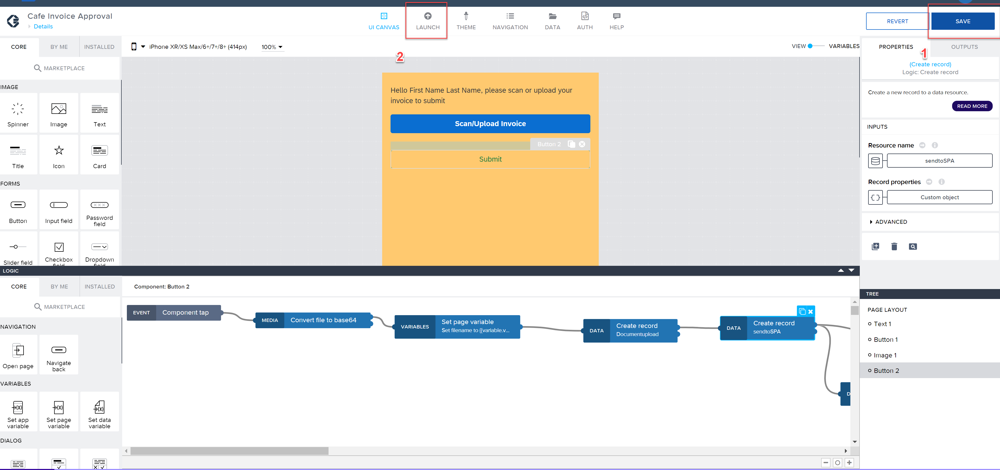

Previous Step: <a href="https://github.com/SAP-samples/process-automation-enablement/blob/main/Workshops/LCNC_Roadshow%20-%20simplified/Build%20Apps/3%20Details%20Page/3_3%20Logic%20Building%20for%20Submit%20Button/readme.md"> 3_3 Logic Building for Submit Button</a>.

1. if you have not yet, **Save** the whole application using the button in the top right corner. After that open the **Launch** tab.

2. You can either **open** application as a web app on the computer or on your mobile phone. You can use both of the options. Please note that: 
- you can only upload the file if you plan to use option 1
- you need to save an invoice to your mobile phone if you plan to use option 2

3. **Open** the Application you have created.

4. Enter the data and submit the invoice file!

Please proceed to **SAP Process Automation** part now.
[1 Create Process](https://github.com/SAP-samples/process-automation-enablement/tree/main/Workshops/LCNC_Roadshow%20-%20simplified/SAP%20Process%20Automation/1%20Create%20Process/spa-dox-create-process.md)
