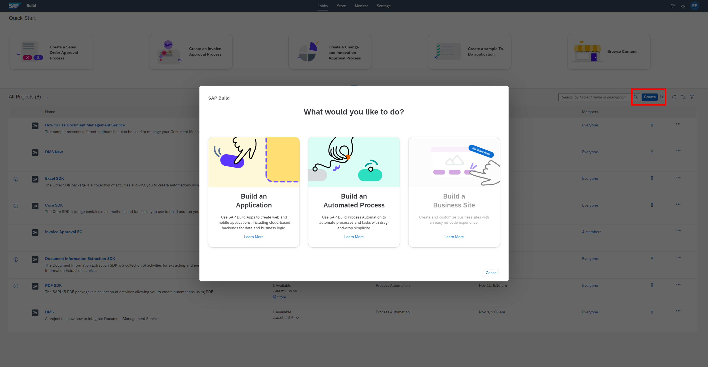

## Details
You work in the finance department of the company and need to regularly process incoming scanned invoices.
This is actually causing a lot of manual effort in order to extract the data out of the pdf or image, send to the approval of the manager before the data would be actually entered into the system.
This needs to be automated since we are talking about multiple invoices which are coming every single day. Also we need to define the approval flow depending on the specific criteria (in this tutorial series, company is considered as criteria).

### You will learn
  - How to create a project and the related process
  - How to add a form to trigger this process
### About this Exercise

In this exercise you create a process which houses all the project files related to an automation, including bots, workflows, decisions and forms. As part of this, you will define a set of inputs that will define the location and information of the process trigger. 

---

### Step 1: Create a Business Process Project

   The project includes all artifacts you will create during the course of these tutorials. You can share, release, rename or delete these projects.

1. Once you have entered the Lobby, choose **Create**, then select **Build an Automated Process** followed by **Business Process**.

    

2. In the wizard enter the **Project Name** `Invoice Approval XX`, where XX must be replaced with **your initials**, and also a **Short Description**, then choose **Create**.

    

---

### Step 2: Create a Process

   The process will describe the flow of the activities.

1. Within the newly created project **Invoice Approval**, select **Create** and then choose **Process**.

    

2. Maintain the **Name** **`Get Invoice Details`** and also the **Description**. The identifier will be created automatically.

    

    The process with a start and end event is now available for you.

---

### Step 3: Define the Form to Start the Process

   When working with SAP Build Process Automation, processes can be triggered by a variety of ways such as an API, a form and schedules. In this example, we will build a form that a user will enter information into to trigger the process.

1. In the canvas
    - Select **+**
    - Select **Forms**
    - Select **New Form**.

    

2. Provide the following information and choose **Create**:

    |  Field Name     | Value
    |  :------------- | :-------------
    |  Name          | **`Invoice Request Form`**
    |  Description    | **`Form to start the process`**

    > Note: Identifier will be filled automatically.

    

    In the form you have multiple layout and input elements.

    - Click on '...' next to the newly created form and open the Editor.

    

3. Create a headline, drag and drop **Headline 1** into the canvas.

    

4. Now, we will create the form layout the will be used to input the relevant information for the process:

    - Add a Headline 1 called: `Invoice Request Form`
    - Add a Paragraph: `Please provide the following details to start the process`

    
    

5. Now, let's add some input fields into the form that need to be set to required:

    |  Input Field Type  | Name | Settings
    |  :------------- | :------------- | :------------
    |    Text       |**`Employee Name`**| **Required**
    |    Text       |**`File Path`**| **Required**
    |      Date      |  **`Current Date`** | **Required**

    
    

Proceed to the next exercise: [2 Create Automation](https://github.com/SAP-samples/process-automation-enablement/tree/main/Workshops/LCNC_Roadshow%20-%20simplified/SAP%20Process%20Automation/2%20Create%20Automation/spa-dox-create-automation.md)

---
