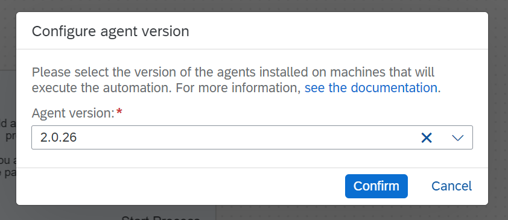
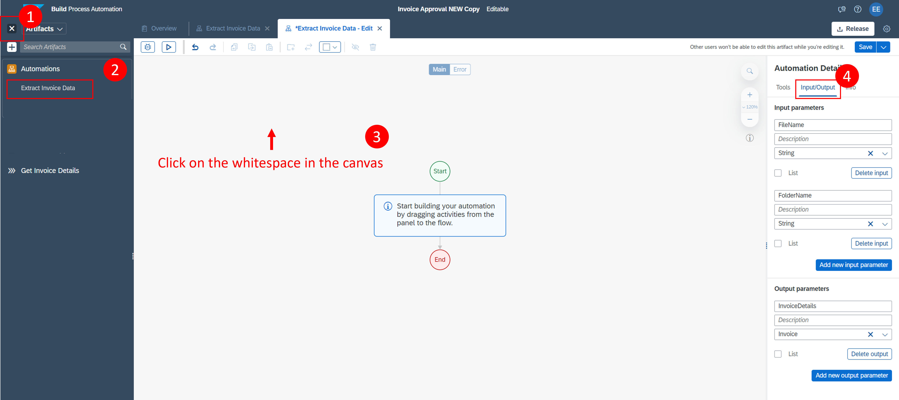
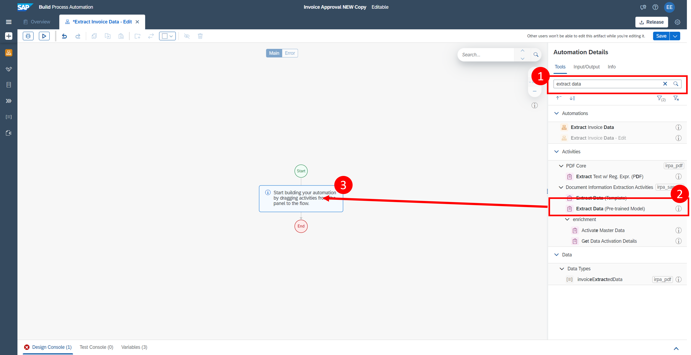
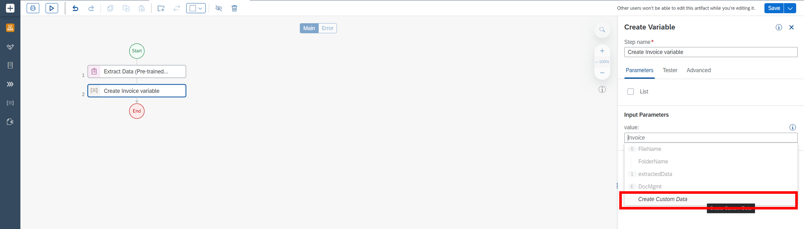
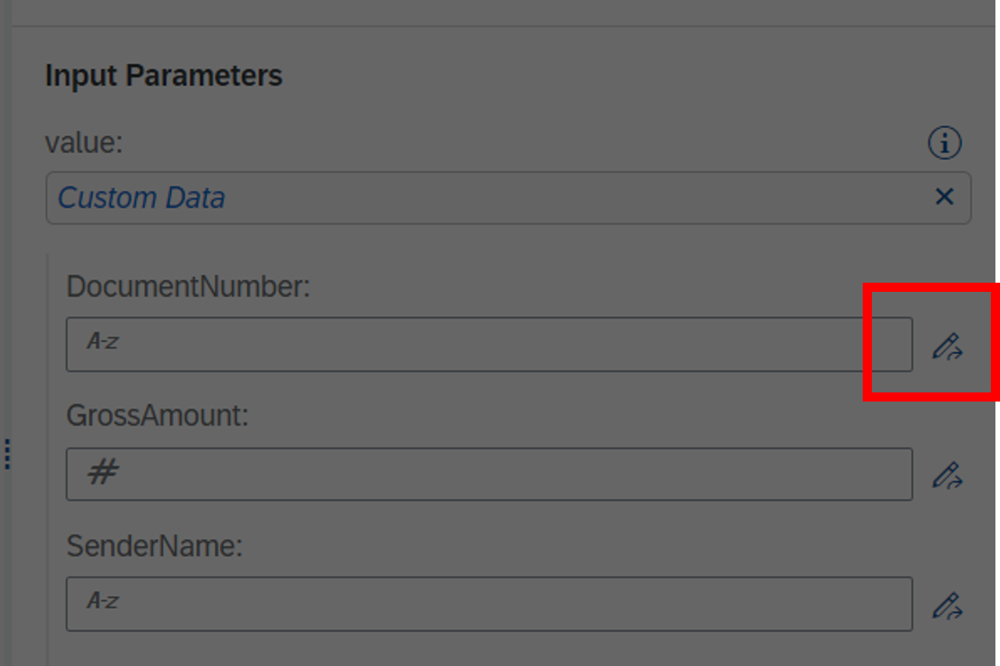
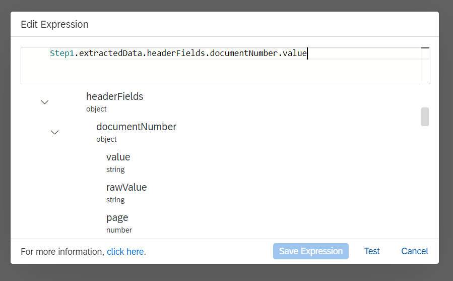

## Prerequisites
- Complete  [1 Create Process](https://github.com/SAP-samples/process-automation-enablement/tree/main/Workshops/LCNC_Roadshow%20-%20simplified/Build%20Process%20Automation/1%20Create%20Process/readme.md) tutorial
 - Download the [Invoice Document](https://github.com/SAP-samples/process-automation-enablement/blob/main/Workshops/LCNC_Roadshow%20-%20simplified/Build%20Process%20Automation/2%20Create%20Automation/invoice.pdf) to your local machine

## Details
### You will learn
  - How to extract data using Document Extraction Template
  - How to bind parameters between process and automation

---

### Step 1: Create Automation

1. In the process **Get Invoice Details**:
    - Choose .
    - Select **Automation** > **New Automation**.

    

2. A pop-up will appear to configure the Desktop Agent version. Do the following in the pop up:
    - From the dropdown, select the version of the Desktop Agent installed on your machine. During the exercise we would use version **2.0.26**; so please select it.
    - Choose **Confirm**.

    > It would be with suffix as **Registered**. Version on a screenshot can differ.

    

3. A new pop-up will appear to create the automation. Enter the following:

    -  Name: **Extract Invoice Data**.
    -  Description: **Extract data from invoice**
    -  Click **Create**.    

    

    An automation **Extract Invoice Data** will be created successfully and presented in the screen.

---

### Step 2: Create Data Types

1. Click on the **Plus** symbol on the left of your screen > Create > **Data Type**.

    

2. Enter the name of the data type as **Invoice** and choose **Create**.

    

3.  Select New Field and add the following information, then save once finished

    |  Field Name     | Type
    |  :------------- | :-------------
    |  `DocumentNumber`| String
    |  `GrossAmount`   | Number
    |  `SenderName`    | String

    

---

### Step 3: Create Input and Output Parameters

> Input and output parameters allow you to exchange data in the workflow of your automation between activities, screens, and scripts.

1.  Now we will create the input and output parameters in you automation. 
    - Click on the left panel to view your artifacts
    - Select `Extract Invoice Data`
    - Click on the canvas

    
    

2. Under input and output, add the following information, one by one.

    |  Parameter Name       | Data type        | Parameter Type | Description
    |  :---------------     | :-------------   | :------------- | :---------------
    |  `FilePath`      | **`String`**     | **Input**          | Path where the invoice document is stored  
    |  `InvoiceDetails`    | **`Invoice`** | **Output**         | Extracted Invoice Details
    
    

3. Choose **Save**.    

---

### Step 4: Configure Pre-Trained Data Extraction Model
> In this step, we will define the headers that a pre-trained model will extract from our invoice.pdf.

1. In this part, we will add a pre-trained model for an invoice to extract the necessary information from our invoice.pdf
    
    - Click on the canvas
    - In the tools panel, search `extract data`
    - Add `Extract Data (Pre-trained Model)` into the automation 

    

2. Now we will configure the pre-trained model

    - Select the Extract Data (Pre-trained model) step to open its configuration panel
    - Select Document Type: `Invoice`
    - Select the pencil next to documentPath to open the **Expression Editor**
    - Enter the following (you can copy and paste): `"C:\\Users\\Public\\" + Step0.FileName`
    - Test and Save Expression
        > Please ensure the expression is entered correctly in the editor.
    
    
    
    

3. Next, we will add the data type **invoice** which we created in Step 1

    - Click on the canvas to open the tools panel
    - Search `invoice`
    - Click and drag invoice data type into the flow

    

4. Configure input parameters for **Create Invoice Variable**

    - Click on Create Invoice Variable
    - Under value, select `Create Custom Data`

    
    
    > Note: Document Number, Gross Amount and Sender Name have been prepopulated as we defined these as outputs of the data type Invoice earlier.
    
    - Click on the Pencil icon to open the expression editor.
        > Here we will be able to see all of the header fields associated 
    
    

    - To write the expression, we will use the dropdown options
        
        - Variables > extractedData > headerFields > documentNumber > Click `Value`
        - An expression is generated: `Step1.extractedData.headerFields.documentNumber.value`
        - Click Test, then save your expression
    
    
    
    - Complete the same steps for `Gross Amount` and `Sender Name`

        - Gross Amount: `Step1.extractedData.headerFields.grossAmount.value`
        - Sender Name: `Step1.extractedData.headerFields.senderName.value`
        - Change output parameter to: `myinvoiceData`
        - At the end, you should have something that looks like this:

    

5. Add a log message to view the output of the automation

    - Click on the canvas 
    - Search `Log Message`
    - Add to your automation flow
    - Add `myinvoiceData` to the message field.

    

---

### Step 5: Passing the Parameters Outside the Automation

1. Select the **End** and pass the variable `myinvoiceData` to the output parameter `InvoiceDetails` which you have created earlier.

    

2. **Save** the automation.

---

### OPTIONAL Step 6: Test the Automation (Requires Desktop Agent)

We are using virtual desktop machines connected to the tenant, so please proceed to **Step 7**.

1. Select Test button and enter the `FilePath` where the invoice document is stored locally on your machine.

    

2. The automation opens the Invoice Document, extracts data and prints the details i.e Document number, Gross amount and Sender name.

    

3. Your automation is built successfully.

---

### Step 7: Mapping of Parameters to the Automation and Process

1. Navigate to the process **Get Invoice Details** and select the automation **Extract Invoice Data**.

2. Map the input parameters of the automation to the form parameter `FilePath`.

    

3. Your process looks like below once you complete this tutorial.

    

- Continue with the next part of the tutorial [3 Create Decision](https://github.com/SAP-samples/process-automation-enablement/tree/main/Workshops/LCNC_Roadshow%20-%20simplified/Build%20Process%20Automation/3%20Create%20Decision/readme.md)

---
