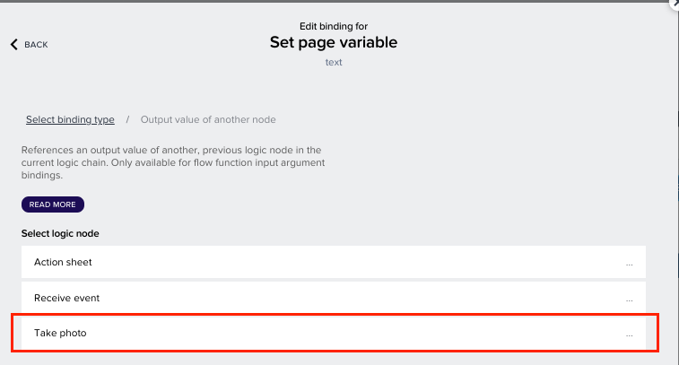
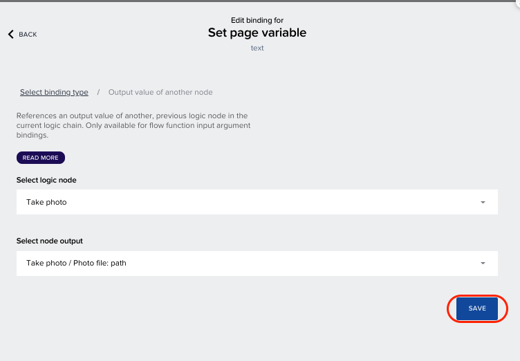
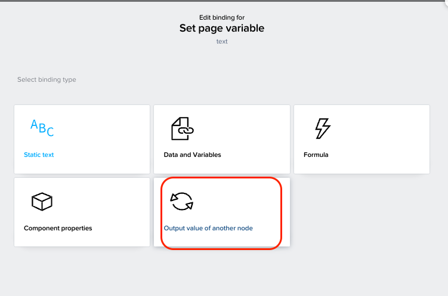

Previous Step: <a href="https://github.com/SAP-samples/process-automation-enablement/tree/main/Workshops/LCNC_Roadshow/AppGyver/3%20Details%20Page/3_2%20Data%20Connection/Readme.md"> 3_2 Data Connection for Details Page</a>

# Logic Building for Scan Button

1. Open the logic composer for the <b>Scan/Upload</b> button by click on the grey bar in the bottom

2. By default, the trigger event will be <b>Component tap</b>. 
Now we are going to download a new component from the <b>MARKETPLACE</b>.

3. In the search bar, search for “<i>action sheet</i>”.  Now, select the <b>Action</b> Sheet component.

4. Click <b>Install</b> button to install this component in your library.

5. You can see the <b>Action sheet</b> component, now available under <b>INSTALLED</b> tab of the logic component library.
  Drag and drop the <b>Action sheet component</b> to logic canvas.

 
 
6. Connect the nodes of <b>Component tap</b> and <b>Action sheet</b>.   
Now open the binding menu for the <b>Action sheet options</b> under the component’s properties on the right-hand side. 

7. In the binding menu, select <b>List of values</b>.

8. Click on <b>Add a value</b>.

9. Under the <b>label</b> enter “<i>Scan Invoice</i>” and under <b>value</b> enter “<i>image</i>”.

10. Now <b>Add another value</b>. Enter “<i>Upload Invoice</i>” under <b>label</b> and “<i>upload</i>” under <b>value</b> 
and click on <b>SAVE</b>.

11. Drag and drop the <b>If condition</b> logic component which is available under <i>UTILITY</i> in the logic component library on the left-hand side.

12. Connect the logic nodes of <b>Action sheet</b> and <b>If condition</b>. Open the binding menu for the
Condition of the <b>If condition</b> logic component.

13. In the binding menu, select <b>Formula</b>.

14. Open the formula editor.  Select <b>Output of another node</b> and double click on
<b>outputs["Action sheet"].pickedAction.value</b> to use the function in your formula.
Now add, the following in the formula.
<pre>==”image”</pre> 
The formula should look like.
<pre>outputs["Action sheet"].pickedAction.value=="image"</pre>
Click on <b>SAVE</b> button.

15. The <b>If condition</b> node has two output nodes. The first node is for True case and the second node is for false case. 
Now drag and drop <b>Take photo</b> logic component under available under <b>DEVICE</b> in the logic component library on the left-hand side. 
Now connect the first output node of <b>If condition</b> to the <b>Take photo</b>.

16. Now open <b>Marketplace</b> and search for “<i>pick image</i>”.
Now select <b>Pick image from library</b> and  Click on <b>INSTALL</b> to use the component.

18. Drag and drop the <b>Pick image from library</b> under Installed tab to the logic canvas. 
Connect the second output node of the <b>If condition</b> logic component with the <b>Pick image
from library</b>. 

19. From the Core tab of the component library drag and drop the two <b>Set page variable</b> components.

20. Connect one <b>Set page variable</b> with <b>Take photo</b> and other <b>Set page variable</b> with <b>Pick
image from library</b>.

21. Open the binding menu for <b>Assigned value</b> of the <b>Set page variable</b> connected with <b>Take photo</b>.

22. In the binding menu, select <b>Output value of another node</b>.

23. Select <b>Take photo</b>.

24. Select <b>path</b> and click on <b>SAVE</b>.

25. Make sure the page variable here is <b>InvoiceScan</b>.

26. Now open the binding menu for <b>Set page variable</b> logic which is connected with the <b>Pick image from library</b> logic.

27. Select <b>Output value of another node</b>.

27. Select <b>Pick image from library</b> node.

28. Now select <b>path</b> and click on <b>SAVE</b>.

28. Click on <b>SAVE </b> again.

29. Make sure the page variable here is <b>InvoiceScan</b>. If not change it to <b>InvoiceScan</b>.

30. The logic for <b>SCAN/UPLOAD</b> button should like this.

  Next Step: <a href="https://github.com/SAP-samples/process-automation-enablement/tree/main/Workshops/LCNC_Roadshow/AppGyver/3%20Details%20Page/3_4%20Logic%20Building%20for%20Submit%20button/Readme.md"> 3_4 Logic Building for Submit Button</a>
