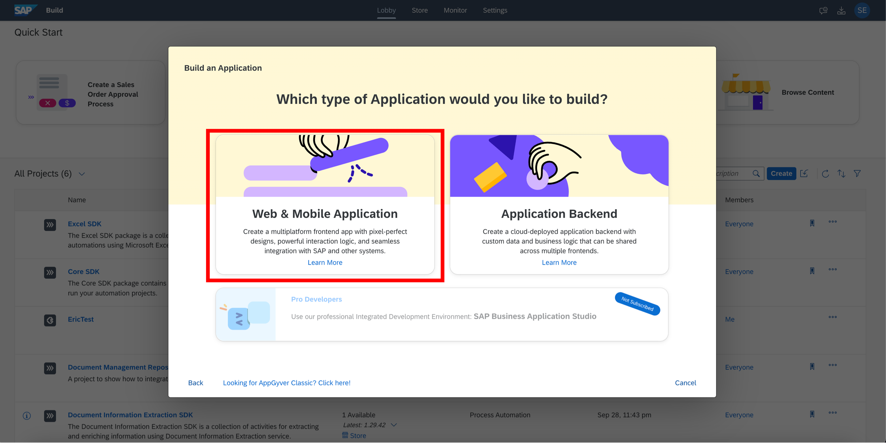

# Create an Build Apps Project

1. In the Build Application lobby click on <b>Create</b>.  

2. Now select <b>Build an Application</b>.   

3. Click on <b>Web & Mobile Application</b> to start building your application.  
 

4. Under Project Name, enter <b><i>"Company Name</i> Invoice Approval"</b>. For example, <i>Cafe Invoice Approval</i>.  
Click on <b>Create</b> to start building your application.   

Next Step: <a href=https://github.com/SAP-samples/process-automation-enablement/tree/main/Workshops/LCNC_Roadshow/Build%20Apps/2%20Home%20Page/Readme.md> 2 Home Page</a>
