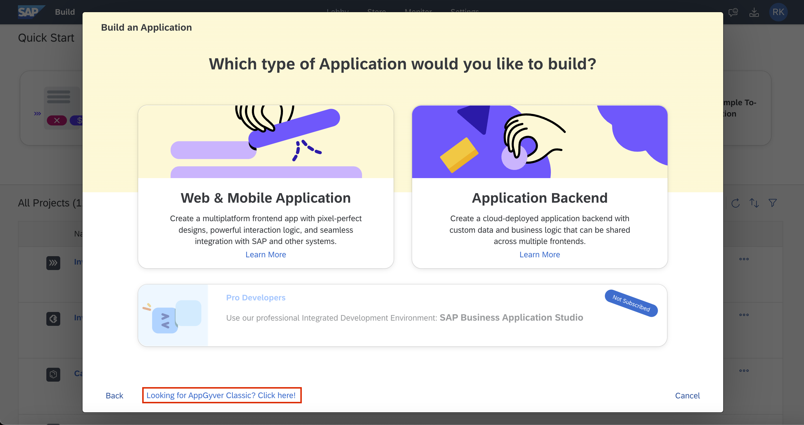
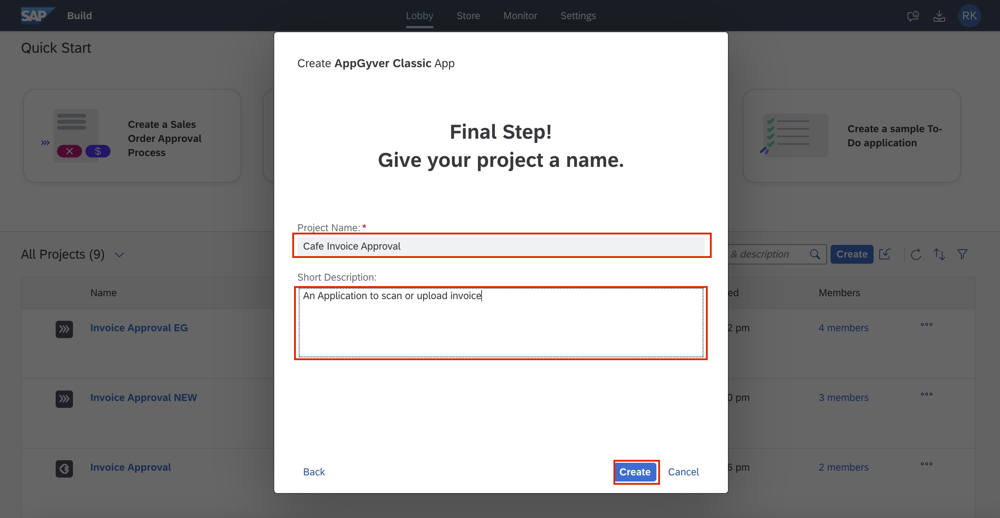

# Create an Build Apps Project

1. Application lobby is now called <b>Build</b>. Within the <b>SAP Build</b> and click on <b>Create</b>.  

2. Now select <b>Build an Application</b>.   

3. Click on <b>Looking for AppGyver Classic? Click here!</b> to start building your application.  
 

4. Under Project Name, enter <b><i>"Company Name</i> Invoice Approval"</b>. For example, <i>Cafe Invoice Approval</i>.
Enter a short description for your reference. <b><i>"An application to Scan or upload invoice”</b></i>.  
Click on <b>Create</b> to start building your application.   

Next Step: <a href=https://github.com/SAP-samples/process-automation-enablement/tree/main/Workshops/LCNC_Roadshow/Build%20Apps/2%20Home%20Page/Readme.md> 2 Home Page</a>
