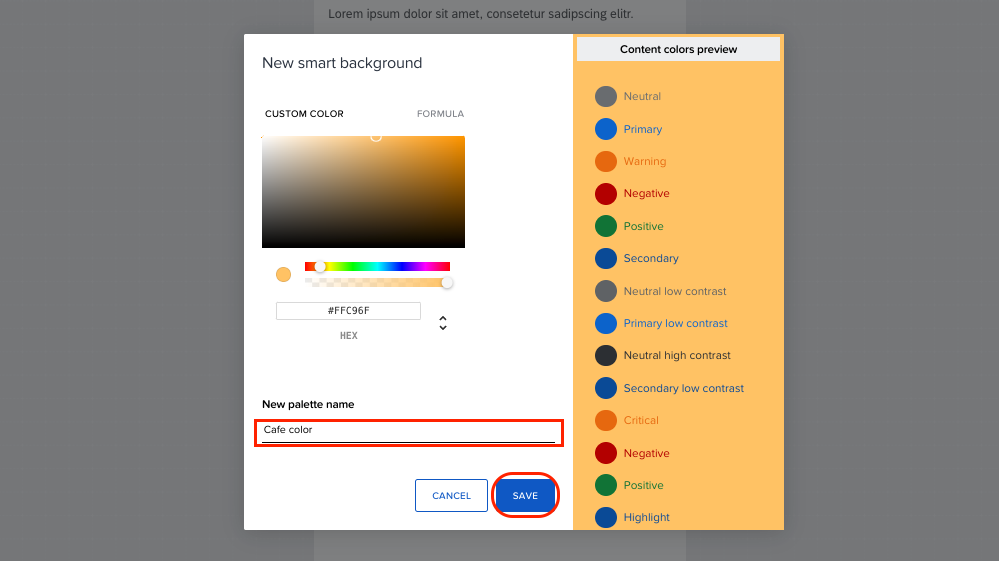
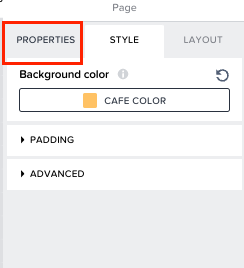

# Changing the Background of the Page

 1. Switch to <b>STYLE</b> tab to change the background of your application.  

 2. You can select a background for your application based on Design theme of your company. If your company’s design color is not available under <b>UNIVERSAL BACKGROUND COLORS</b>, you can create a new color scheme by clicking on <b>NEW PALETTE</b>.  
 

 3. Now you select the color gradient for your application or directly get the shade if you have <b>HEX/RGB</b> value of your color. 
After selecting the color gradient you want, give a name to the color under <b>New palette name</b>, so that it can be reused later. 
After entering the name of the color, click on <b>SAVE</b> to save the color.  
 
 
 4. Now switch back to <b>PROPERTIES</b> tab.  
 

 
 Back to the exercise : <a href= "https://github.com/SAP-samples/process-automation-enablement/tree/main/Workshops/LCNC_Roadshow/Build%20Apps/2%20Home%20Page/2_1%20UI%20Building/Readme.md"> 2.1 UI Building for Home Page</a>
