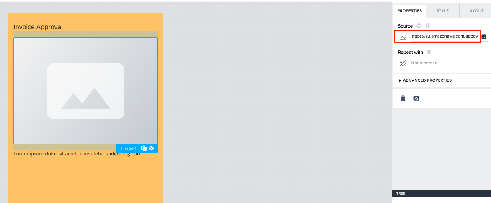
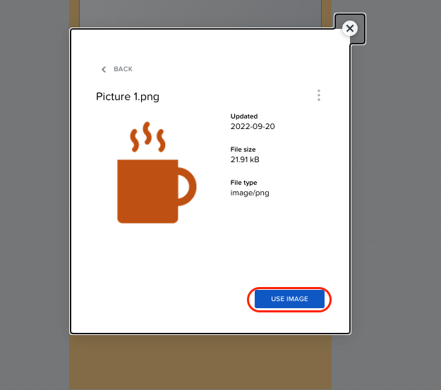
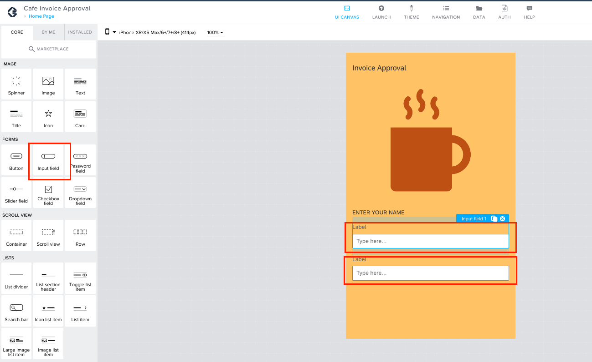

Previous Step: <a href="https://github.com/SAP-samples/process-automation-enablement/tree/main/Workshops/LCNC_Roadshow/Build%20Apps/2%20Home%20Page/Readme.md">2 Home Page</a>

# UI Building for Home Page

Now it's time to design your page.

If you wish to change the Background color of the page, please follow this steps: <a href="https://github.com/SAP-samples/process-automation-enablement/tree/main/Workshops/LCNC_Roadshow/Build%20Apps/2%20Home%20Page/2_1%20UI%20Building/Change%20the%20Background/Readme.md"> Change the Background color</a>

1. Click on “<i>Headline</i>” on the canvas to select the <b>Title</b> component.
Now, the properties tab on the right-hand side will show the properties of the Title component
where you can modify this component.  Under <b>Content</b>, enter “<i>Invoice Approval</i>”.  

2. Drag and drop an <b>Image component</b> from component library on the left-hand size under the Title component which is now displayed as Invoice Approval.  

3. If you have a public URL link for your company’s logo, you can paste it under the <b>Source</b> in the properties of <b>Image</b> component.  
  
Alternatively, 
3.1 You can also upload the image from your computer by clicking on the image icon under the <b>Source</b>.

  3.2 Click on <b>DRAG & DROP FILES HERE OR CLICK TO UPLOAD</b> and now select image from your computer.
  
  3.3 You can preview the uploaded image now. Click on the image now.
  
  3.4 Click on <b>Use Image</b>, so that this image will be displayed on the image component.
 
  

4. Select the <b>Text</b> component and change the <b>Content</b> of the Text component to “<i>ENTER YOUR NAME</i>” in the properties tab on the right-side.
  

5. Drag and drop two <b>Input field</b> component from the component library on the left-hand side into the canvas.
  

6. Select the first <b>Input field</b> component. Under the properties of Input field 1 component, clear the <b>Label</b> and enter “<i>First Name</i>” under <b>Placeholder text</b>.
  

7. Similarly, select the Input field 2 component and clear the <b>Label</b> and enter “<i>Last Name</i>” under <b>Placeholder text</b>.
  

8. Drag and drop a <b>Button</b> component from the component library on the left-hand side to the canvas.
  

9. You can change the <b>Label</b> on the button in the properties tab of the button component. Change it to “<i>Submit Invoice</i>”.
  

Next Step : <a href="https://github.com/SAP-samples/process-automation-enablement/tree/main/Workshops/LCNC_Roadshow/Build%20Apps/2%20Home%20Page/2_2%20Logic%20Building/Readme.md"> 2_2 Logic Building</a>
