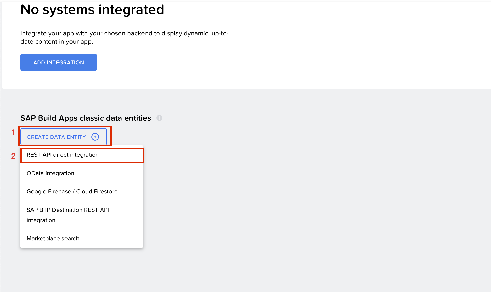
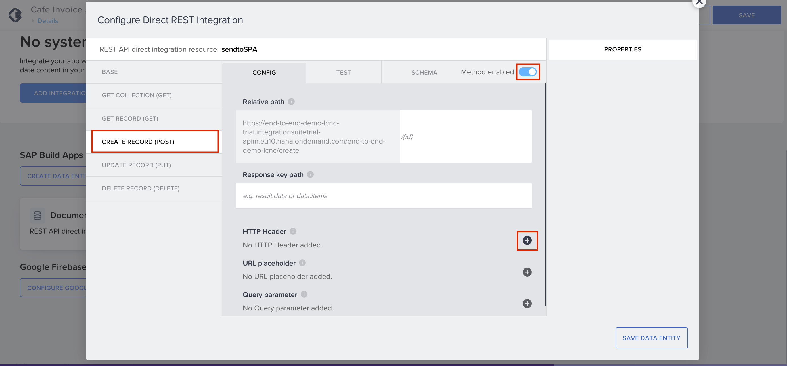
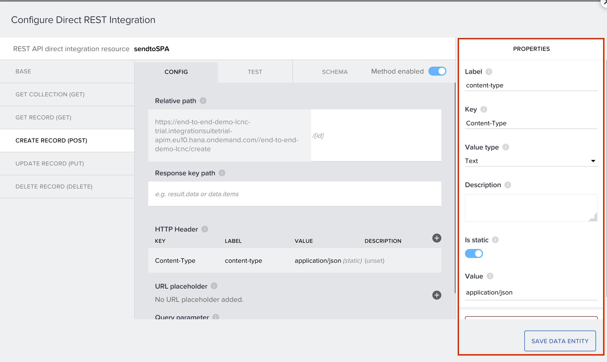
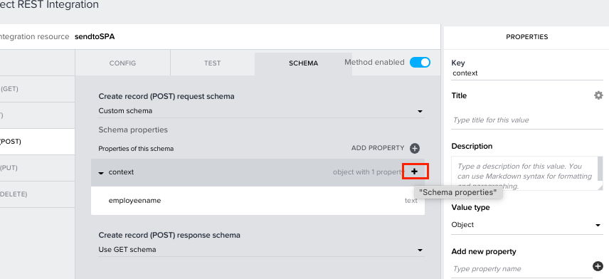
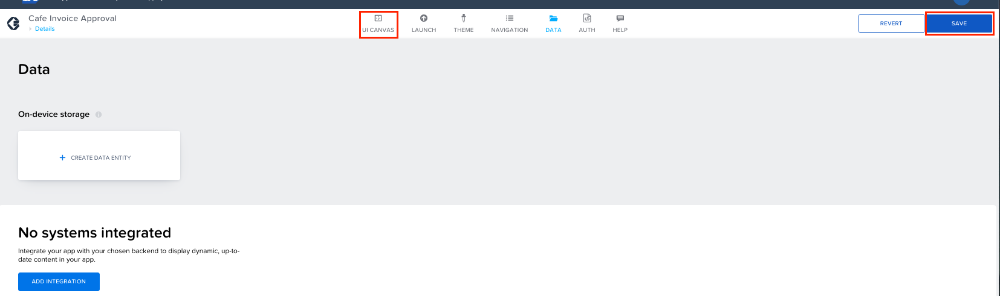

Previous Step: <a href="https://github.com/SAP-samples/process-automation-enablement/tree/main/Workshops/LCNC_Roadshow/Build%20Apps/3%20Details%20Page/3_1%20UI%20Building%20for%20Details%20page/Readme.md"> 3.1 UI Building for Details Page</a>.

# Data Connection for Details Page.

The app will have two Data Conenctions:  
  i) Document Management System (DMS) - to store the invoice from the application 
 ii) SAP Build Process Automation - to trigger the invoice processing. 
 
 Both the connections will be integrated through Rest API.
   

1. Click on <b>DATA</b> tab on the top to open the Data connections tab.  

2. Select <b>AppGyver classic data entities</b> and select <b>REST API direct integration</b>.  

3. In the <b>BASE</b> tab of the API configuration enter the following values.  
<b>Resource ID</b> : Documentupload  
<b>Resource URL</b>: https://end-to-end-demo-lcnc-trial.integrationsuitetrial-apim.eu10.hana.ondemand.com/end-to-end-demo-lcnc/httpjsonv2/docrepoupload  

4. Select the <b>GET COLLECTION</b> tab and disable the <b>Method enabled</b> option to disable get collection for the API.  

5. Select <b>GET RECORD</b> tab and disable the <b>Method enabled</b> option to disable get record for the API.  

6. Now select the <b>CREATE RECORD</b> tab and enable it.  

7. Switch to <b>SCHEMA</b> tab. 
 Under <b>Create record (POST) request schema</b> use the drop down list and select <b>Custom schema</b>.  
 
 
8. Click on <b>ADD PROPERTY</b>.	 					
Rename the key in the property to “<i>base64</i>”.  

9. Add another property and rename it to “<i>fileName</i>”.  
  
  
10. Click on <b>SAVE DATA ENTITY</b>.  

11. Add another <b>REST API direct integration</b>.  

12. Add the following configuration in the BASE tab.  
<b>Resource ID</b> : sendtoSPA 
<b>Short description</b> : Send info to SPA 
<b>Resource URL</b> : https://end-to-end-demo-lcnc-trial.integrationsuitetrial-apim.eu10.hana.ondemand.com/end-to-end-demo-lcnc/lcnc  

13. Disable <b>GET COLLECTION</b> and <b>GET RECORD</b> and enable <b>CREATE RECORD</b>. 
Now add a HTTP header.   

14. Enter the following values in the fields under the properties of the HTTP header.  
<b>Label</b> : content-type 
	<b>Key</b> : Content-Type 
  <b>Value type</b>: Text 
  <b>Is static</b> : enabled  
  <b>Value</b> : application/json  
  Click on <b>SAVE DATA ENTITY</b>  

  15. Now switch to <b>SCHEMA</b> tab and <b>Custom schema</b> under <b>Create record (POST) request schema</b>.  

  
16. Click on <b>ADD PROPERTY</b> rename the key to “<i>context</i>” and change the value type to “<i>Object</i>”.  

  
17. Select the <b>id</b> and rename it to “<i>employeename</i>”.  

  
18. Click on the <b>+</b> icon in the context tab to add more properties under context.   

19. Add two properties under context and rename the <b>key</b> values as “<i>filename</i>” and “<i>foldername</i>”.  

  
20. Now click on <b>ADD PROPERTY</b> to add another property and rename it as “<i>definitionId</i>”.  

  
21. Click on <b>SAVE DATA ENTITY</b> to save the data connection.  

  
22. Click on <b>SAVE</b> and switch to <b>UI CANVAS</b>.  
  
  
  Next Step: <a href="https://github.com/SAP-samples/process-automation-enablement/tree/main/Workshops/LCNC_Roadshow/Build%20Apps/3%20Details%20Page/3_3%20Logic%20Building%20for%20Scan%20button/Readme.md"> 3_3 Logic Building for Details Page</a>

