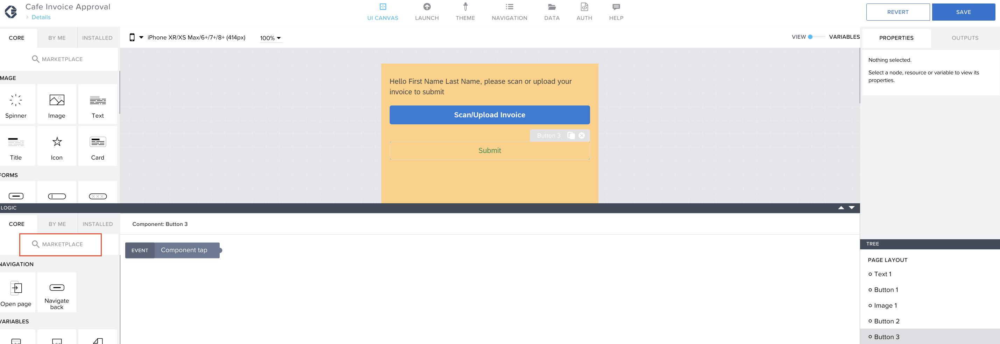
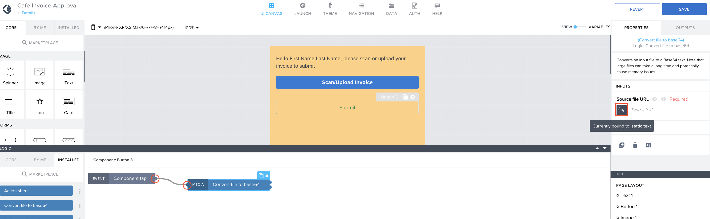

Previous Step: <a href="https://github.com/SAP-samples/process-automation-enablement/tree/main/Workshops/LCNC_Roadshow/AppGyver/3%20Details%20Page/3_3%20Logic%20Building%20for%20Scan%20button/Readme.md">3_3 Logic Building for Scan button</a>

# Logic Building for Submit button

1. Now, open the logic composer for the button component to create a logic to send the image to SAP Process Automation.  
Open the <b>MARKETPLACE</b> in the logic component library.  

2. In the search bar, search for “<i>base64</i>” and select <b>Convert file to base64</b>
and <b>Install</b> it.  

3. Drag and drop <b>Convert file to base64</b> to the logic canvas.  

4. Connect the nodes of <b>Component tap</b> and <b>Convert file to base64</b>.
Open the binding menu for <b>Source file URL</b> of the <b>Convert file to base64</b> logic component.  

5. In the binding menu select <b>Data and Variables</b> and select <b>Page variable</b>.  

6. Now select <b>InvoiceScan</b> and click on <b>SAVE</b>.  

7. Now drag and drop <b>Set page variable component</b> from the component library and connect the node with <b>Convert file to base64</b>.  

8. Connect the nodes <b>Convert file to base64</b> and <b>Set Page variable</b>.  Open the binding menu for set page variable.  

9. In the Binding menu, select <b>Formula</b> and open the formula editor. 				
Select App variable and double click on <b>appVars.LastName</b> to use the function.  

10. Now add the following values.<pre>+TIMESTAMP()+".png"</pre>
The overall formula will look like.<pre>appVars.LastName+TIMESTAMP()+".png"</pre>
Click on <b>SAVE</b>.  

11. Drag and drop <b>Create record</b> logic component to logic canvas. 				
In the properties tab of the logic component check if the <b>Resource name</b> is <b>Documentupload</b>, 
Open the binding menu of <b>Record properties</b>.   

12. In the binding menu, select <b>Object with properties</b>.  

13. Open the binding menu for <b>base64</b>.  

14. In the binding menu select <b>Formula</b> and open the formula editor. 				
In the formula editor, enter the following formula.<pre>REPLACE_ALL(outputs["Convert file to base64"].base64,"data:image/png;base64,","")</pre>
Click on <b>SAVE</b> button.   

15. Now, open the binding menu for <b>fileName</b>.  

		
16. In the binding menu, select <b>Data and Variables</b> and select <b>Page variable</b>.  Now select the variable <b>filename</b> and click on <b>SAVE</b>.  

17. Save the bindings now.  

18. Drag and drop another <b>Create record</b> logic component to the logic canvas.
Change the resource name <b>sendtoSPA</b>.						
Open the binding menu for <b>Record properties</b>.   

19. In the binding menu, select <b>Object with properties</b>.   

20. Open the binding menu for <b>filname</b>.  

		
21. In the binding menu, select <b>Data and Variables</b> and select <b>Page variable</b> and select the variable <b>filename</b>. 
Click on <b>SAVE</b>.	  

		
22. The folder name will be static, enter the value “<i>Invoices</i>”.  		

				
23. Now, open the binding menu for the <b>employeename</b>.  

24. In this binding menu, select formula and open the formula editor. 
Enter the following formula<pre>appVars.FirstName+" "+appVars.LastName</pre>
click on <b>SAVE</b>.  

25. Value for definitionId is to be retrieved after creating the process in SAP Process Automation. We will skip it for now and come back later. 
Click on <b>SAVE</b> to save the bindings.  

26. Drag and drop a <b>Open Page</b> logic component to the logic canvas and connect it with the previos <b>Create record</b> component.  
Change the page to <b>Home Page</b>.  

	
27. Drag and drop a <b>Toast</b> component to the logic canvas and connect it with previous <b>Create record </b> component.  
Give the following input under <b>Toast message</b>
	<pre>Your invoice has been submitted successfully</pre>
		
	
28. The Final logic should look like this.  			

Please proceed to **SAP Process Automation** part now.
[1 Create Process](https://github.com/SAP-samples/process-automation-enablement/tree/main/Workshops/LCNC_Roadshow/SAP%20Process%20Automation/1%20Create%20Process/spa-dox-create-process.md)
				

			

		
	
		

