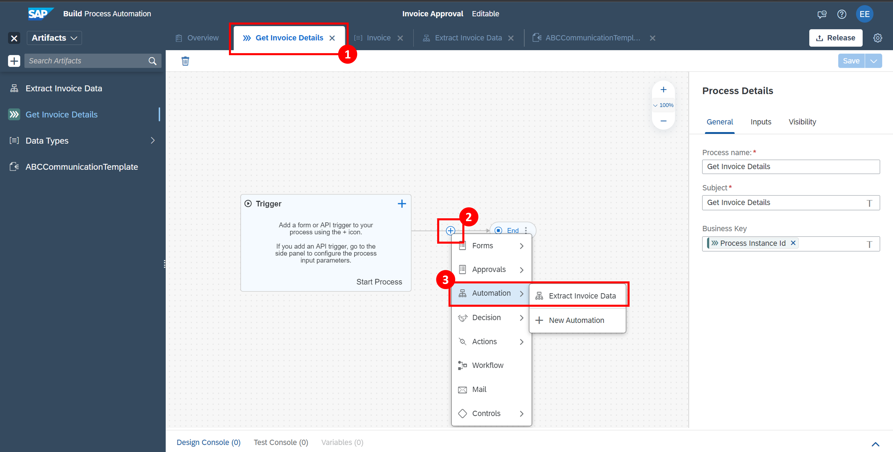
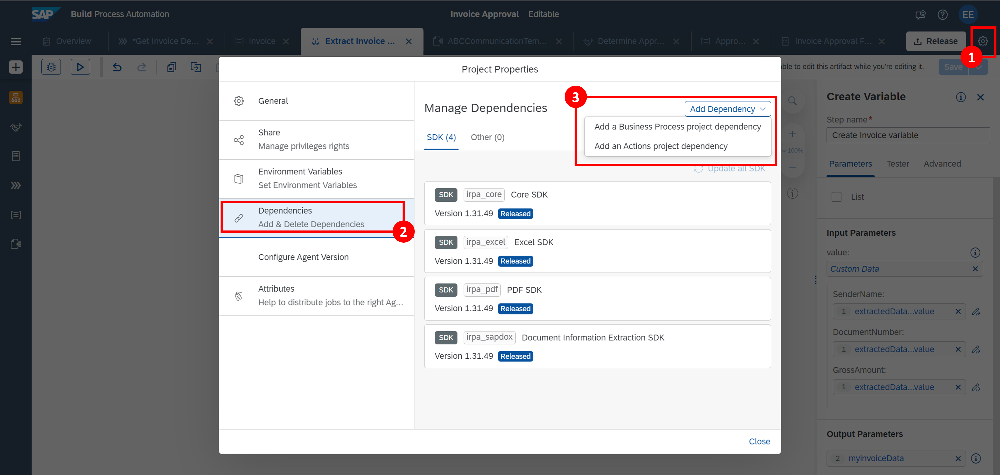
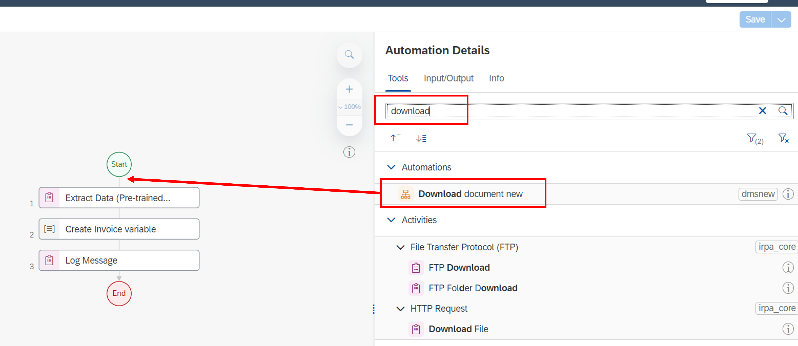

## Prerequisites
 - Complete the previous part of the tutorial [2 Create Automation](https://github.com/SAP-samples/process-automation-enablement/tree/main/Workshops/LCNC_Roadshow/Build%20Process%20Automation/2%20Create%20Automation/spa-dox-create-automation.md)
 
 ## Details
### You will learn
  - How to include the document stored in the DMS into the automation: we need to download it to local folder in order to process by the bot created at the previous step.
---

### Step 1: Add step to download the document 

1. Navigate back to your process. Now we will add the automation to our process flow.

    - Click on **Get Invoice Details** process
    - Click on **+**
    - Navigate to **Automation > Extract Invoice Data**
    - Click on the three dots and select **Open Editor**

    
    

2. Connect the Document Management Service built on Business Technology Platform into your automation

    - Select `Settings` cogwheel
    - Select `Dependencies`
    - Click `Add Dependency`
    - Add a `Business Process project dependency`

    

    - Select `DMS` from the package dropdown
    - Select the latest version
    - Provide the alias: `dms`
  
    

3. Now we can add the package dependency into the automation
    
    - Click on the canvas
    - Search `document`
    - drag `Download document` to the start of your automation

    
    
4. Enter the following parameters into the configuration panel.

    |  Field Name     | Input
    |  :------------- | :-------------
    |  `uploadedFileName:`| **FileName**
    |  `folderName`   | **FolderName**
    |  `outputPath`    | **"C:\\\\Users\\\\Public\\\\" + Step0.FileName**
    
   

Congratulations, you are done with this part. Return back to the Process View. 

Note: please disregard the error in the "Download Document" automation.

  Proceed to the next exercise: [4 Create Decision](https://github.com/SAP-samples/process-automation-enablement/tree/main/Workshops/LCNC_Roadshow/Build%20Process%20Automation/4%20Create%20Decision/spa-dox-create-decision.md)
