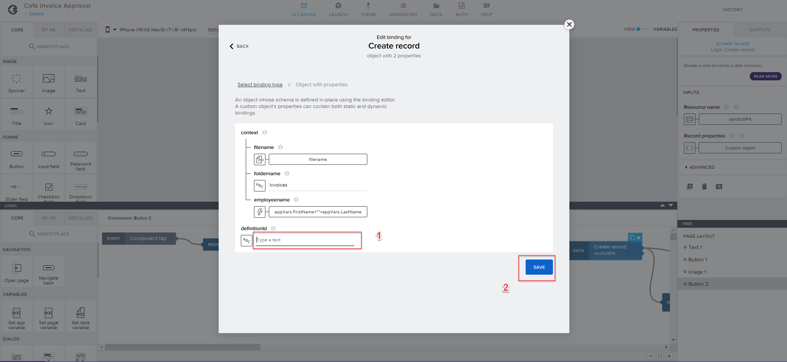

## Prerequisites
- Complete the previous part of the tutorial [5 Create Forms](https://github.com/SAP-samples/process-automation-enablement/tree/main/Workshops/LCNC_Roadshow/Build%20Process%20Automation/5%20Create%20Forms/spa-dox-forms.md)

## Details
### You will learn
  - Learn how deploy and release Business Process and then execute the scenario triggered by SAP AppGyver 

---

### Step 1: Release and Deploy Project

Once you have completed the previous steps, your process looks like this:

1. **Release** the project.

    

2. Choose the **Version** and confirm **Release**.

    

3. Choose **Deploy** the project.

    

4. In the **Deploy a project** window:

    - Under Set Variables choose **No trigger creation**,
    - Under Destination choose `sap_process_automation_document_store`,
    - **Confirm** and **Deploy** a project.

    

### Step 2: Start the process

1. Start in the **Lobby** and open **Monitor** tab.

 

2. Click on **Process and Workflow Instances** in the **Manage** section

3. Find your process and copy its **Definition ID**

4. Go back to **SAP AppGyver** and provide the definition ID to start the process.

### Step 3: Work with AppGyver to start the Application

1. Open your AppGyver App from the **Lobby**

2. Click on **Submit** button on the screen and then on the **Show Logic** below on the Invoice Submission Page

3. In the logic section, click on **Create Record** and then on the **Record Properties** icon to the right

4. Select **Object with properties**

5. Click on the icon under **definitionID**

6. Choose **Static text**

7. Paste the **definitionID** parameter you have copied for your Process from SAP Process Automation (see step 2). After that click **Save**.

8. **Save** the whole application using the button in the top right corner. After that open the **Launch** tab.

9. You can either **open** application as a web app on the computer or on your mobile phone. You can use both of the options. Please note that: 
- you can only upload the file if you plan to use option 1
- you need to save an invoice to your mobile phone if you plan to use option 2

10. **Open** the Application you have created.

11. Enter the data and submit the invoice file!
The invoice file can be downloaded here: [Invoice.png](Invoice.png)

### Step 4: Get back to SAP Process Automation part to work on the Tasks

1. Start in the **Lobby** and open the **My Inbox** application by selecting the button  at the top right corner.

    

2. After opening the **My Inbox** application, you will see on the left-hand side all the tasks listed. Select the task with the invoice number with which you triggered the process.

    

3. Move on with one of the actions:

    

      - **Approve**, **Reject**, **Show Log** (to see what has been done so far),
      - **Claim** (to reserve this task for you) or
      - **Mail** (to forward this task via email).

4. You could also **sort**, **filter** or **group** the tasks at the bottom of the task list with these buttons:

    

5. Depending on your selected actions and the information you have provided at the start of the process, the next task would be to **Approve** the invoice.

    

### Step 5: Monitor Process and Automation

1. Navigate to the **Monitor** tab and choose **Process and Workflow Instances**.

    

2. Choose **Get Invoice Details** instance to check the status of the **CONTEXT** and **EXECUTION LOG**.

    

3. Go to **Automation Jobs** under **Monitor**.
   You can see the Automation ran successfully:

    

    Notice how the process instance progresses further to the approval step in the business process.

    

Congratulations! You have finished the exercise!
---
