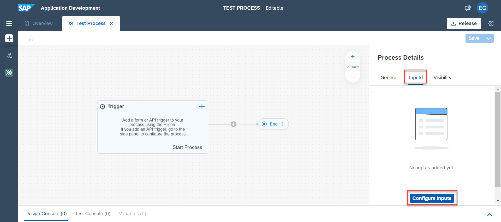
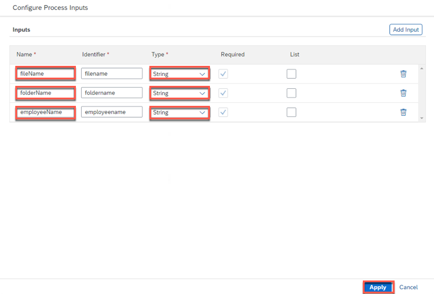

## Details
You work in the finance department of the company and need to regularly process incoming scanned invoices.

This is actually causing a lot of manual effort in order to extract the data out of the pdf or image, send to the approval of the manager before the data would be actually entered into the system.
This needs to be automated since we are talking about multiple invoices which are coming every single day. Also we need to define the approval flow depending on the specific criteria (in this tutorial series, company is considered as criteria).

### You will learn
  - How to create a project and the related process
  - How to add a form to trigger this process

---

**Step 1: Create a Business Process Project**

   The project includes all artifacts you will create during the course of these tutorials. You can share, release, rename or delete these projects.

1. Once you have entered the Lobby, choose **Create** and select **Business Process**.

    

2. In the wizard enter the **Project Name** **`Invoice Approval`** and also a **Short Description**, then choose **Create**.

    

**Step 2: Create a Process**

   The process will describe the flow of the activities.

1. Within the newly created project **Invoice Approval**, select **Create** and then choose **Process**.

    

2. Maintain the **Name** **`Get Invoice Details`** and also the **Description**. The identifier will be created automatically.

    

    The process with a start and end event is now available for you.

**Step 3: Configure Inputs for API Trigger**

1. Click on the **Canvas** in the background of your newly created process.

    

3. Choose **Configure Inputs** in **Inputs** to configure inputs.

    

3. In **Configure Process Inputs** window choose **Add Input** to add parameters.

    

4. Configure three inputs. Enter the names and choose types.

    |  **Name**    | **Type**
    |  :------------- | :-------------
    |  `fileName`       | string
    |  `folderName`     | string
    |  `employeeName`   | string

    **Apply** changes.

    

    Proceed to the next exercise: [2 Create Automation](https://github.com/SAP-samples/process-automation-enablement/tree/main/Workshops/LCNC_Roadshow/SAP%20Process%20Automation/2%20Create%20Automation/spa-dox-create-automation.md)