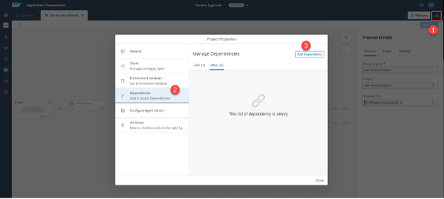
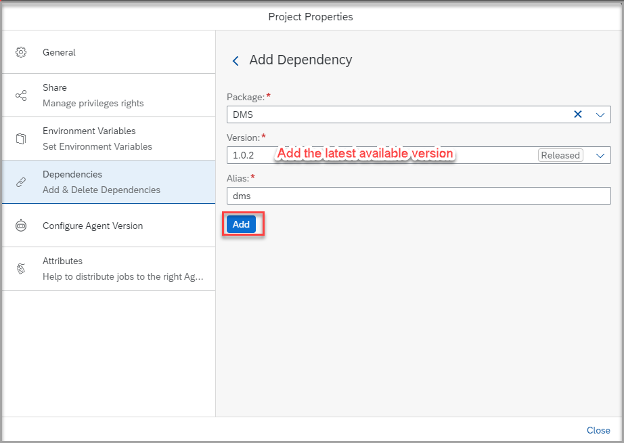
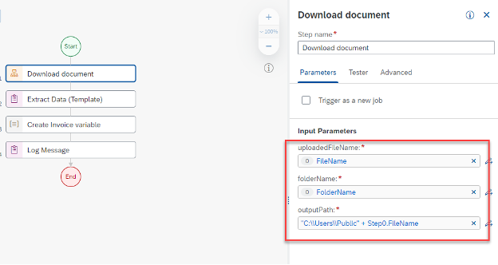

## Prerequisites
 - Complete the previous part of the tutorial [2 Create Automation](https://github.com/SAP-samples/process-automation-enablement/tree/main/Workshops/LCNC_Roadshow/SAP%20Process%20Automation/2%20Create%20Automation/spa-dox-create-automation.md)
 
 ## Details
### You will learn
  - How to include the document stored in the DMS into the automation: we need to download it to local folder in order to process by the bot created at the previous step.
---

**Step 1: Add step to download the document**

1. Navigate to the automation **Extract Invoice Data**. Click on the three dots and select **Open Editor**.

    

2. Name the Input Parameter name **FileName** (leave the data type as **String**).

    

3. Add a new input parameter, therefore click **Add new input parameter**. 
  
    
    
    Call the new input parameter **FolderName** with data type **String**.
   
   

4. Navigate to the Settings of your automation (on the right-hand side), select **Dependencies** and click **Add Dependency**.

    

    Now maintain in the dependency **Package** the **DMS**, as **Version** select the latest released one and set **Alias** as **dms**. Then click **Add**.
  
    

5. Once the packages is added as a dependency, drag and drop the automation **Download document** between **Start** and **Extract Data (Template)**.

    
    
6. Maintain the parameters of the new step. Select **Download document** and maintain the **Input Parameters**:

    |  Field Name     | Input
    |  :------------- | :-------------
    |  `uploadedFileName:`| **FileName**
    |  `folderName`   | **FolderName**
    |  `outputPath`    | **"C:\\\\Users\\\\Public\\\\" + Step0.FileName**
    
   
    
7. Finally maintain the document path in the next step. Select the step **Extract Data (Template)** underneath **Input Parameters** change **documentPath** to **"C:\\\\Users\\\\Public\\\\" + Step0.FileName** (same entry as maintained outputPath in the step before).

    
Congratulations, you are done with this part. Return back to the Process View.

  Proceed to the next exercise: [4 Create Decision](https://github.com/SAP-samples/process-automation-enablement/tree/main/Workshops/LCNC_Roadshow/SAP%20Process%20Automation/4%20Create%20Decision/spa-dox-create-decision.md)
