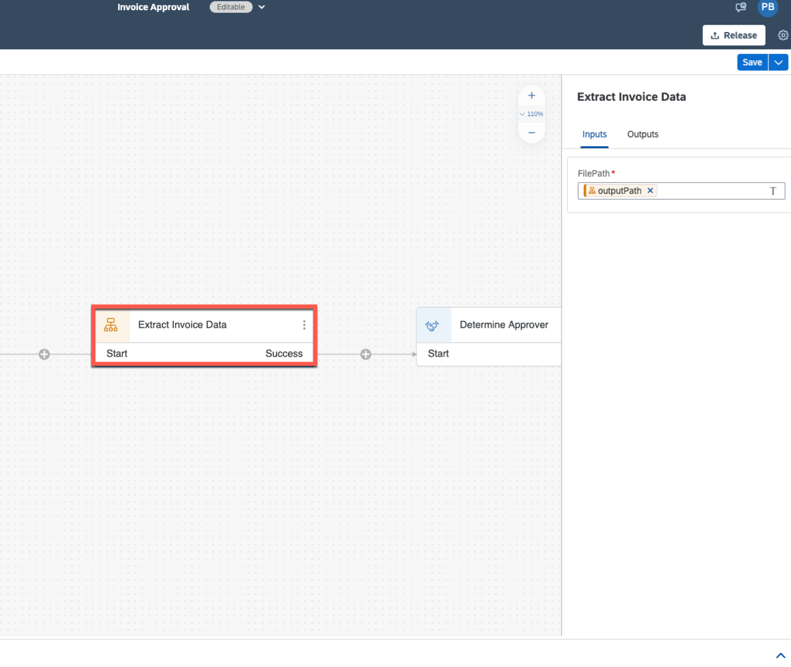

## Prerequisites
- Complete the previous part of the tutorial [5 Create Forms](https://github.com/SAP-samples/process-automation-enablement/tree/main/Workshops/LCNC_Roadshow/SAP%20Process%20Automation/5%20Create%20Forms/spa-dox-forms.md)

## Details
### You will learn
  - How to create inputs and outputs in the process

---

**Step 1: Binding Input and Output Parameters**

1. Choose **Extract Invoice Data** automation.

    

    - Configure **Inputs** section. Select the text box and map corresponding content.

    |  **Form Input Fields**    | **Process Content Entry**
    |  :------------- | :-------------
    |  `FilePath`    | `outputPath`

    

3. Select **Invoice Approval Form**.

    

    - Configure **General** section. Select the text box and map corresponding content.

    |  **Form General Fields**    | **Process Content Entry**
    |  :------------- | :-------------
    |  Recipients > Users  | `eMail`

    

    - Configure **Inputs** section. Select the text box and map corresponding content.

    |  **Form Inputs Fields**    | **Process Content Entry**
    |  :------------- | :-------------
    |  Employee Name  | `employeeName`

    

4. **Save** your work.

  Proceed to the next exercise: [7 Run Process](https://github.com/SAP-samples/process-automation-enablement/tree/main/Workshops/LCNC_Roadshow/SAP%20Process%20Automation/7%20Run%20Process/spa-dox-run-api-trigger.md)

---
