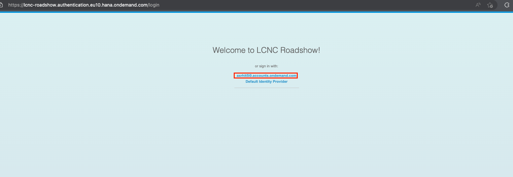
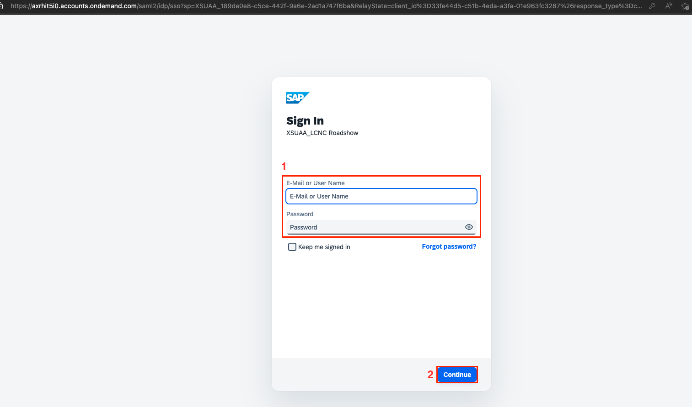

# Create a Sales Order Business Process and an App 

## Description

This repository contains the material for the hands-on session called "Create a Sales Order Business Process and an App".

## Overview

In this session you will learn how to
- create a sales order business process with SAP Build Process Automation, including forms, email notifications, condidtions and an API trigger
- create an application with SAP Build Apps, to trigger the sales order process created before

## Requirements

There are no dedicated requirement for this exercise. 

## System access and important hints

1. Please use Google Chrome as your browser (others are not supported and you might not be able to experience every feature)
2. Please access the system (SAP Build Lobby) here:
   - Open [SAP Build Lobby](https://lcnc-roadshow.eu10.build.cloud.sap/lobby).   Click on <b>axrhit5i0.accounts.ondemand.com</b>.  

   - Enter your login details and click on <b>Continue</b>.

4. You will get user and password from the instructor
5. You DO NOT need to: setup any system, create any destinations
6. Please follow carefully the descriptions in the exercise documents below

## Exercises

- [Exercise 1 - Create Sales Order Business Process](https://developers.sap.com/tutorials/spa-academy-salesorder.html) (45 minutes)
- [Exercise 2 - Run the Sales Order Business Process](https://developers.sap.com/tutorials/spa-academy-run-salesorderprocess.html) (10 minutes)
- [Exercise 3 - Create SAP Build App to Trigger Workflow](https://developers.sap.com/tutorials/build-apps-workflow-trigger.html) (25 minutes)
  
Once you are done with Exercise 3, please just check the new task in the My Inbox application in SAP Build Process Automation.

Good luck!
  

## How to obtain support

Support for the content in this repository is available during the actual time of the online session for which this content has been designed. Otherwise, you may request support via the [Issues](../../issues) tab.

## License
Copyright (c) 2022 SAP SE or an SAP affiliate company. All rights reserved. This project is licensed under the Apache Software License, version 2.0 except as noted otherwise in the [LICENSE](LICENSES/Apache-2.0.txt) file.

