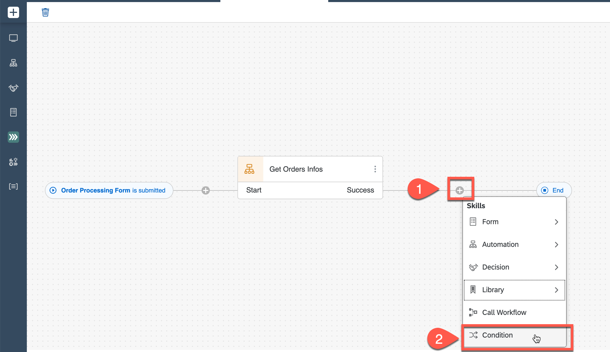
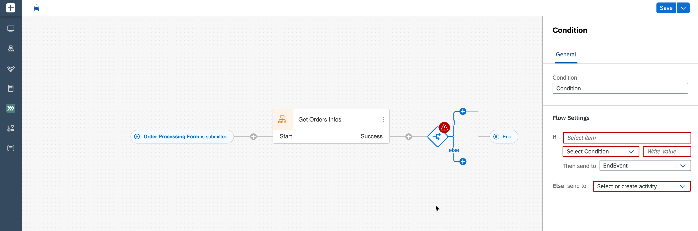
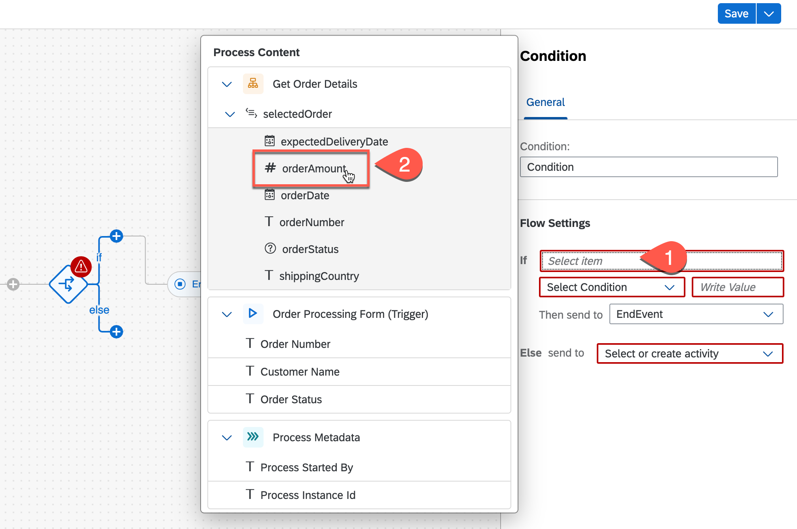
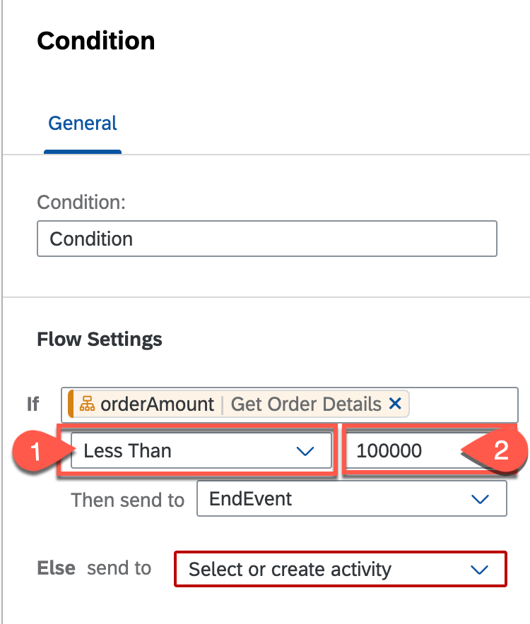
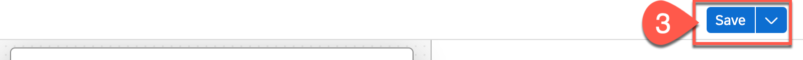

## Table of Contents
- [Adding Process condition](#section1)
- [Summary](#summary)

## Adding Process condition 
**Process condition** routes the business process based on certain criteria. These conditions apply an If or Else rule and the business process responds according to the rules defined as settings in the process builder.

In this section, you will learn how to use process condition in a business process to route the process towards auto-approval and one-level approval flow based on the total order value of the sales order.

1. Click the **+** and choose **Condition** from the given options.

    

    This will add the condition to the process, and the condition configuration will open.

    

2. On the right **Condition** configuration page, click on **If** text box and select **#orderAmount** from the process content.
    > Process content will contain list of attributes that have been defined in previous skills. For Example: In the screenshot, you can see attributes from the trigger form and automation. You will use these process content to configure different skills during business process modelling.

    

3. In the same condition configuration, select **Less Than** operator and enter **100000** as the value.

  

4. **Save** the process.

   

## SUMMARY 

###### You have successfully created and configured the process condition, data type and decision for the business process.

  You are now able to:
  - [x] Add & configure Process Condition

