## Table of Contents
- [Adding Form](#section1)
  - [Create and Configure Auto-Approval Form](#section1-autoapproval)
  - [Create and Configure Approval Form](#section1-approval)
  - [Create and Configure Notification Form](#section1-notification)
- [Summary](#summary)

## Adding Form 
**Interactive forms** are created by adding text elements and input fields to a canvas. Once a form has been created, it can then be added as a start trigger for the business process or for an user approval or to send notifications in the business process.

Currently there are two types of Forms:
  - **Simple Form** : used for sending notification or as a start trigger of the business process. It has one pre-configured Submit button.
  - **Approval Form** : approvals are managed by creating and adding an **Approval Form** to a business process. It has pre-configured  Approve and Reject buttons.

When creating forms, you can use different form elements for Layout and  Fields. These **Form elements** can then be added to the form canvas by dragging and dropping them.

Each **Form input field** can be added to both a standard form and an approval form. These fields allow you to design and manage the information displayed to the process participant. Like whether the field will be a dropdown, or a checkbox etc. or whether the field is mandatory or not, or if has a text limit, or whether its read-only etc.

In this section, you will create 3 forms:
  - **Auto-approval Form**: this will be a simple form to inform the requestor that the sales order is approved automatically.
  - **Supplier Approval Form**: this will be an approval form which will be send to the approvers determined by the decision table for their approval.
  - **Notification Form**: this will be a simple form to inform the requestor whether their sales order is approved or rejected by the supplier.

### Create and Configure Auto-Approval Form 
1. In the process builder, click **+** of the **if conditional flow** and select **Form > New Form**.

    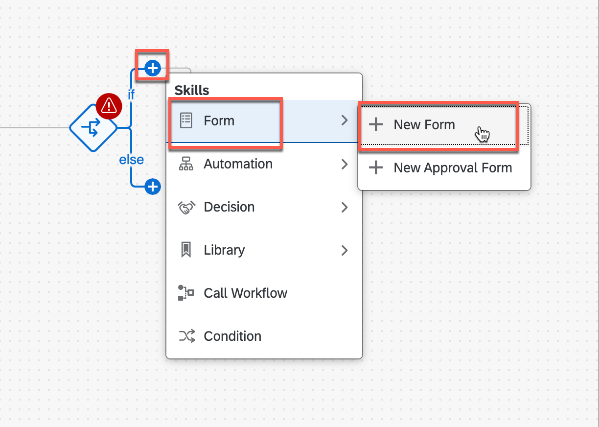

2. In the pop-up, do the following:
    - Enter **Auto Approval Notification** in the **Name** box.
    - Enter **Notification form for auto approval** in the **Description** box.
    - Click **Create**.

    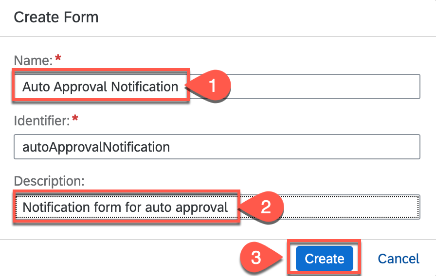

3. Now you have to model the form. For that, click on *three-vertical-dots* on **Auto Approval Notification** form to open the menu and click **Open Editor**.

  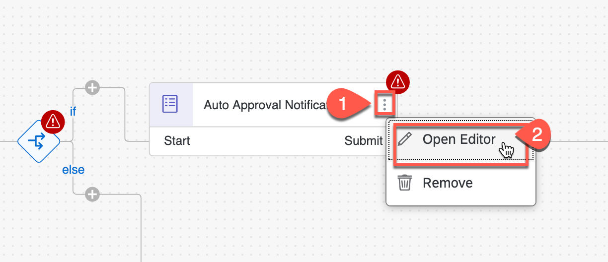

4. In the Form Editor, either click or drag-and-drop **H1 Headline 1** layout on the form editor.

  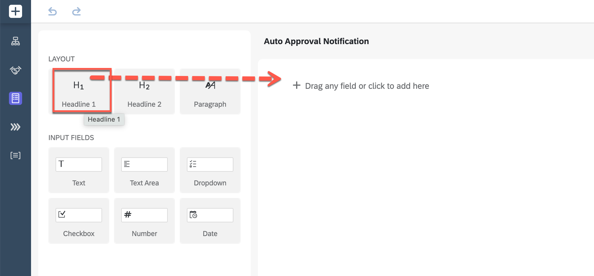

  > the Headline layout will then be available to add text.
    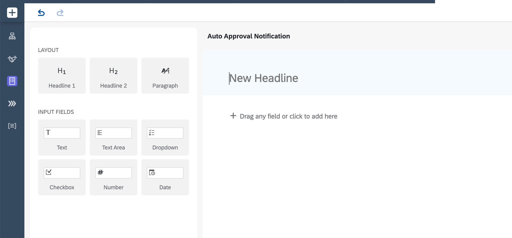

  - Enter **Automatic Order Confirmation** as the **Headline** text.
  - Similarly click or drag-and-drop **Paragraph** on the form editor.

  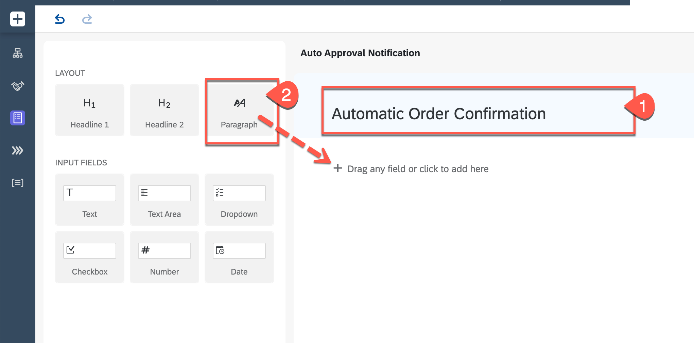

  - Enter **Your order has been received and we will send you the details as soon as the order is shipped. You can find the details of your order below, please review and verify your request:** as the **Paragraph** text.

  - Similarly drag-and-drop another **Paragraph** and enter **Your Sales Order Details:** as the **Paragraph** text.
  - To add input fields, drag-and-drop **Text** from the **INPUT  FIELDS** on the form editor.

  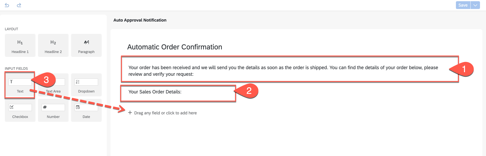

  - In the **Field Settings** properties on the left panel, do the following:
      - Enter **Order Number** in the **Field Name** box.
      - Select **Read Only**.

  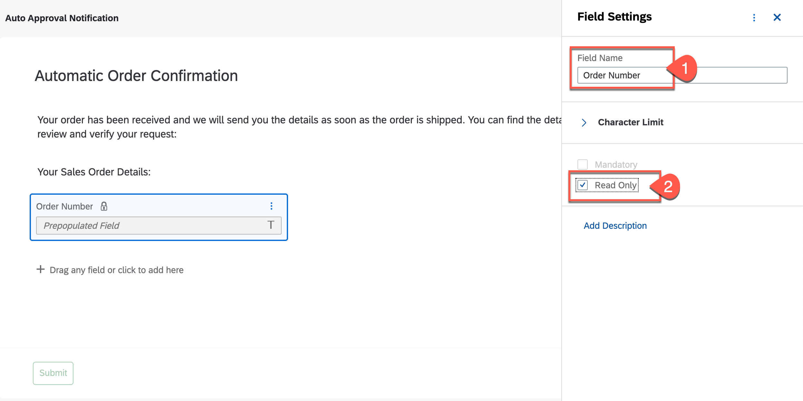

  - Continue adding more fields with following details:
    - Once done, click on **Save**.

  | Input Field | Field Settings |
  |---|---|
  | Number | Name: Order Amount   Read Only : checked|
  | Date      | Name: Requested Order Delivery Date   Read Only : checked|

  | Layout| Text |
  |---|---|
  | Paragraph |If everything is ok, please press the SUBMIT button, so the process can be finalized. |

  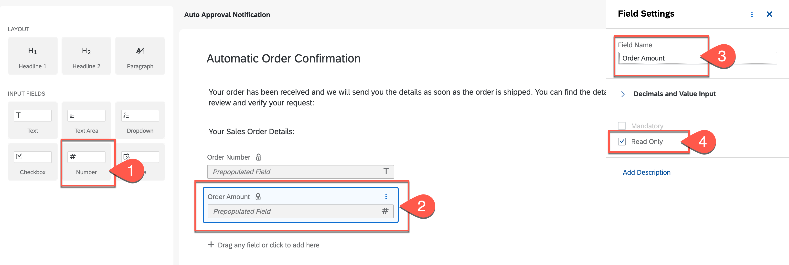

  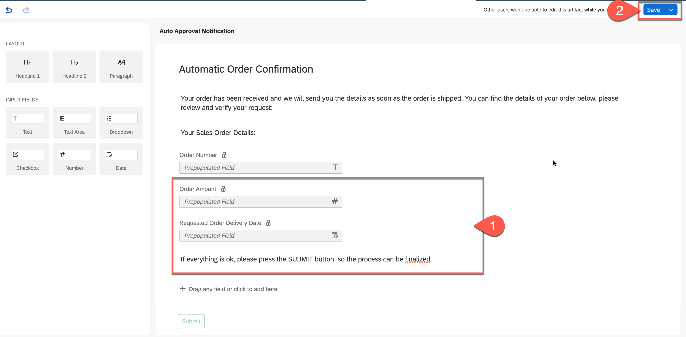

5. Go back to the process builder, select **Auto Approval Notification** form and do the following:

  - Click on **General** tab, and do the following:
      - Enter **Your Order has been successfully received** in the **Subject** box.
      - Select **Process Stared By** from process content as **Users** in **Recipients**.

      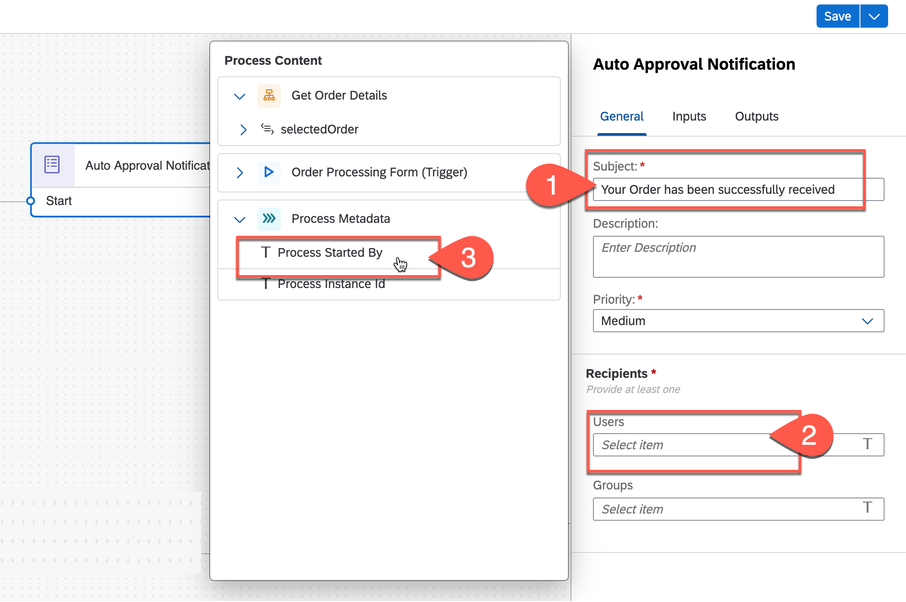  

  - Click on **Inputs** tab.
  - Map the following decision table input with the process content:

    | Form Input Field | Process Content |
    |---|---|
    | Order Amount | selectedOrder > orderAmount |
    | Order Number | selectedOrder > orderNumber |
    | Requested Order Delivery Date | selectedOrder > expectedDeliveryDate |

    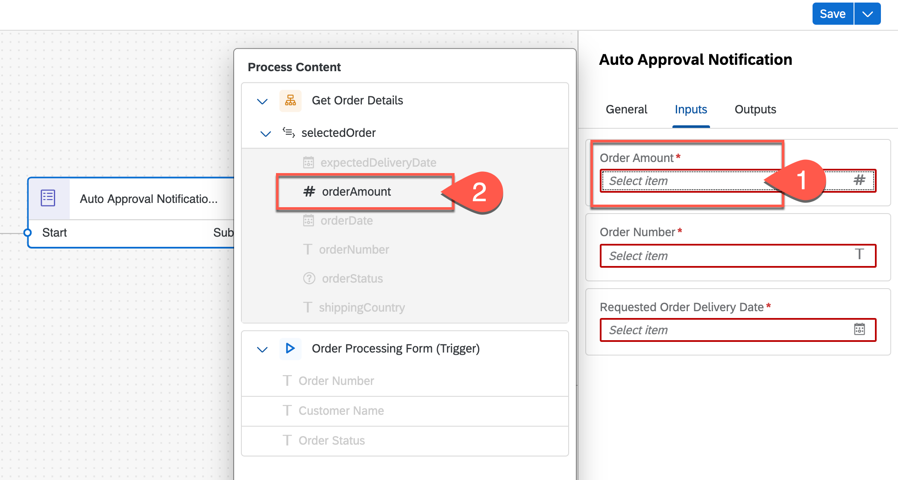  

  - **Save** the process.

    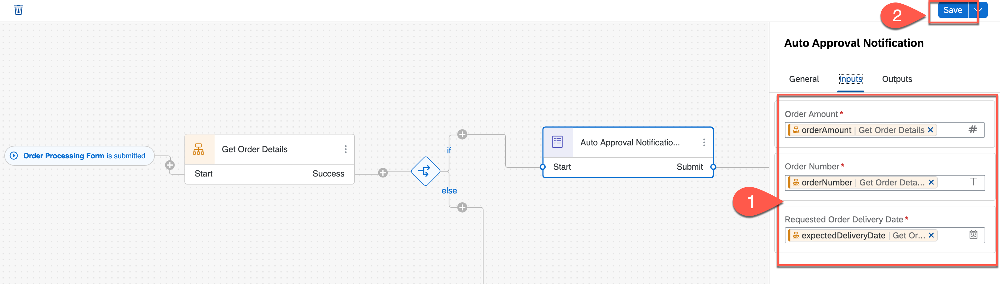

### Create and Configure Approval Form 

1. In the process builder, click **+** of the conditional flow (**else**) and select **Form > New Approval Form**.

    

2. In the pop-up, do the following:
    - Enter **Approval Form (Supplier)** in the **Name** box.
    - Enter **Supplier will approve or reject the sales order** in the **Description** box.
    - Click **Create**.

    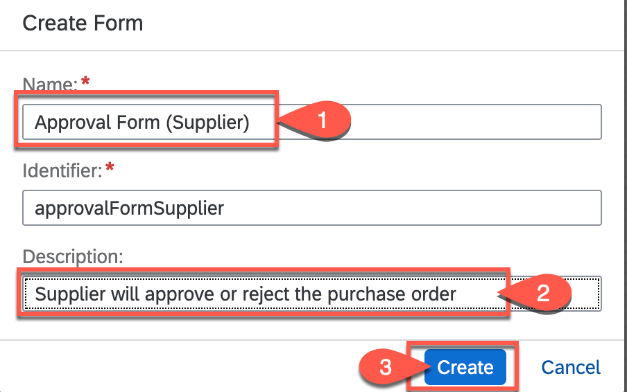

3. Now you have to model the form. For that, click on *three-vertical-dots* on **Approval Form (Supplier)** form to open the menu and click **Open Editor**.

  

4. In the Form Editor, click or drag-and-drop the following layout and input fields in the given order on the form editor:

  | Order| Layout   | Text |
  | ---- |----------|---|
  | 1 | Headline1  |Approve Sales Order|
  | 2 | Headline2  |Customer has requested for the new order. Please review and confirm whether the requirements can be met or not. |
  | 3 | Paragraph |Sales Order Details: |

  | Order | Input Field   | Field Settings |
  | ---- |----------|---|
  | 4 | Text   | Name: Customer Name   Read Only : checked|
  | 5 | Text   | Name: Order Number   Read Only : checked |
  | 6 | Number | Name: Order Amount   Read Only : checked |
  | 7 | Date | Name: Delivery Date   Read Only : checked |

  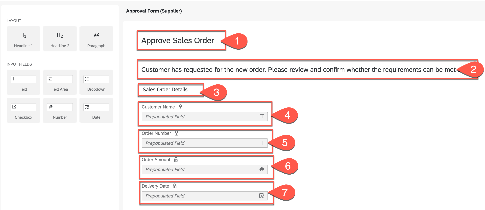

  | Order| Layout   | Text |
  | ---- |----------|---|
  | 8 | Paragraph  |Supplier Acknowledgment|

  | Order | Input Field   | Field Settings |
  | ---- |----------|---|
  | 9 | Checkbox   | Name: I acknowledge that we have received your purchase order and will deliver on scheduled date|
  | 10 | Text Area  | Name: Message to buyer: |

   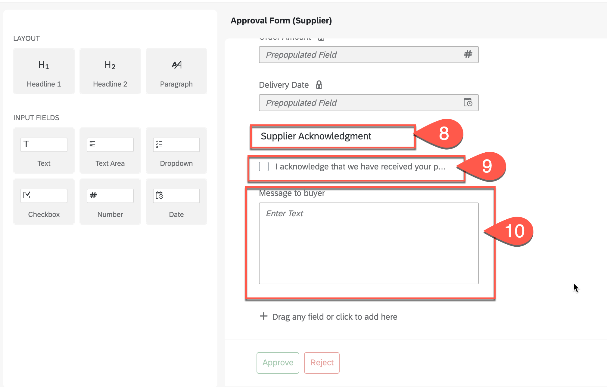

   - Once done, click to **Save**.

5. Go back to the process builder, select **Approval Form (Supplier)** form and do the following:

  - Click on **General** tab, and do the following:
    > you will use dynamic value from process content to define the subject.

      - In the **Subject** box, enter **Review and Approve Order**
        - then select **selectedOrder > orderNumber** from the process content.
        - again enter **from**, then select **Order Processing Form > Customer Name** from the process content.

      - Select **Order Processing Form > Approver Email** from process content as **Users** in **Recipients**.
      - Leave **Groups** empty.

      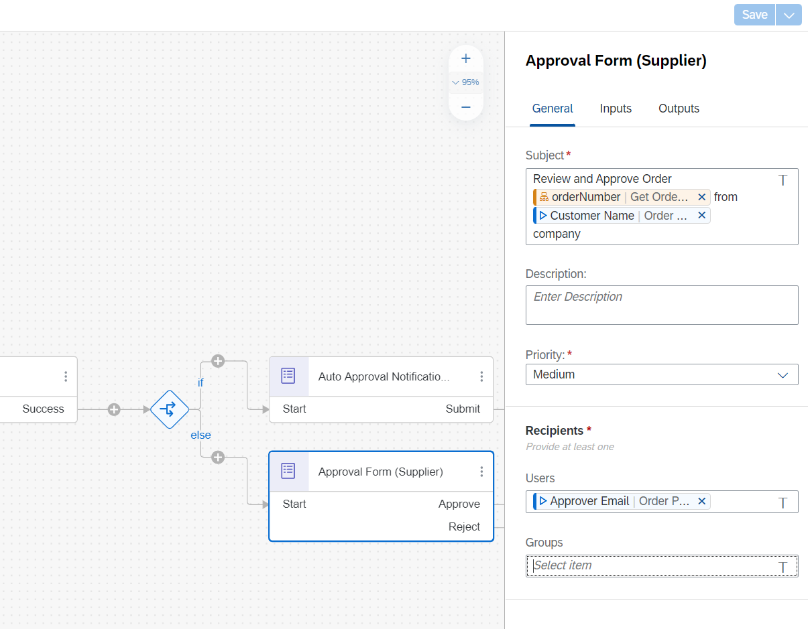  

  - Click on **Inputs** tab.
  - Map the following decision table input with the process content:

    | Form Input Field | Process Content |
    |---|---|
    | Delivery Date | selectedOrder > expectedDeliveryDate |
    | Customer Name | Order Processing Form > Customer Name |
    | Order Amount | selectedOrder > orderAmount |
    | Order Number | selectedOrder > orderNumber |

    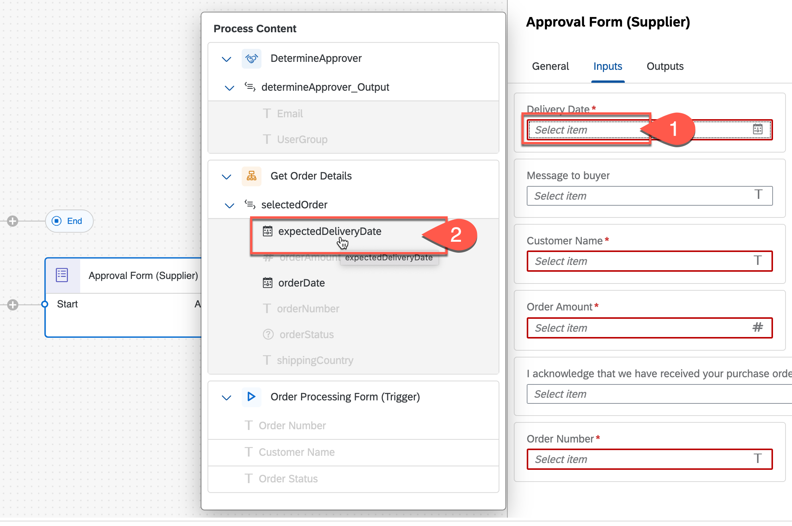  

  - Once completed, click to **Save** the process.

    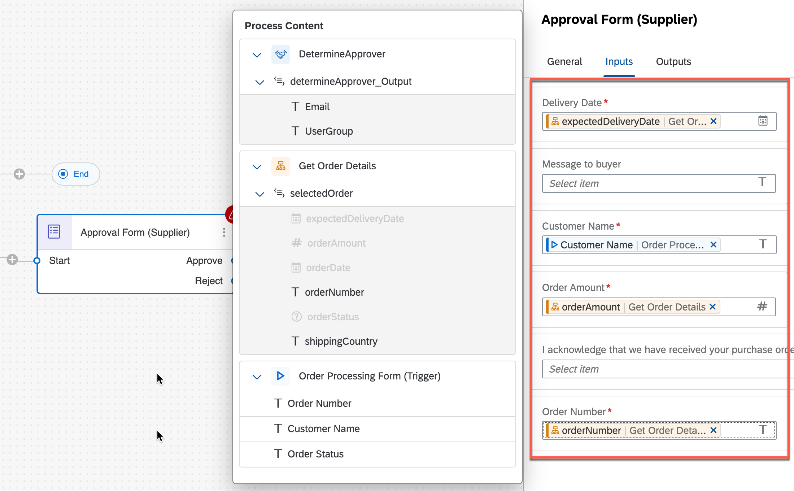

### Create and Configure Notification Form 

1. In the process builder, click **+** of the **Approve** conditional flow of **Approval Form (Supplier)** and select **Form > New Form**.

    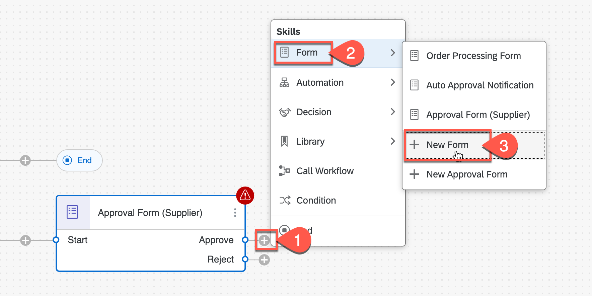

2. In the pop-up, do the following:
    - Enter **Sales Order Notification (Approved)** in the **Name** box.
    - Enter **Notification form to inform that the sales order is approved by the supplier** in the **Description** box.
    - Click **Create**.

    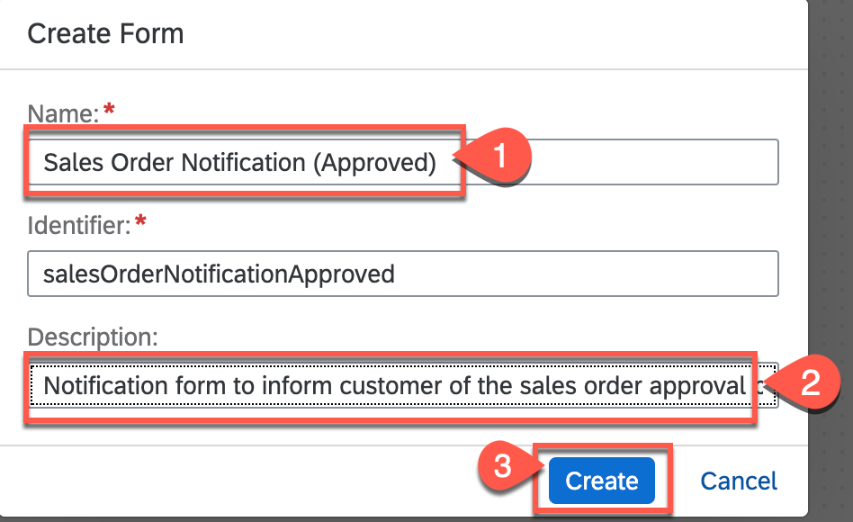

3. Now you have to model the form. For that, click on *three-vertical-dots* on **Sales Order Notification (Approved)** form to open the menu and click **Open Editor**.

  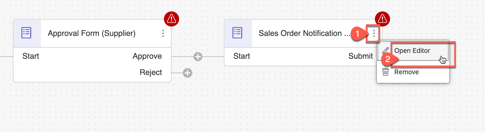

4. In the Form Editor, click or drag-and-drop the following layout and input fields in the given order on the form editor:

  | Order| Layout   | Text |
  | ---- |----------|---|
  | 1 | Headline1  |Order Confirmation|
  | 2 | Paragraph  |We are happy to let you know that your order has been received and accepted for delivery. We will inform you as soon as your order has been shipped.  You can find the details of your order below, please review and verify the request:|

  | Order | Input Field   | Field Settings |
  | ---- |----------|---|
  | 3 | Text Area   | Name: Message from the supplier:   Read Only : checked|

  | Order| Layout   | Text |
  | ---- |----------|---|
  | 4 | Paragraph  |Your Sales Order Details:|

  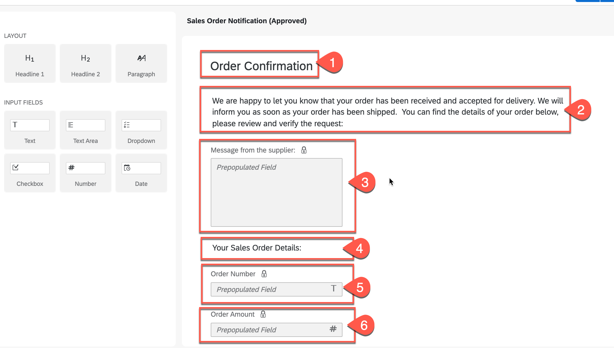

  | Order | Input Field   | Field Settings |
  | ---- |----------|---|
  | 5 | Text   | Name: Order Number   Read Only : checked |
  | 6 | Number | Name: Order Amount   Read Only : checked |
  | 7 | Date | Name: Order Delivery Date   Read Only : checked |
  | 8 | Text | Name: Order Status   Read Only : checked |

  | Order| Layout   | Text |
  | ---- |----------|---|
  | 9 | Paragraph  |please press the SUBMIT button, so that the process can be finalized.|

  

  - Once done, click to **Save**.

5. Go back to the process builder, select **Sales Order Notification (Approved)** form and do the following:

  - Click on **General** tab, and do the following:
    > you will use dynamic value from process content to define the subject.

      - In the **Subject** box, enter **Your Order**
        - then select **selectedOrder > orderNumber** from the process content.
        - again enter **is confirmed by the supplier**,
      - Select **Process Metadata >> Process Started By** from process content as **Users** in **Recipients**.

      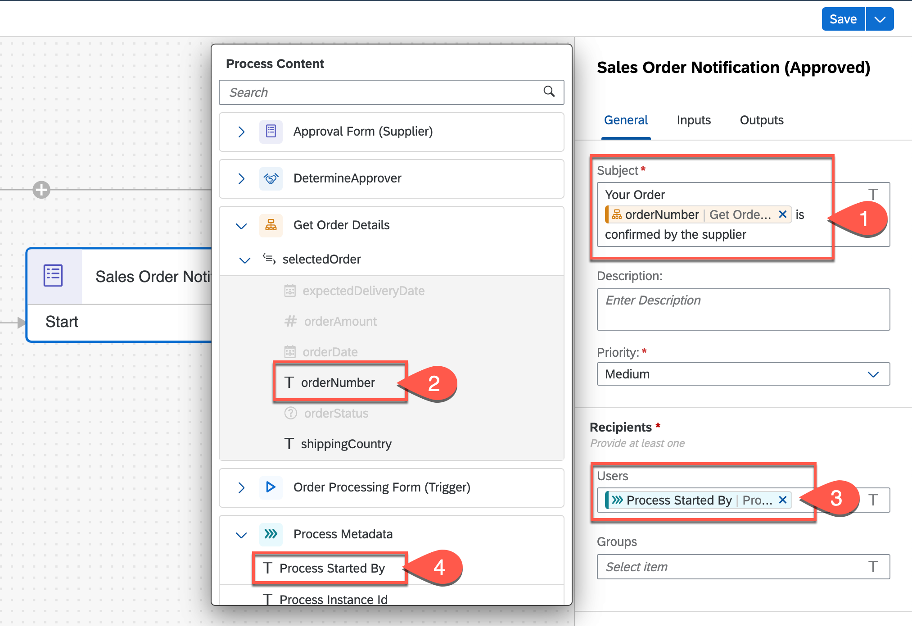  

  - Click on **Inputs** tab.
  - Map the following decision table input with the process content:

    | Form Input Field | Process Content |
    |---|---|
    | Order  Number | selectedOrder > orderNumber  |
    | Order Delivery Date | selectedOrder > expectedDeliveryDate |
    | Message from supplier | Approval Form > Message to buyer |
    | Order Amount | selectedOrder > Order Amount |
    | Order Status | Order Processing Form > Order Status |
    

    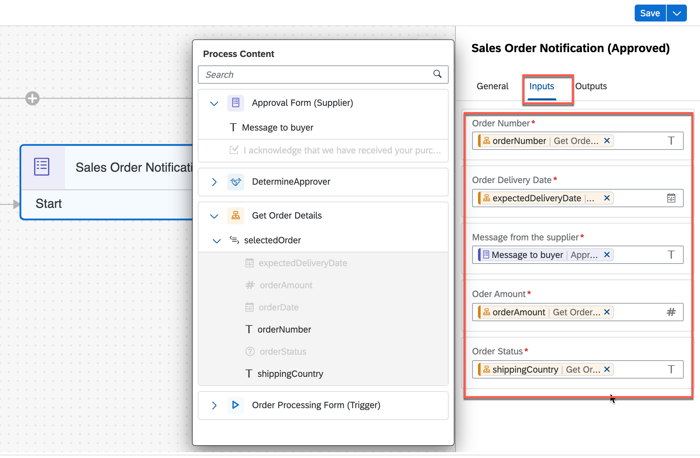

  - Drag and drop the connection flow from **Submit** action to **End** step in the process.

    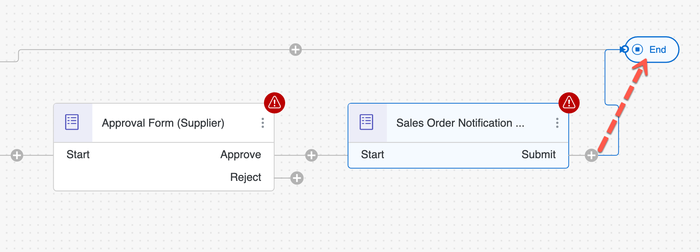

  - Once completed, click to **Save** the process.

6. Repeat the above steps to create one more notification form to inform the requestor about the rejection of the sales order.  

    - In the process builder, click **+** of the **Reject** conditional flow of **Approval Form (Supplier)** and select **Form > New Form**.

        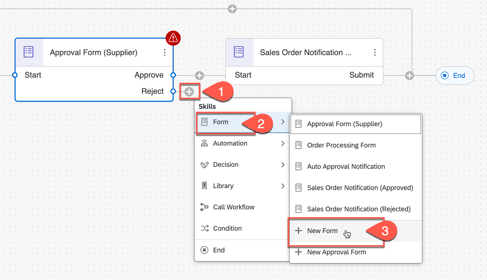

    - In the pop-up, do the following:
        - Enter **Sales Order Notification (Rejected)** in the **Name** box.
        - Enter **Notification form to inform that the sales order is rejected by the supplier** in the **Description** box.
        - Click **Create**.

        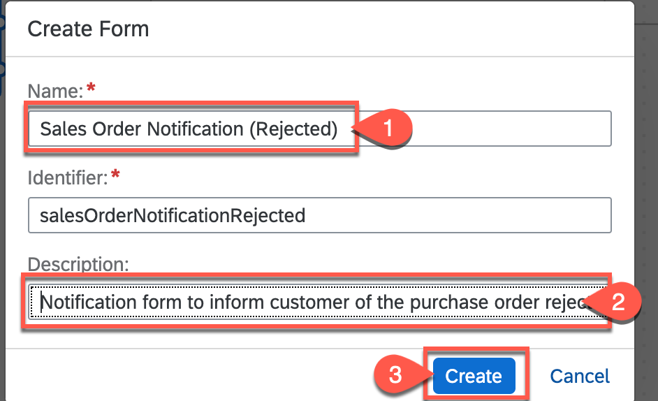

    - Now you have to model the form. For that, click on *three-vertical-dots* on **Sales Order Notification (Rejected)** form to open the menu and click **Open Editor**.

    - In the Form Editor, click or drag-and-drop the following layout and input fields in the given order on the form editor:

      | Order| Layout   | Text |
      | ---- |----------|---|
      | 1 | Headline1  |Order Rejection|
      | 2 | Paragraph  |We are sorry to inform you that your order cannot not be accepted. Any inconvenience caused due to refusal of order is regretted. You can find the reason of rejection and the details of your order below, please confirm the request:|

      | Order | Input Field   | Field Settings |
      | ---- |----------|---|
      | 3 | Text Area   | Name: Message from the supplier:   Read Only : checked|

      | Order| Layout   | Text |
      | ---- |----------|---|
      | 4 | Paragraph  |Your Sales Order Details:|

        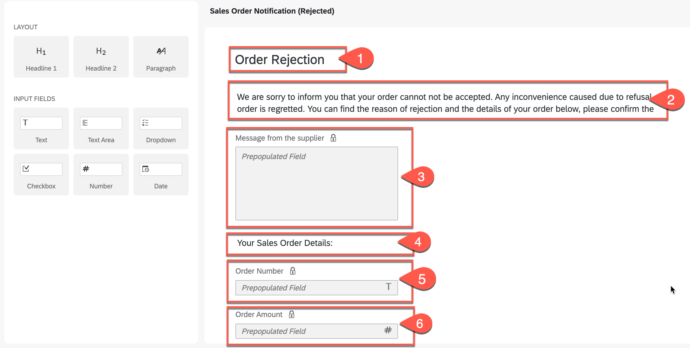

      | Order | Input Field   | Field Settings |
      | ---- |----------|---|
      | 5 | Text   | Name: Order Number   Read Only : checked |
      | 6 | Number | Name: Order Amount   Read Only : checked |
      | 7 | Date | Name: Order Delivery Date   Read Only : checked |
      | 8 | Text | Name: Order Status   Read Only : checked |

      | Order| Layout   | Text |
      | ---- |----------|---|
      | 9 | Paragraph  |please press the SUBMIT button, so that the process can be finalized.|

      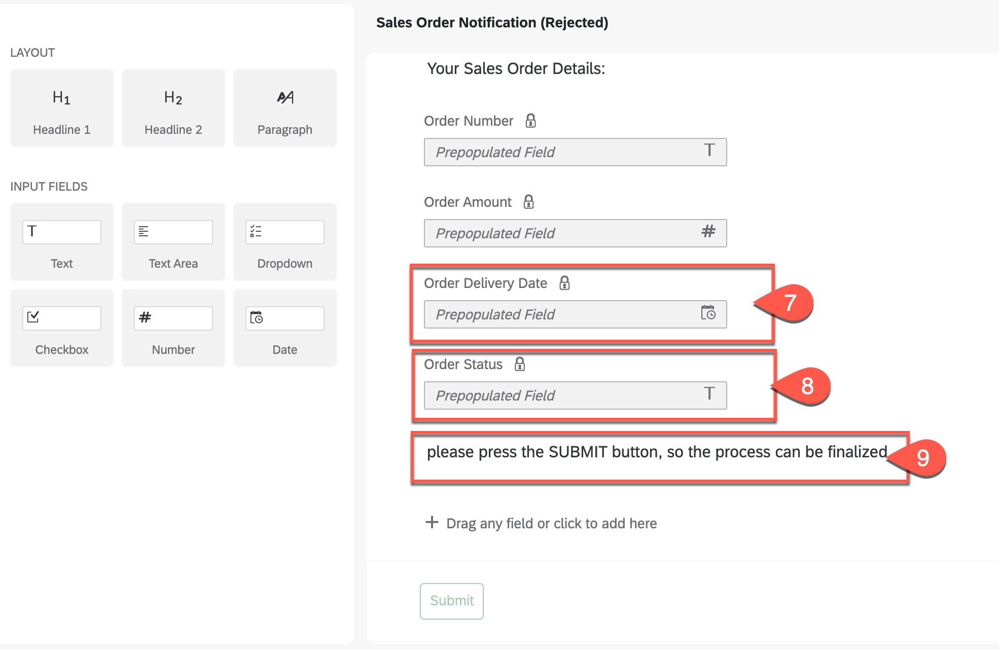

    - Once done, click to **Save**.

    - Go back to the process builder, select **Sales Order Notification (Rejected)** form and do the following:

     - Click on **General** tab, and do the following:
        > you will use dynamic value from process content to define the subject.

          - In the **Subject** box, enter **Your Order**
            - then select **selectedOrder > orderNumber** from the process content.
            - again enter **is rejected by the supplier**,
          - Change the **Priority** to **High**.
          - Select **Process Metadata >> Process Started By** from process content as **Users** in **Recipients**.
          

          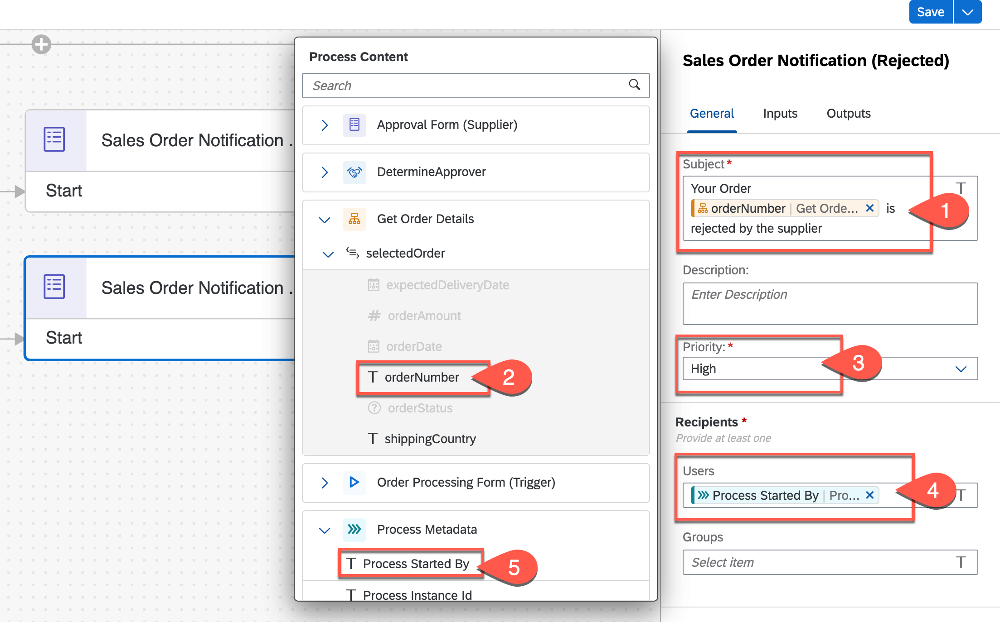  

      - Click on **Inputs** tab.
      - Map the following decision table input with the process content:

        | Form Input Field | Process Content |
        |---|---|
        | Order Status | Order Processing Form > Order Status |
        | Order Amount | selectedOrder > orderAmount |
        | Order  Number | selectedOrder > orderNumber  |
        | Order Delivery Date | selectedOrder > expectedDeliveryDate |
        | Message from supplier | Approval Form > Message to buyer |

        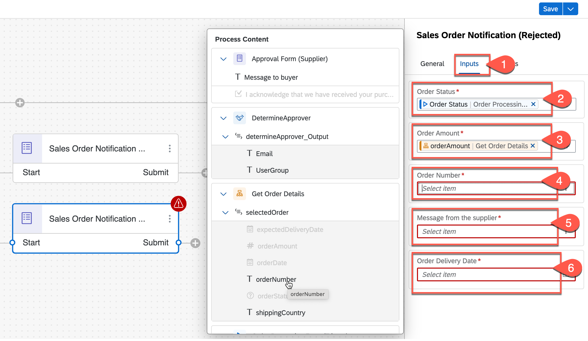

      - Drag and drop the connection flow from **Submit** action to **End** step in the process.

      - Once completed, click to **Save** the process.

        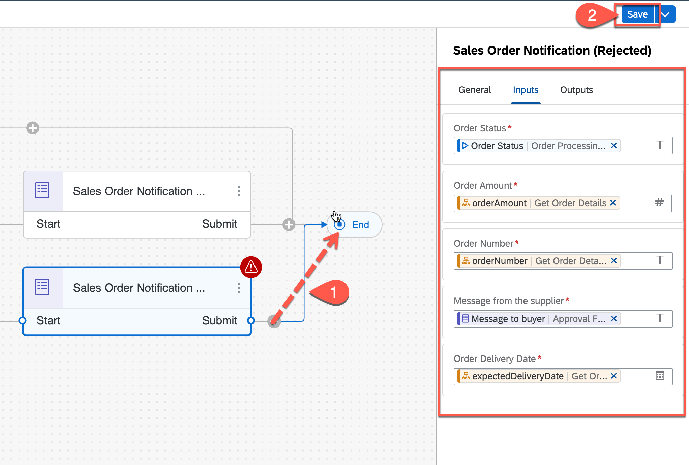

## SUMMARY 

###### You have successfully created and configured the simple and approval forms. These forms will be shown in the My Inbox for the users to take actions.

  You are now able to:
  - [x] Create Simple and Approval Forms.
  - [x] Design the forms using simple layout and field controls.
  - [x] Map the process content to the form fields.
  - [x] Add the forms in the business process.
